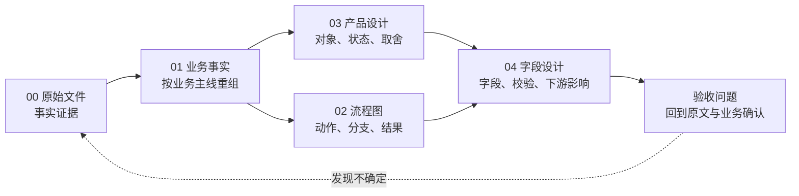

# 万里牛WMS拆解：全面走查与学习地图

## 1. 走查结论

当前资料已经形成“原始资料 → 业务事实 → 局部流程图 → 产品设计 → 字段设计”的五层结构。原始资料迁移基本完整，主要问题不是缺少更多菜单，而是跨层之间还不够容易串起来：新手能看到很多内容，却不一定知道先看什么、哪些是万里牛事实、哪些是通用设计建议，以及一个业务动作最终如何落到状态、数量和字段。

本轮优先补足四个缺口：

1. **缺少总地图**：各章节流程图是局部正确的，但缺少入库、出库、库存异常和结算之间的跨章节关系。
2. **加工与费用层偏薄**：01 有原始内容，03、04 原先主要以通用模块带过，不能充分展示仓内加工和3PL结算如何建模。
3. **原始观察到字段的桥不够清楚**：字段文档容易被读成“真实数据库字段”，需要明确原文词、建议字段、下游用途和验收问题的关系。
4. **入口统计和阅读路径不一致**：根 README 的源文档数量与 01 层实际迁移数不一致；新手缺少一条可执行的学习路线。

## 2. 证据范围

| 层级 | 当前内容 | 本次判断 |
|---|---|---|
| 00 源文件 | 330个Markdown文件；其中305个非导航正文文件，另有9个含正文的`index.md`被纳入章节 | 作为唯一事实源，不改写原文 |
| 01 业务事实 | 12 个章节，314 个源正文引用 | 已覆盖全部非导航正文来源；重点是阅读组织，不是继续搬运 |
| 02 流程图 | 12 章各 3 张局部图，另补 1 个跨章节总览文档 | 从局部规则补到总链和异常回流 |
| 03 产品设计 | 原有 12 个通用设计模块，新增加工、3PL 费用、作业体验三个模块 | 把原始内容中容易被忽略的业务边界和现场问题独立出来 |
| 04 字段参考 | 原有基础字段与公共基线，新增加工、作业体验、3PL 结算、原始观察与验收 | 明确字段设计是建议模型，不是假设的真实库表 |

## 3. 五层资料怎样互相串联

每读一个功能，都建议完成一条最小链：

> 原文事实 → 业务动作 → 系统结果 → 状态/数量变化 → 字段承载 → 异常和反向处理 → 验收问题

## 4. 已发现的问题分级

| 优先级 | 问题 | 影响 | 已采取的处理 |
|---|---|---|---|
| P0 | 根目录统计口径过时 | 读者无法判断资料覆盖范围 | 已按 01 层实际源正文数修正入口 |
| P0 | 没有跨章节主链 | 新手无法理解订单、库存、任务和包裹的关系 | 新增 [跨章节主链与学习导航](02-按章节拆分的流程图/00-跨章节主链与学习导航.md) |
| P1 | 加工的原料、成品、退料、批次和任务关系分散 | 容易把加工误设计成一次库存加减 | 新增 [仓内加工与作业结果设计](03-WMS产品设计精华知识借鉴/13-仓内加工与作业结果设计.md) 及字段文档 |
| P1 | 3PL 费用、货主账单、承运商对账缺少独立设计 | 容易只做金额报表，无法解释和纠正费用 | 新增 [3PL费用、货主协同与结算设计](03-WMS产品设计精华知识借鉴/14-3PL费用货主协同与结算设计.md) 及字段文档 |
| P1 | 原始字段与建议字段之间缺少验收桥 | 新手可能把推导字段误认成事实字段 | 新增 [原始字段观察与设计验收](04-WMS的字段设计参考借鉴/20-原始字段观察与设计验收.md) |
| P2 | 01 层保留 HTML 标签和原始截图，阅读密度较高 | 事实保真，但自学体验不够轻 | 暂不批量改写；后续可另做“学习摘要”，不覆盖事实层 |
| P2 | 部分平台、行业、设备能力与通用核心混在同一阅读路径 | 新手容易照搬专属规则 | 在 03、04 的边界说明中统一标注扩展能力 |

## 5. 现场体验需要补的内容

这些不是“原文已经统一实现”的结论，而是基于原文中反复出现的扫描匹配、报缺、补货、盘点差异、打印失败和接口失败场景，提炼出的通用产品设计要求：

| 体验要求 | 页面至少要让用户知道什么 | 对应设计入口 |
|---|---|---|
| 当前对象清楚 | 正在处理哪个订单、任务、库位、容器或包裹 | [15-作业体验与异常反馈](03-WMS产品设计精华知识借鉴/15-仓内作业体验与异常反馈设计.md) |
| 数量不丢失 | 应作、已作、差异、剩余和最终生效数量 | [18-体验与异常反馈字段](04-WMS的字段设计参考借鉴/18-作业体验与异常反馈字段设计.md) |
| 错误可行动 | 错在哪里、能否现场纠正、下一步是什么 | 15、18 |
| 自动规则可解释 | 命中什么规则、为什么未命中、人工如何接管 | 03-规则策略、02-跨章节主链 |
| 失败可恢复 | 重试、释放、作废、转派后是否会重复生效 | 03-15、04-18、04-12 |
| 异常可追溯 | 原对象、处理人、时间、原因、结果和库存/接口影响 | 03-11、04-13、04-18 |

## 6. 推荐给新手产品经理的阅读路径

### 第一步：先建立全局模型

阅读 [02-跨章节主链与学习导航](02-按章节拆分的流程图/00-跨章节主链与学习导航.md)，先回答三件事：订单怎样变成现场任务，现场结果怎样影响库存，库存和业务记录怎样被追溯。

### 第二步：只读原始事实，不急着设计

按 [01 业务事实层](01-按章节拆分的md文件/README.md) 选择一个场景，优先入库、出库和库存异常。每个关键结论都回到 00 层原文，区分“页面上出现了什么”和“系统明确保证了什么”。

### 第三步：用局部图找分支

进入 [02 流程图](02-按章节拆分的流程图/README.md)，重点看条件、异常回流、取消、退料、释放和重算。流程图只表达资料明确支持的关系，图中“原文未说明”要保留。

### 第四步：再看产品设计抽象

用 [03 产品设计精华](03-WMS产品设计精华知识借鉴/README.md) 把页面动作抽象为单据、任务、库存、流水和外部同步；加工、3PL 结算和作业体验分别看新增的 13、14、15 三篇。

### 第五步：最后写字段和验收

用 [04 字段设计参考](04-WMS的字段设计参考借鉴/README.md) 写表头、明细、数量、状态和审计字段，再用 [20 原始字段观察与设计验收](04-WMS的字段设计参考借鉴/20-原始字段观察与设计验收.md) 检查每个字段的来源、用途、校验和下游影响。

## 7. 推荐练习题

新手不要从“设计一张完整WMS数据库表”开始，先各写一页：

| 练习场景 | 必须说清的内容 |
|---|---|
| 收货无预约 | 匹配对象、收货结果、库位、入库生效时点、无法匹配怎么办 |
| 拣货报缺 | 重锁范围、补货或打回、已拣货如何处理、谁能确认 |
| 盘点差异 | 盘前量、实盘量、差异量、库存调整、审批和流水 |
| 仓内加工 | 原料锁定、实际消耗、退料、成品数量、批次和ERP回传 |
| 货主账单 | 计费事实、费率快照、费用明细、账期、对账、冲红和开票 |

每个练习都按“输入 → 系统处理 → 页面反馈 → 数据结果 → 异常回退”验收。写不出来的地方，不用补常识，标记为“待确认”，并回到原始文件寻找证据。

## 8. 后续维护规则

1. 新增事实先进入 00 或 01，再补 02、03、04，不能只在字段文档中孤立增加字段。
2. 新增流程图必须注明原始文件和小节；如果只是通用建议，放在 03 层并明确标注。
3. 新增字段必须写明来源等级：原文词、原文计算、建议字段或待确认。
4. 任何状态或数量变更都要同步检查操作矩阵、库存流水、异常回退和外部同步。
5. 统计数字以脚本或实际目录盘点为准，根 README、各层 README 和总走查文档保持一致。
