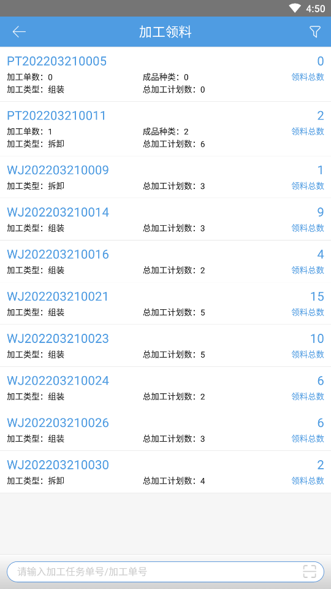
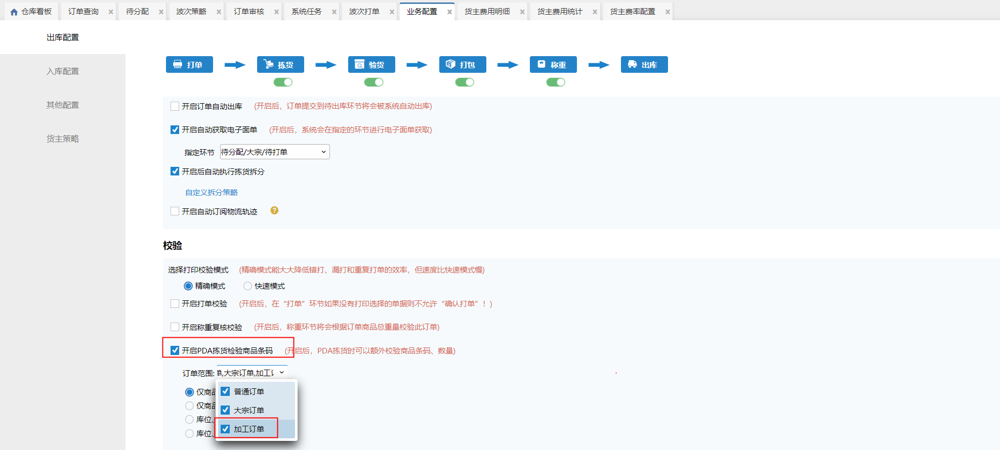
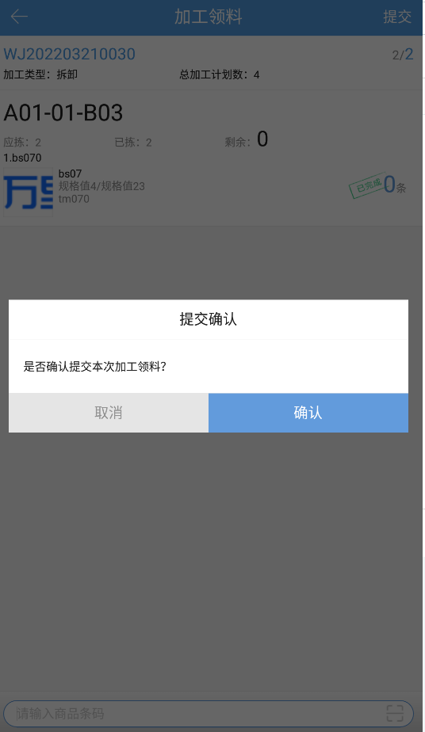

# PDA-加工领料

加工领料可以先对加工单/加工任务进行领料操作，后续再进行加工，将原先的加工拆分成领料+加工两个操作。

01.正常领料操作

第一步：领取加工单/加工任务

进入页面后，支持下拉加载或直接扫描单号领取待领料加工单/加工任务，

若该操作员已领取拣货任务或其他仓加工单/加工任务，领取时报错提示，不允许领取当前加工单；

若该操作员未领取其他任务，则允许领取当前加工单，PC-仓内加工对应加工单领料员=操作员，且在PC上不允许对该加工单进行加工操作，否则报错提示。允许手动解锁任务，解锁后pda上同步解锁。

第二步：拣货

此页面拣货校验逻辑关联业务配置开关，拣货操作和订单拣货一致，支持条码截取：

第三步：提交作业

① 若已拣=0时，允许强制提交，提交后单据作业状态由[待领料]变成[待加工]，原料已拣数量=计划数量，成品实际数量=空，绩效明细报表、绩效统计报表加工领料相关绩效数据+1，按原料计划数量计算：

，

② 若0<已拣<应拣时，有部分提交和强制提交两种选择：

部分提交：提交后单据作业状态由[待领料]变成[待加工]，原料已拣数量=已拣数量，成品实际数量=空，绩效明细报表、绩效统计报表加工领料相关绩效数据+1，按原料已拣数量计算；

强制提交：提交后单据作业状态由[待领料]变成[待加工]，原料已拣数量=计划数量，成品实际数量=空，绩效明细报表、绩效统计报表加工领料相关绩效数据+1，按原料计划数量计算。

③ 若已拣=应拣时，则拣货完成后自动弹出提交窗口，提交后单据作业状态由[待领料]变成[待加工]，原料已拣数量=计划数量，成品实际数量=空，绩效明细报表、绩效统计报表加工领料相关绩效数据+1，按原料计划数量计算。

02.放弃作业

① 若已拣=0时，允许直接放弃，仓内加工，对应加工单领料员清空，PC-操作员任务，解绑该加工单；允许其他操作员领取

② 若已拣>0时，手动放弃任务并确认后转到退料页面，明细为已拣>0的，数量=已拣数量，不可编辑；库位可改。

03.erp关闭加工单

领单后/领料过程中/领料完成后提交前，erp关闭加工单，PDA上能继续拣货，在提交时提示异常，完成后作业状态变成[已关闭]。

> 更新: 2023-12-21 09:57:10  
> 原文: <https://hupun.yuque.com/unzko7/lsbfg0/kdq70u4phe349dna>