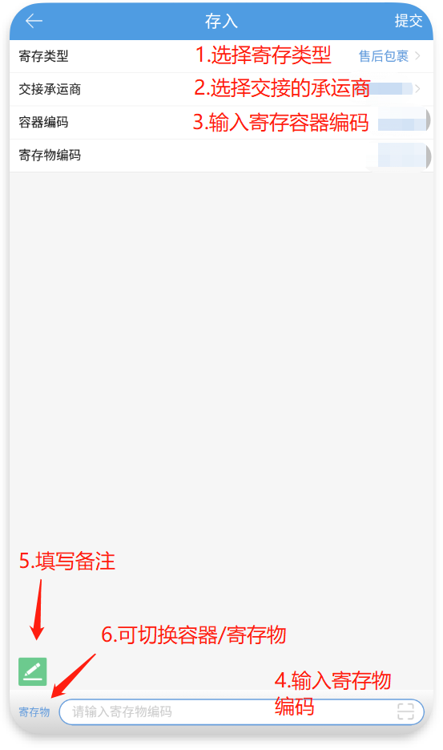
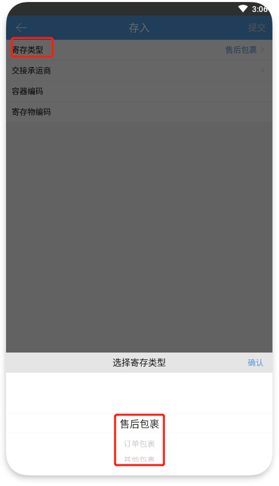
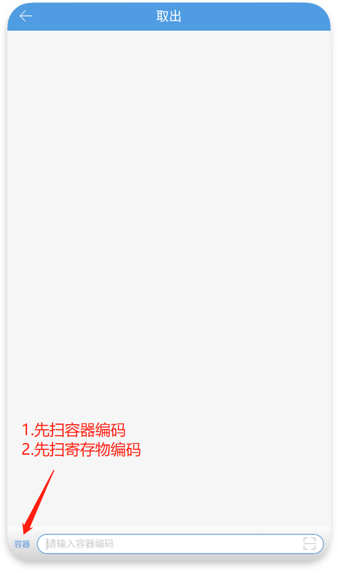

# PDA-容器寄取

01.包裹存入

1.容器寄取类型：售后包裹、订单包裹、其他包裹；其他包裹支持一个容器存入多个寄存物。

2.存入时允许存入多个寄存物的，寄存物进行多行展示。

3.订单包裹需要关联单据，售后包裹和其他包裹可关联单据，也可不关联。

02.包裹取出

1.取出时可以先扫寄存物编码或先扫容器编码。

2.存入多包裹的容器扫描容器后显示多个待取出包裹。

3.扫描寄存物编码取出后进行打标。

> 更新: 2024-03-19 14:31:51  
> 原文: <https://hupun.yuque.com/unzko7/lsbfg0/thoqdu8i2xi2b4vw>