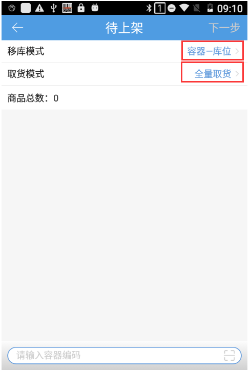
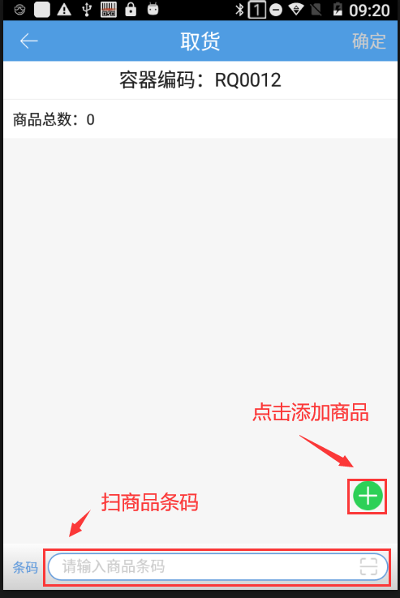
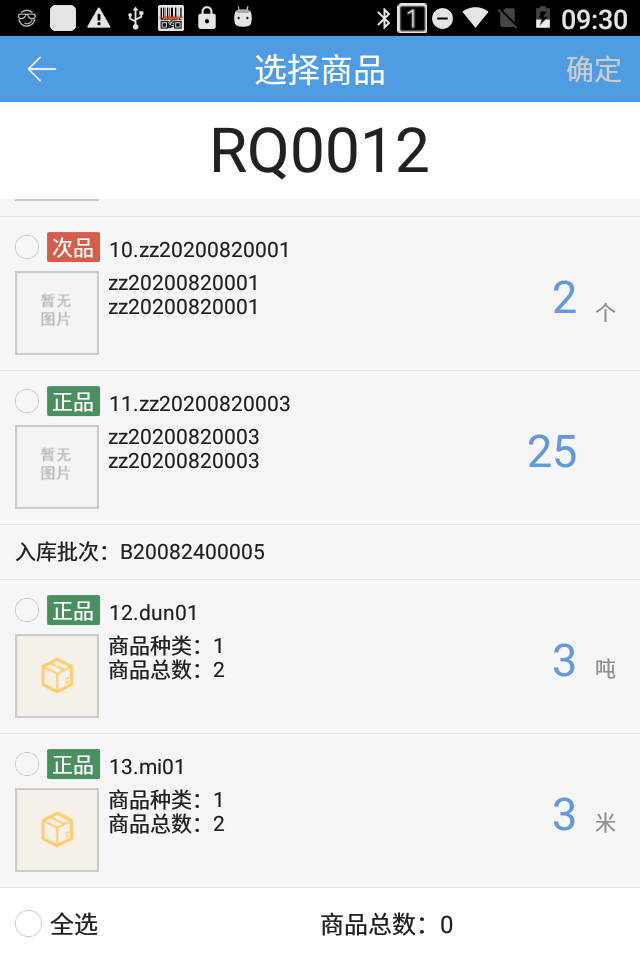
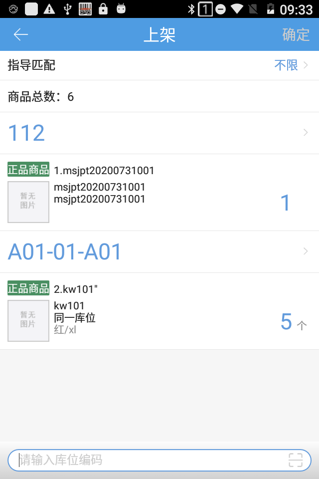
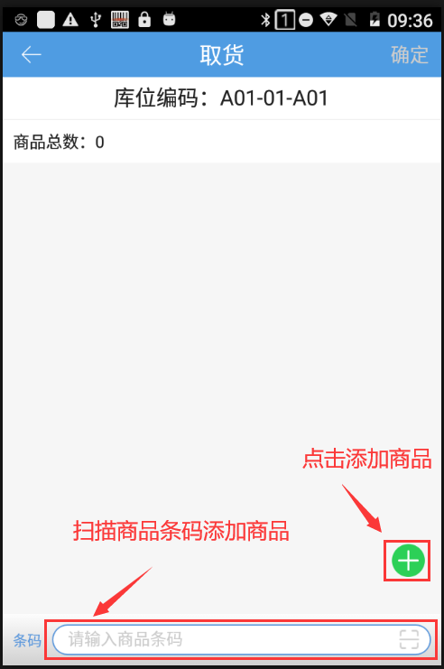
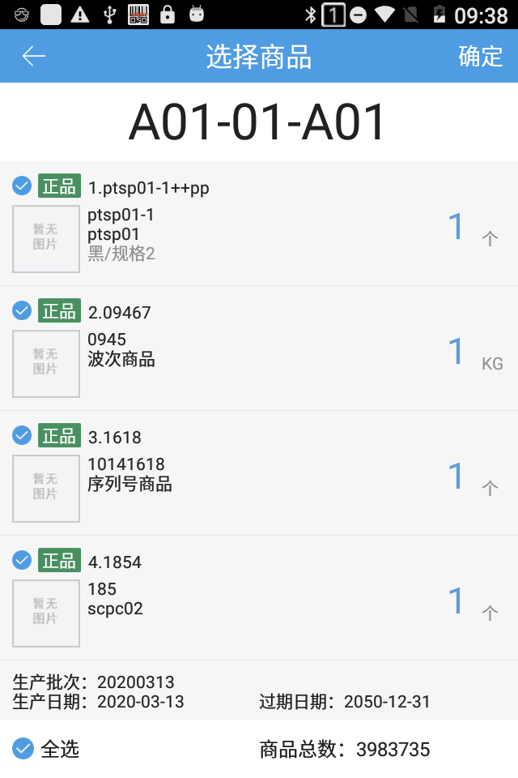
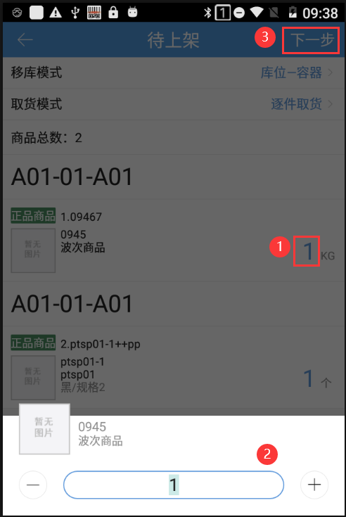
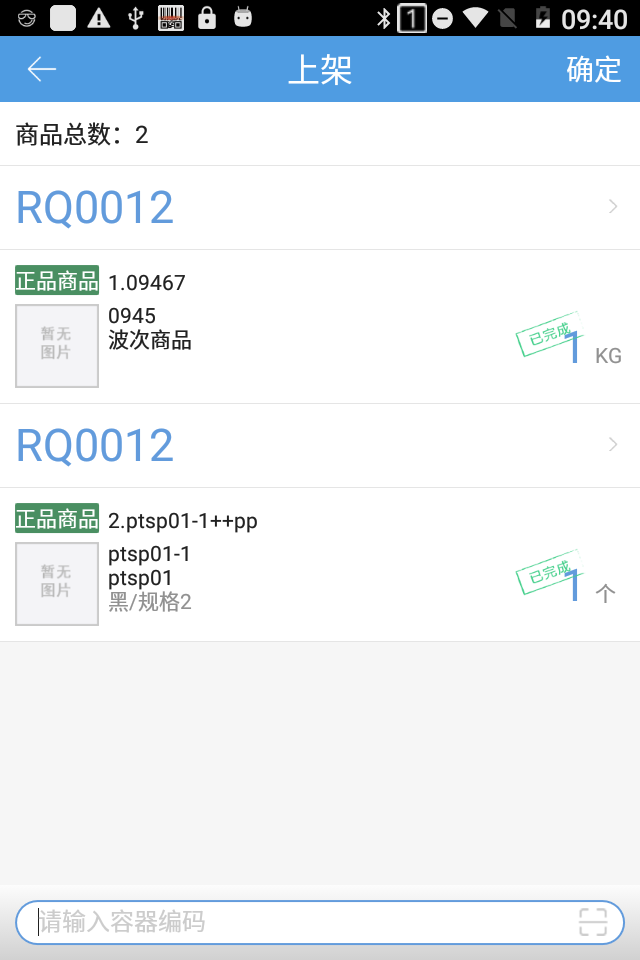
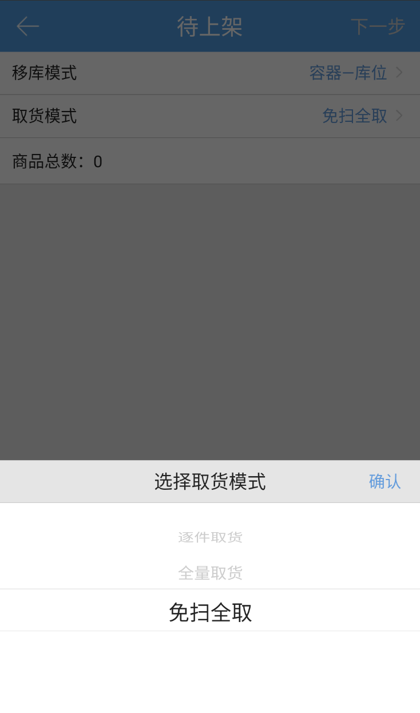

# PDA-容器移库

仓库人员通过扫描周转容器快速找到货品进行上架。

(1)、点击“容器移库”进入容器移库首页，选择移库模式和取货模式。

(2)、移库模式选择容器-库位，扫描容器编码。

(3)、取货页面，可直接扫描商品条码或者点击绿色加号按钮选择当前容器中的商品明细。

(4)、点击选择商品，当前界面显示该库位下所有商品及数量，如有装箱货品则显示货箱编码，勾选需要上架的商品点击确定。

(5)、选择商品后可点击商品数量选择需要上架的数量，再点击确认。

(6)、下一步扫描或输入指导的库位编码完成该库位下对应的商品上架操作。

(7)、移库模式选择库位-容器，扫描库位编码。

(8)、取货页面，可直接扫描商品条码或者点击绿色加号按钮选择当前容器中的商品明细。

(9)、点击选择商品，当前界面显示该库位下所有商品及数量，如有装箱货品则显示货箱编码，勾选需要上架的商品点击确定。

(10)、进入待上架页面，取货模式、上架模式，编辑商品数量，点击下一步。

(11)、进入上架页面，扫描上架的容器，点击确定。

### 取货模式-免扫全取
移库模式：库位-容器，取货模式选择“免扫全取”时，扫描库位编码后，会跳过取货流程，直接跳转到最终【上架】页面，默认显示该库位下所有有库存的商品。省去了中间取货过程，上架更便捷。同理移库模式：容器-库位情况下，扫描容器会将容器内所有有库存的商品带到【上架】页面，可以直接上架到库位。

> 更新: 2026-08-07 17:30:24  
> 原文: <https://hupun.yuque.com/unzko7/lsbfg0/dmfn3bse9lazhubp>