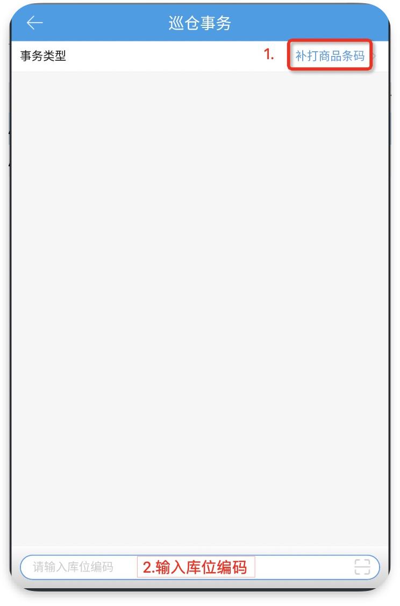
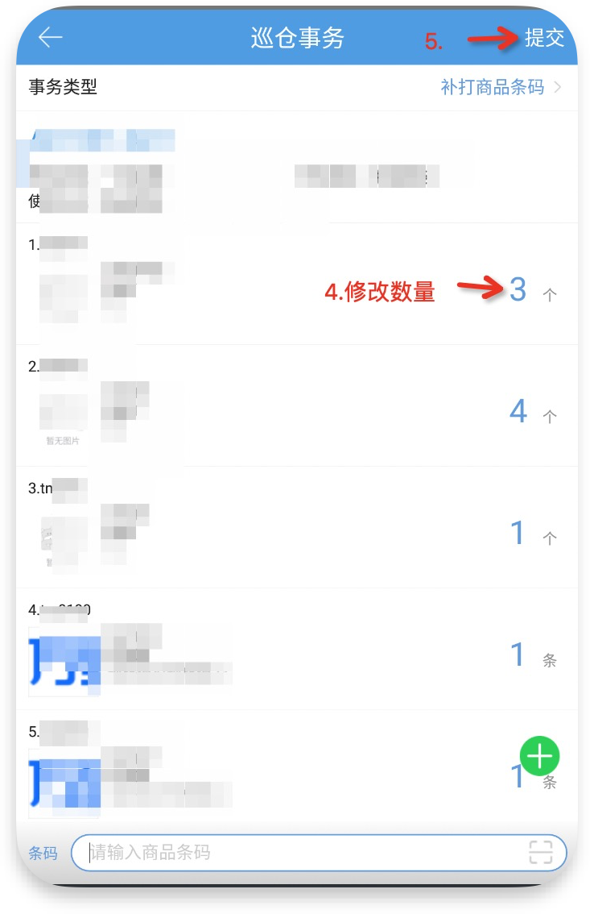
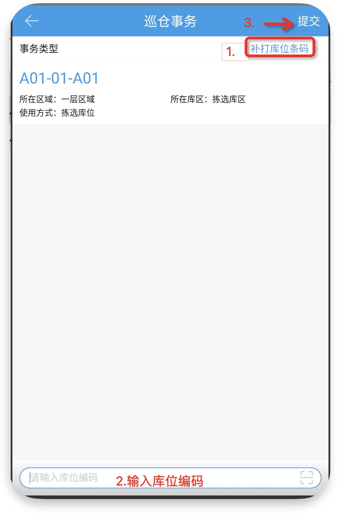

# PDA-巡仓事务

PDA巡仓事务主要用于提交事务数据到PC端，根据PC端配置的事务类型不同，有3种不同的录入方式。

### **01.补打商品条码-数量**

### **02.补打库位条码-无**

### **03.其他-文本**

> 更新: 2023-12-21 09:58:00  
> 原文: <https://hupun.yuque.com/unzko7/lsbfg0/fclshu4i5luk2u1e>