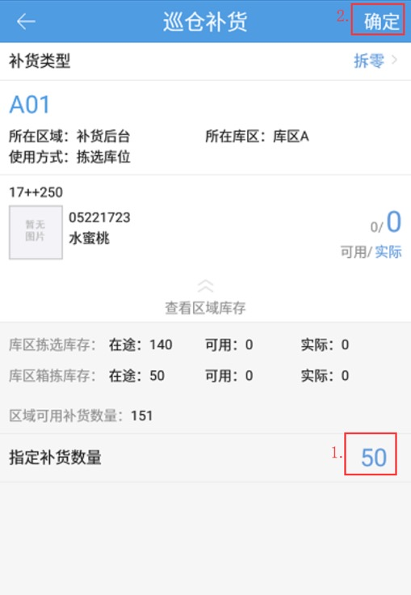

# PDA-巡仓补货

业务背景：巡仓即大型仓库内设定的巡查岗，属于相对传统的巡检方式，在巡仓过程中通过指定库位和商品手动新增补货任务。

点击巡仓补货按钮，选择补货类型后，输入需要补货的拣选库位

 

 

选择需要补货的商品

重要：点击 +号，可以选择当前库位上有库存记录的商品（次品、冻结商品除外），扫描条码可以选择库位上无库存记录的商品（即全仓的商品）

输入需要补货的数量，点击确定，自动生成补货任务

注意：

1.业务配置开启箱规后，按货箱补货，目标库位可以选择箱拣选库位；

2.选择商品，通过条码查询商品支持条码位数截取；

3.巡仓补货任务找来源的顺序为：先在目标库位同库区的存储库位根据库位编码从小到大依次取货，取完本库区的在找相邻库区的存储库位。

4.本库区有库位能满足补货数量时，直接取此库位上的库存。

5.生成的补货任务可以在PC端 补货上架以及pda补货任务中查询领取               

 

> 更新: 2023-12-21 09:28:19  
> 原文: <https://hupun.yuque.com/unzko7/lsbfg0/ts40kdritleeraoi>