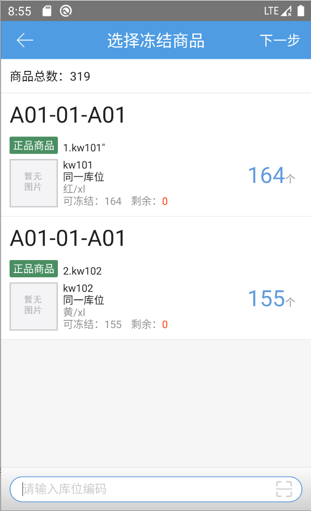
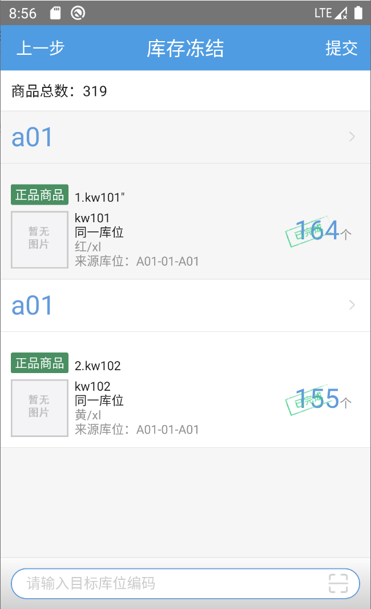

# PDA-库存冻结

当仓库中商品有损坏等情况不能进行出库时，则需要将这些商品进行**冻结**

点击库存冻结按钮，输入需冻结库存的库位编码，选择需要冻结的商品

点击选择需要冻结商品的数量，然后点击下一步，输入冻结商品的目标库位，可根据商品手动选择，也可直接输入库位编码将当前界面的待冻结商品统一指定至目标库位。

提示

1.目标库位不可选择与来源库位相同；

2.异常暂存库位不允许冻结；

3.多货主同商品情况下，同一库位保存报错

 

> 更新: 2023-12-21 09:28:18  
> 原文: <https://hupun.yuque.com/unzko7/lsbfg0/caez0vz5mu4sqs66>