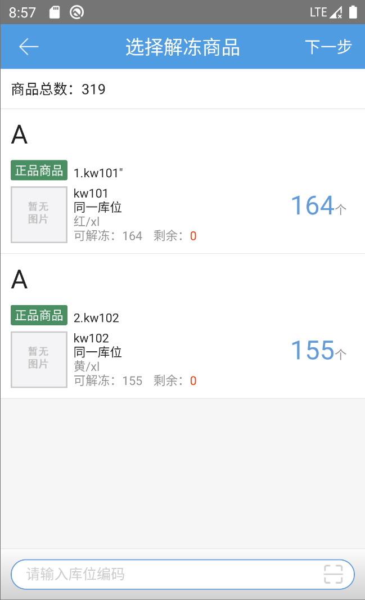

# PDA-库存解冻

当冻结商品进行返修或其他操作后可以贩售了，则需要将商品解冻。

点击库存解冻按钮，输入已有冻结商品的库位编码,显示当前库位冻结商品的情况

修改解冻数量或点击下一步，输入目标库位，点击提交确认。

提示

1.解冻校验同商品多货主不允许保存到相同库位

2.目标库位不可选择与来源库位相同；

3.来源库位没有冻结商品是提示错误

 

> 更新: 2023-12-21 09:28:18  
> 原文: <https://hupun.yuque.com/unzko7/lsbfg0/pvy02ngwye8fzxid>