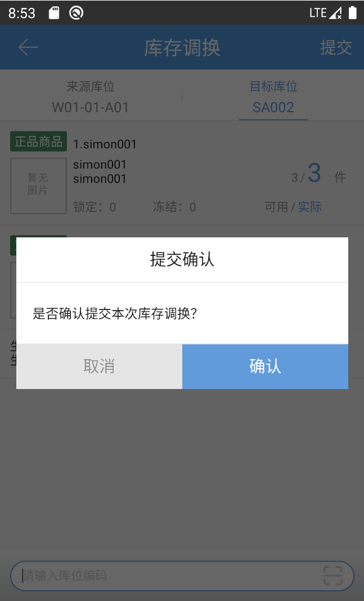

# PDA-库存调换

库存调换功能可使两个库位之间的所有库存互换。

点击库存调换按钮，输入来源库位编码

输入库位编码后当前界面显示所有商品的可用库存和实际库存

点击右上角目标库位切换至输入目标库位界面，该界面显示当前目标库位库存，点击提交确认完成库存调换

提示

1、库存调换是全量调换，除当前库位锁定库存外其余全部调换

2、如来源或目标库位有装箱库存，则无法与拣选库位、预配库位进行调换

 

> 更新: 2023-12-21 09:28:18  
> 原文: <https://hupun.yuque.com/unzko7/lsbfg0/tkn309qosaiuucuw>