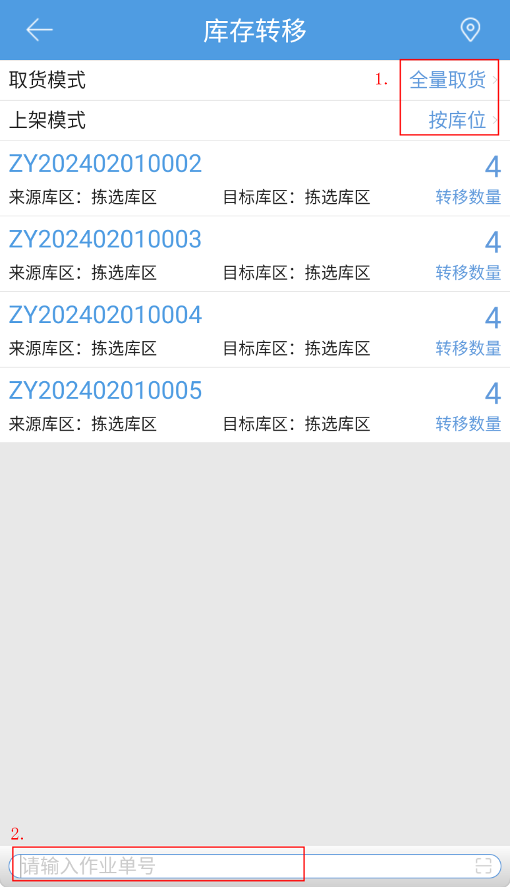
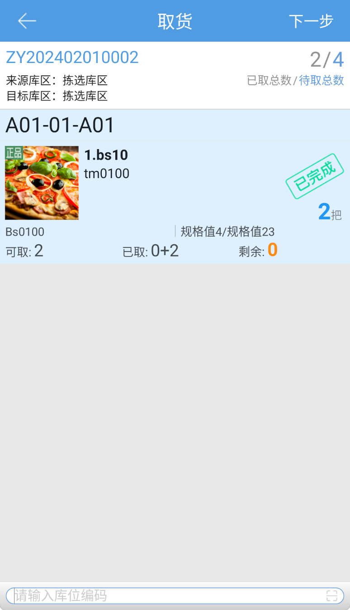
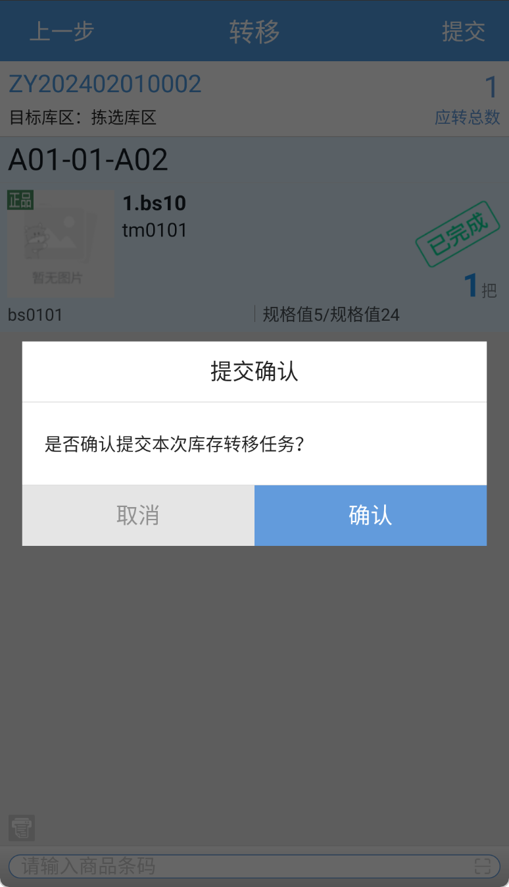

# PDA-库存转移

PC端生成转移任务，用户可以手持pda进行转移。

点击“库存转移”按钮，进入选择转移单页面，选择取货模式、上架模式后，下拉加载转移任务并选择转移任务或者输入作业单号领取转移任务。

#### 1、全量取货+按库位上架
进入取货页面，扫描来源库位或直接编辑商品数量进行取货，取货完成后，点击下一步。

跳转转移页面，扫描目标库位进行转移，点击提交，移库作业完成。

#### 2、逐件取货+按商品上架
领取任务进入取货页面，扫描库位编码跳转取货商品确认页面，扫描商品条码逐件添加取货商品数量，取货完成后点击下一步。

跳转转移页面，扫描需要进行转移的**目标商品条码**

自动跳转到转移页面，扫描商品的目标库位：

完成转移：

①.转移任务中有超过1条明细时，选择任务后，会先跳转到商品选择页面，点击选择其中1个商品进行转移

②.单次转移作业提交后，若当前任务中还存在超过1条明细未作业，会自动跳转到商品选择页面，选择商品后进行转移；若仅1条明细未作业，会返回单据选择页面，重新选择单据后进行作业。

> 更新: 2024-02-01 18:29:05  
> 原文: <https://hupun.yuque.com/unzko7/lsbfg0/gmotxgx247074imu>