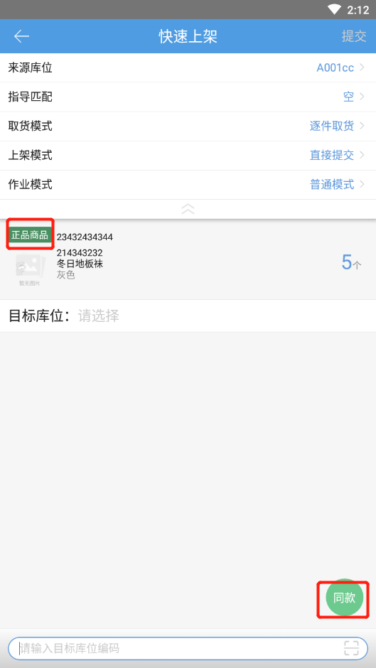
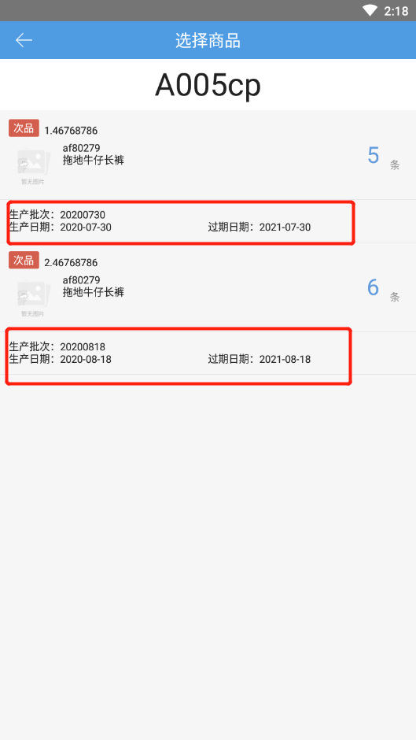
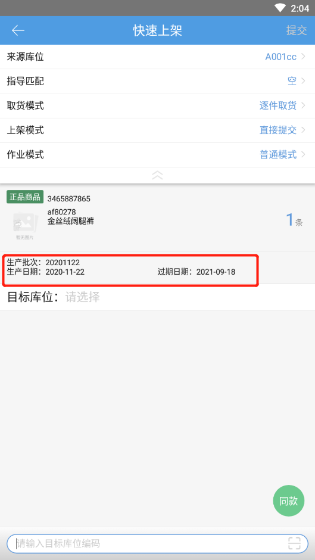

# PDA-快速上架

快速上架可以扫一次上架库位后就不用再次扫，用于快速的上架。

(1)点击“快速上架”，进入快速上架页面，设置取货模式、上架模式、指导匹配、来源库位、作业模式后，扫描商品条码。

提示

①.取货模式，逐件取货是每扫描一次商品，商品数量+1；全量取货是每扫描一次商品，商品数量和该库位上的可用库存一样。

②.上架模式，直接提交是和指导匹配一起用，指导匹配选择不限、拣选库位等有指导出的库位可以直接提交，不需要再次输入目标库位；校验库位是目标库位必须再次输入一次确认；校验库位并自动提交是输入目标库位后不需要手动点击提交按钮，系统自动提交上架。

③.指导匹配，选择空是不指导；选择不限是指导出全仓下有余量、设置了优先库位和历史下架的库位；选择拣选库位是指导出全仓下有余量、设置了优先库位和历史下架的拣选库位；选择存储库位是指导出全仓下有余量、设置了优先库位和历史下架的存储库位；选择预配库位是指导出全仓下有余量、设置了优先库位和历史下架的预配库位；选择过渡库位是指导出全仓下有余量、设置了优先库位和历史下架的过渡库位；

④.作业模式，普通模式是每次都要扫描目标库位；连扫模式是第一次提交成功后自动带出目标库位，带出的目标库位即上一次提交的目标库位，建议和直接提交一起用。

⑤.查询模式切换，底部扫描框默认显示“条码”，若[开启集合码便捷录入](https://hupun.yuque.com/unzko7/lsbfg0/caki7lz4105n2vpg#CKIQO)开关，会显示“集合码”，通过扫描集合码来同时匹配商品条码、生产批次号等多个信息，并取货模式显示明细数量。

(2)扫描目标库位，点击提交。

（3）最新版本支持上架生产批次商品。若生产批次商品库存只有一种批次，带出来的库存显示生产批次信息；若生产批次商品库存有多个批次，扫描商品后会跳转选择商品页面，选择后回到上架页面，带出商品库存信息。

（4）支持左滑删除商品，删除后扫描库位栏变成扫描商品栏。

> 更新: 2024-09-26 15:20:02  
> 原文: <https://hupun.yuque.com/unzko7/lsbfg0/eya6emv5pc5k4xhm>