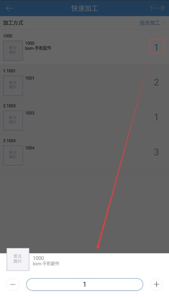
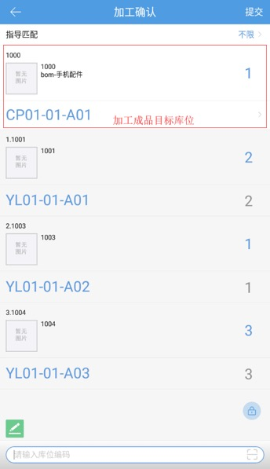
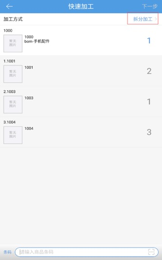

# PDA-快速加工

业务场景：仓库加工作业频繁，随意没有明细计划性，如果由ERP发起加工单就较为麻烦，由PDA根据ERP的BOM规则自动对应成品和原料进行反算，然后生成加工单同步给ERP。

**目前仅支持万里牛ERP对应对接使用**

****

#### 01.组合加工
操作步骤如下：

1.点击快速加工图标，跳转如图页面，加工方式默认组合加工，在底部的扫描框录入成品商品的条码

2.扫描录入成品商品的条码后，根据ERP的BOM规格带出成品、原料商品以及配比数，如图所示：

3.点击成品商品的数量，可以编辑修改商品数量，修改后，原料商品的数据根据配比数自动增减，此处原料商品数量不支持修改。

4.添加完成品，编辑完商品数量后，点击下一步跳转到加工确认页面，系统根据PC端设置的加工单配置指定的原料商品锁定范围自动锁定原料库位，锁定失败后，点击图标在全仓范围内锁库，底部的库位扫描框扫描录入库位编码，加工成品的目标库位自动填充，如图所示：

5.点击提交，加工完成，PC端仓内加工自动生成组合加工单并通知erp，通知erp超时跳转快速加工异常页面，点击重试，重新推送erp，点击跳过，回到快速加工页面，继续快速加工操作，如图所示:

#### 02.拆分加工
 

1.在快速加工页面将作业方式修改为拆分加工，扫描录入成品商品的条码，根据ERP的BOM规格带出成品、原料商品以及配比数，如图所示：

2.点击成品商品的数量，可以编辑修改商品数量，修改后，原料商品的数据根据配比数自动增减，此处原料商品数量不支持修改。

3.添加完成品，编辑完商品数量后，点击下一步跳转到加工确认页面，系统根据PC端设置的加工单配置指定的原料商品锁定范围自动锁定BOM规则中成品商品的库位，锁定失败后，点击图标在全仓范围内锁库，底部的库位扫描框扫描录入库位编码，BOM中原料的库位由上到下依次填充，如图所示：

4.点击提交，加工完成，PC端仓内加工自动生成拆分加工单并通知erp。

提示：

1.快速加工为后台开关，需要找wms技术开启，仅对万里牛ERP直连有效；

2.快速加工扫描的商品要实现在ERP进行仓储商品同步；

3.快速加工仅支持普通商品，BOM规则中成品为序列号商品、生产批次商品的扫描报错；

4.快速加工扫描的是成品，扫描BOM规则中的原料报错提示；

5.加工确认页面，修改成品商品数量，原料商品数量不再根据配比数增减；

6.加工确认页面，原料商品数量支持修改，修改单个原料的数量后不影响成品、其他原料的数量；

7.快速加工原料的库存扣减是在提交加工单时扣减；

8.PC上业务配置开启验货商品条码截取，pda会自动生效。若截取条码前3位，商品条码是new0001，则pda只需要扫描条码new即可。                    

 

> 更新: 2026-05-14 11:04:32  
> 原文: <https://hupun.yuque.com/unzko7/lsbfg0/cxhqadbmygsab6mq>