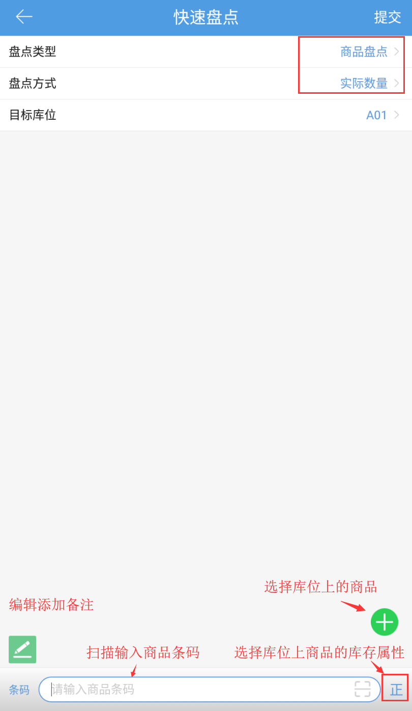

# PDA-快速盘点

快速盘点是日常仓内作业中最灵活的一种盘点方式，具有随意性、便捷性的特征。

快速盘点分为商品盘点和库位盘点两种类型

商品盘点：盘点时以商品为维度仅盘点指定库位下的该商品数量，库位其余商品不做盘点

库位盘点：盘点指定库位内所有商品。

点击快速盘点，选择盘点类型和盘点方式

盘点方式分为

实际数量：即盘点得出的数量

增加数量：再原有库存基础上增加的数量

减少数量：在原有库存基础上减少的数量

1.点击页面上的跳转选择商品页面，可快速选择库位上的商品

2.商品属于多个货主，盘点时需先选择商品的货主

3.生产批次商品盘点时，需选择/录入商品的批次

4.业务配置开启次品管理，盘点前需先选择商品的正/次 库存属性

5.盘点完成后点击提交按钮即实时改变当前盘点的库存。

6.差异提醒

开启后在盘点过程中，若有商品实际盘点数量超过当前库位上的实际数量、或新增了商品时，会有异常提示，不影响作业：

完成盘点后点击提交，会跳转到盘点差异页面，显示与实际库存有差异的明细，点击提交后，盘点成功：

 

> 更新: 2024-03-14 17:13:39  
> 原文: <https://hupun.yuque.com/unzko7/lsbfg0/oqepvoeiyednmz7q>