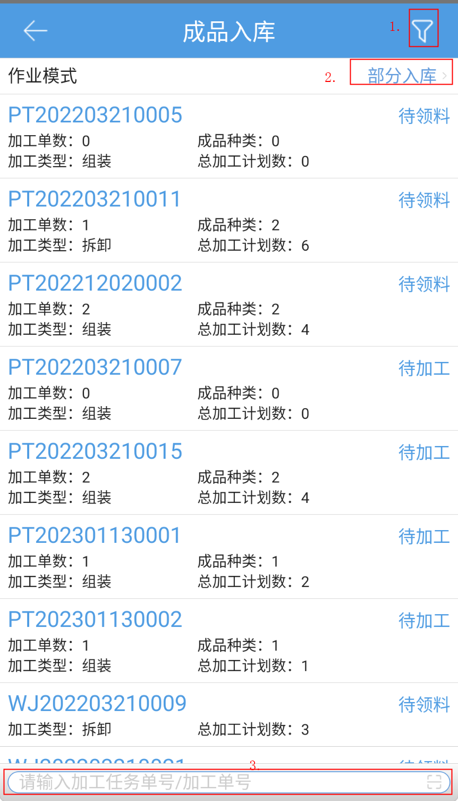

# PDA-成品入库

成品入库，具体操作步骤如下。

1、筛选条件，选择作业模式（部分入库/全部入库），选择或扫描加工任务单号/加工单号，匹配到对应加工单据。

筛选条件：

2、作业模式选择部分入库时，在成品入库页面选择加工任务单后，会跳转到选择加工单页面进行选择，再跳转到加工确认页面：

3、作业模式选择全部入库时，在成品入库页面选择加工任务单后，会直接跳转到加工确认页面，分区域显示成品和原料明细：

4、输入成品数量后，会按照配比自动带出原料数量，点击提交并确认，加工单完成。

注意：入库批次商品不支持加工

> 更新: 2024-02-06 16:38:10  
> 原文: <https://hupun.yuque.com/unzko7/lsbfg0/hhhansqgyeaifia8>