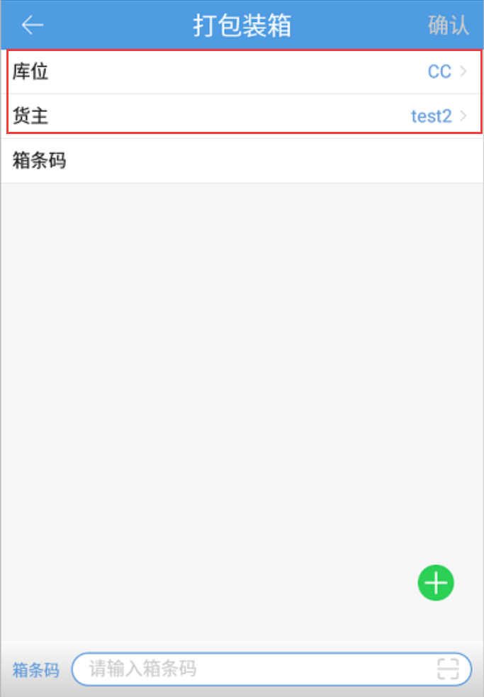

# PDA-打包装箱

PDA支持将仓库内的商品装箱存放，此处商品装箱是唯一箱。

首先选择需要装箱的商品所在库位，不能选择拣选、预配、次品库位；开启3PL的公司需要选择货主。

然后扫描货箱的箱条码后，添加装箱商品后，点击确认（F2），装箱成功。

注意：

1.扫描的箱条码需符合系统中唯一箱的条码规则：XH开头+11位数字；

2.支持扫描条码和点击 + 添加商品；

3.生产批次商品、入库批次商品不能与其他商品混装；

4.普通商品支持多种商品混装箱；

> 更新: 2023-12-21 09:28:19  
> 原文: <https://hupun.yuque.com/unzko7/lsbfg0/yd9g36qbgzhvkt0a>