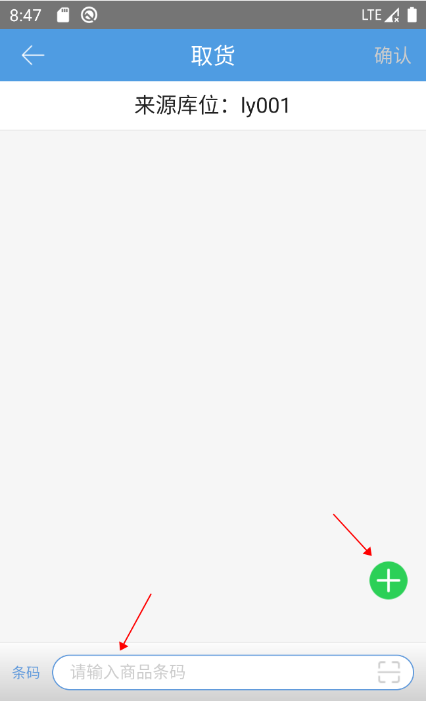
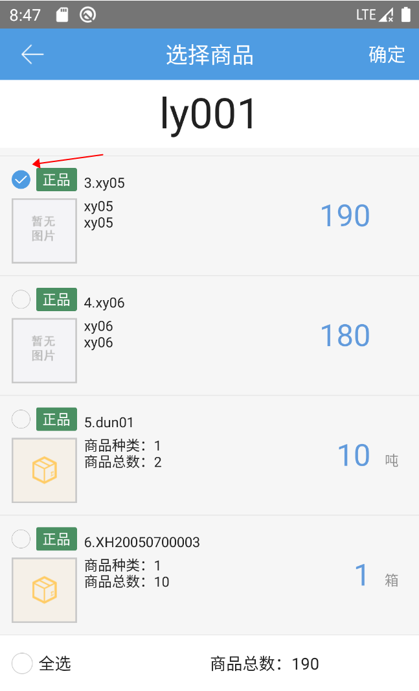
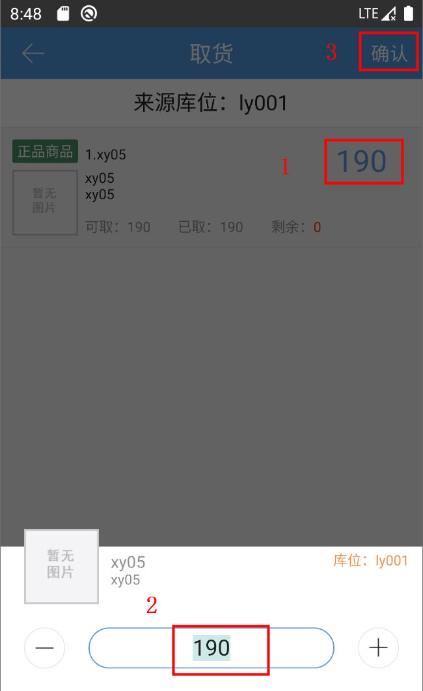

# PDA-指导上架

指导上架是为了将过渡或收货库位的货品移动上架至存储或拣选库位而设定

点击指导上架按钮，先输入待上架货品的来源库位。

输入来源库位后可直接扫描商品条码或者点击绿色加号按钮选择当前库位下商品明细

点击选择商品，当前界面显示该库位下所有商品及数量，如有装箱货品则显示货箱编码，勾选需要上架的商品点击确定

选择商品后可点击商品数量选择需要上架的数量，再点击确认

下一步扫描或输入指导的库位编码完成该库位下对应的商品上架操作。

提示

1、指导库位可选择库位属性，根据所选库位属性查找匹配的库位

2、指导库位匹配原则，依次检查批次号、库存冻结情况、有无库存、有无库存记录、有无历史记录进行查找，所有匹配条件都不满足，系统返回空值。

 

> 更新: 2023-12-21 09:28:17  
> 原文: <https://hupun.yuque.com/unzko7/lsbfg0/dbzklb17ve2l22nx>