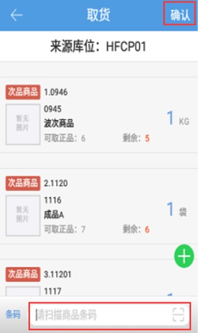

# PDA-次品转正

当残次商品进行返修或其他操作后可以贩售了，则需要将这些商品**转为正品**；

**正次转换模块需要给操作员配置页面权限后可见。**

点击次品转正图标，输入需要转正库存的库位编码，选择需要转正的商品

点击下一步，跳转选择目标库位页面，扫描输入存放正品的目标库位编码后，点击提交，完成商品转正。

注意：

1. 开启3pl的公司一次只能选择一个货主的商品进行转正。

2. 次品转正只能选择库位上商品的次品库存。

3. 同一个商品的正品和次品不能存放在同一个库位，选择目标库位有转正商品的次品库存时，提交时会报错。

4.次品库位不能存放正品库存所以商品转正，目标库位不能选择次品库位。       

5.关联仓库配置->开启次品审核，开启后，生成单据状态为待审核，需在PC端确认审核即可完成单据。

          

 

 

> 更新: 2024-09-10 15:08:09  
> 原文: <https://hupun.yuque.com/unzko7/lsbfg0/wgkufqowpd6tqghg>