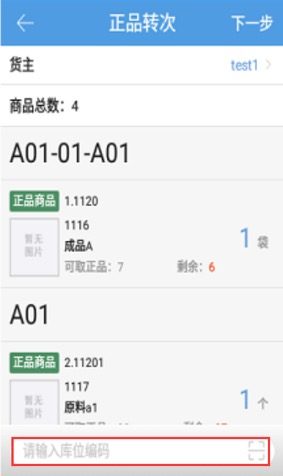
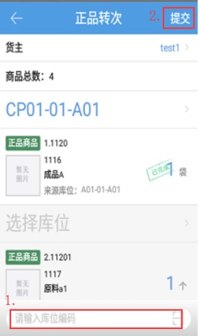

# PDA-正品转次

当入库或仓内作业发现商品有损坏等情况不能进行出库时，则需要将这些商品库**转成次品**

**正次转换模块需要给操作员配置页面权限后可见。**

点击正品转次图标，输入需要报次库存的库位编码，选择需要报次的商品

点击下一步，跳转选择目标库位页面，扫描输入存放次品的目标库位编码后，点击提交，完成商品报次。

注意：

1. 开启3pl的公司一次只能选择一个货主的商品进行报次。

2.正品转次只能选择库位上未锁定、未冻结的拆零正品库存。

3.同一个商品的正品和次品不能存放在同一个库位，选择目标库位有报次商品的正品库存时，提交时会报错。

4.选择序列号商品报次时，需要录入商品的序列号。

5.可以在原库位上转次，所选商品需要全部报次。

6.目标库位设置不允许货品混放后，报次时，库位上有其他商品时，会报错。             

 7.关联仓库配置->开启次品审核，开启后，生成单据状态为待审核，需在PC端确认审核即可完成单据。

> 更新: 2024-09-10 15:07:54  
> 原文: <https://hupun.yuque.com/unzko7/lsbfg0/ya5r2tl1n30vetyt>