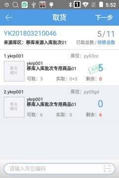
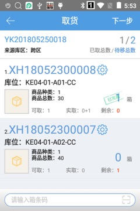
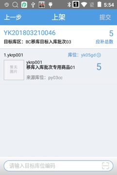

# PDA-移库任务

支持领取pc生成的跨区域移库任务。

01.   取货页面，取商品，扫描库位可取货库位下的所有商品。取箱子，扫描箱条码即取货一个箱子。

取商品：

取箱子：

02.   上架页面，拆零的商品，扫描目标库位即上架成功。箱子上架时，若箱子的目标库位有多个，扫描目标库位后需要跳转确认箱子页面，保证箱子上架到库位上的箱子是正确的。

注意：任务同来源库位同商品但是目标库位不同，取货时会合并在同一个库位下取货，上架时再拆分上架。同理不同来源的同商品，目标库位相同，上架页面明细合并。

 

 

> 更新: 2023-12-21 09:28:18  
> 原文: <https://hupun.yuque.com/unzko7/lsbfg0/dntehhumbel832r7>