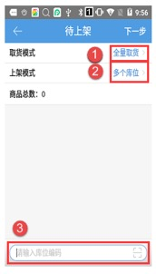
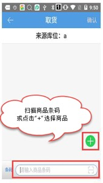
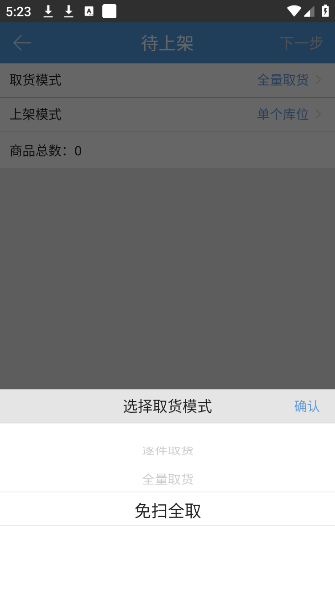

# PDA-自由上架

自由上架一般用于商品在异常暂存库位上架到库位上。

(1) 点击“自由上架”，进入待上架页面，选择取货模式、上架模式和扫描库位，点击下一步。

(2) 进入取货页面，扫描待上架的商品条码或者点击“+”选择上架的商品，点击确认。

(3) 进入待上架页面，取货模式、上架模式，编辑商品数量，点击下一步。

(4) 进入上架页面，扫描上架的库位，点击提交。

(5) 若在待上架页面上架模式选择了多个库位，在上架页面，选择商品左划，拆出一条明细，上架到多个库位上。

### 取货模式-免扫全取
取货模式选择“免扫全取”时，扫描库位编码后，会跳过取货流程，直接跳转到最终【上架】页面，默认显示该库位下所有有库存的商品。省去了中间取货过程，上架更便捷。

 

> 更新: 2026-08-07 17:26:20  
> 原文: <https://hupun.yuque.com/unzko7/lsbfg0/npvqc9ztus6ppd8c>