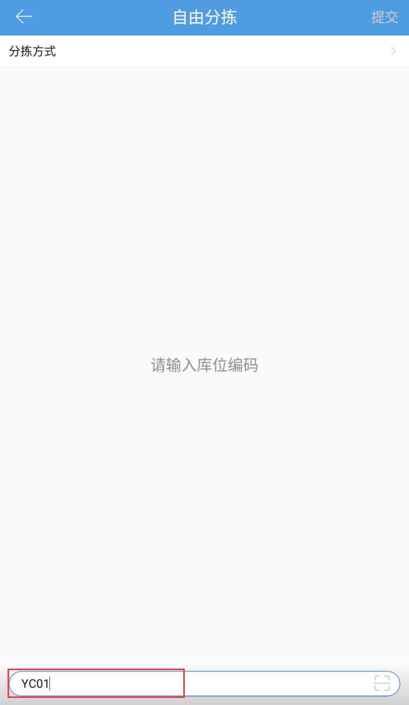
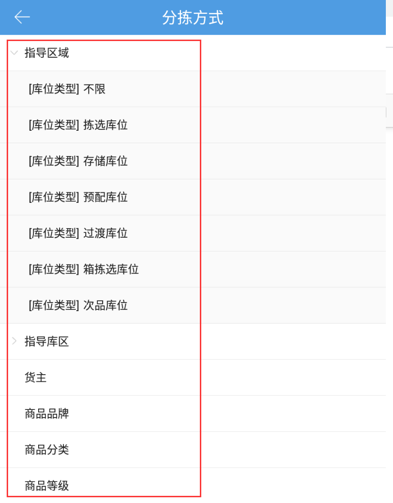
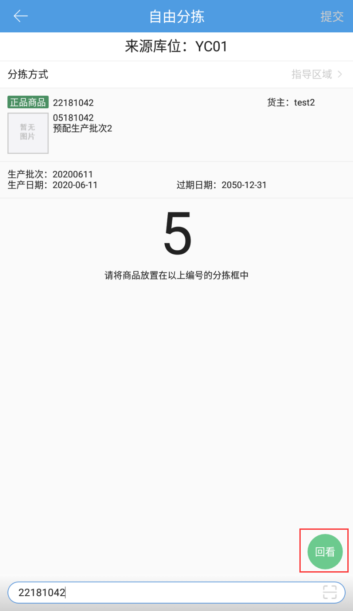

# PDA-自由分拣

库位上销售退货的商品种类繁多，重新上架需要先将库位上的商品根据条件进行分类，然后集中上架，以避免上架过程中过多来回无效跑动。

自由分拣功能，操作如下：

###### 1.确定需要分拣的商品跟库位
扫描需要进行分拣的来源库位

###### 2.选择分拣的方式
分拣方式=分拣分类遵照的规则

现支持：指导区域/指导库区/货主/商品品牌/商品分类/商品等级6种分拣方式

选择分拣方式后，后台计算当前库位上的商品可分为X种，提示需要X个分拣框。

请根据系统提示，准备好拣货筐，然后点击确认开始分拣。

如果框不够或者条件选择错误，点击取消可以重新选择分拣方式。

###### 3.开始分拣
扫描库位上的商品条码，提示将商品放置在Y号分拣框中，支持回看上次的分拣结果，库位上的商品全都扫描后，点击右上角的提交按钮，完成分拣。

###### 注意事项
1.开启播种验货语音播报后，自由分拣扫描商品后会语音播报商品将要放置的筐号

2.扫描商品开启分拣后，分拣方式不支持中途修改

3.根据指导区域、指导库区进行分拣，可以选择指导上架的库位类型

4.系统配置开启条码截取后，开始分拣扫描商品条码时，也支持条码截取

> 更新: 2024-10-31 15:04:51  
> 原文: <https://hupun.yuque.com/unzko7/lsbfg0/usew97o4ngb1k855>