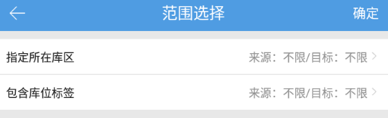
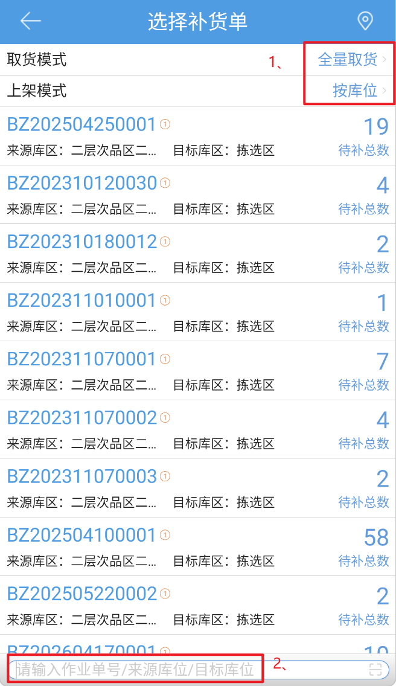
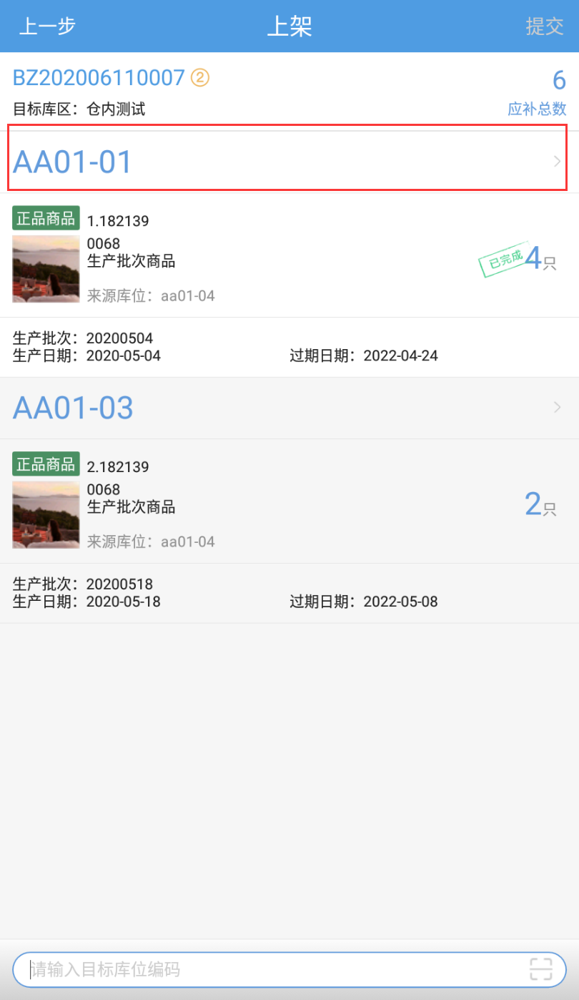
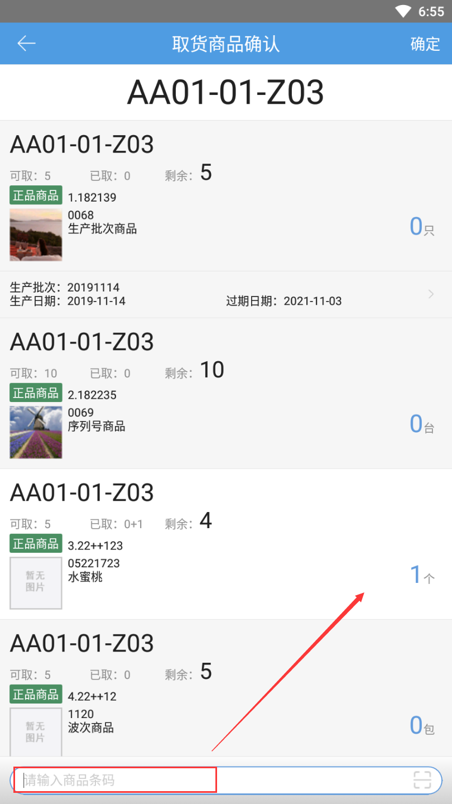
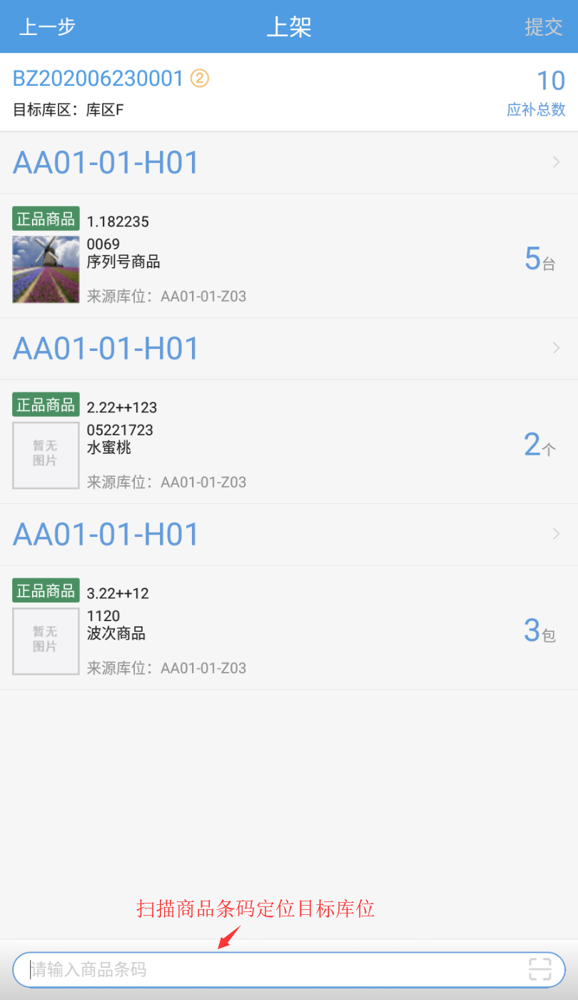
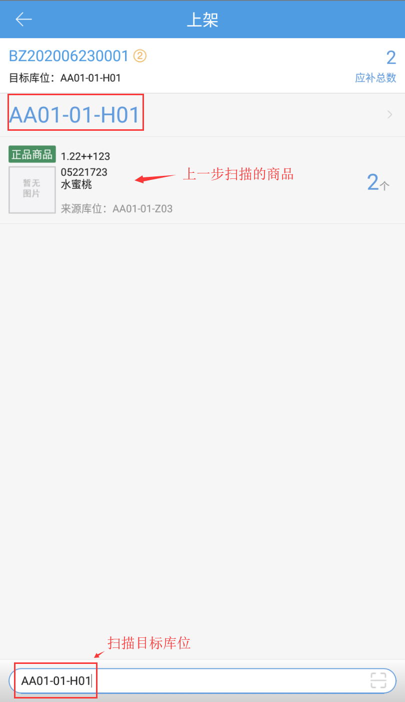
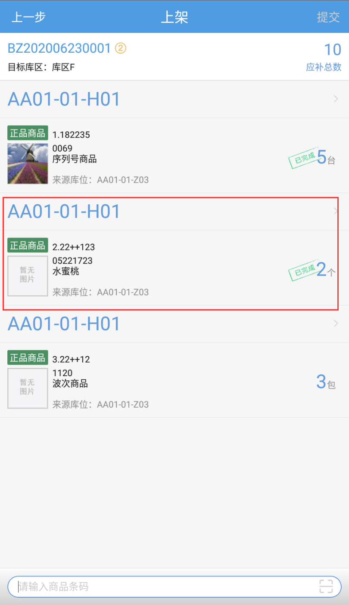
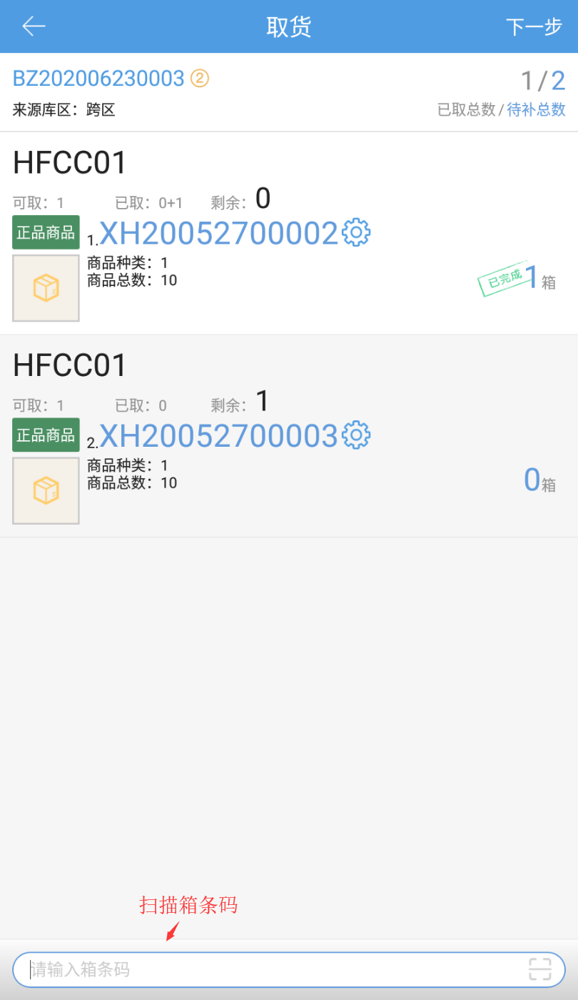
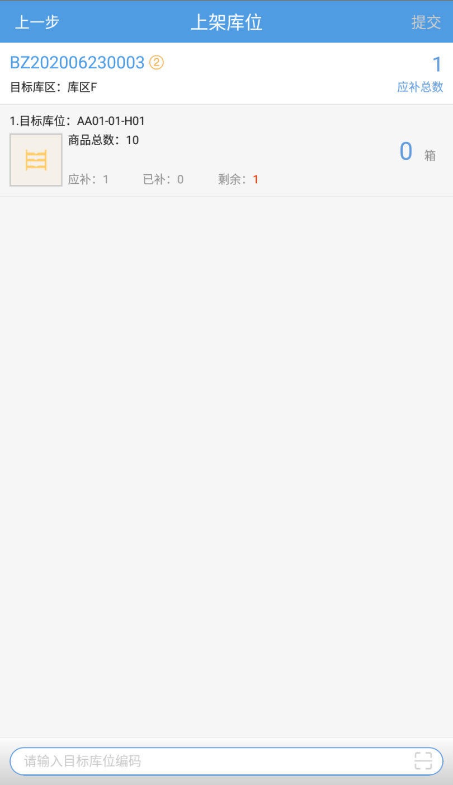
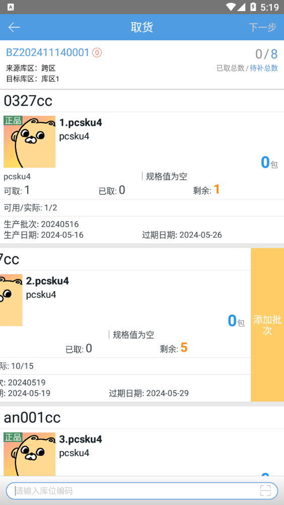

# PDA-补货任务

PC端生成补货任务，用户可以手持pda进行补货。

### 01.补货任务筛选
点击右上角：

a.指定所在库区：支持选择来源/目标库区，仅支持单选。

b.包含库位标签：

+ 数据来源：PC仓库库位->标签维护
+ 不选或全选时显示不限
+ 支持选择来源/目标库位标签，支持多选。

库位标签满足条件：任务中来源/目标所在库位均在设定的库位标签所查询到的库位范围内。

c.指定所在库区、包含库位标签为“且”逻辑关系。

### 02.零散-补货上架
 点击“补货任务”按钮，进入选择补货单页面，选择取货模式、上架模式后，下拉加载补货任务并选择补货任务或者输入作业单号/来源库位/目标库位领取补货任务

#### 1、全量取货+按库位上架
进入取货页面，扫描来源库位或直接编辑商品数量进行取货，取货完成后，点击下一步。

跳转上架页面，扫描目标库位进行上架，点击提交，补货上架完成。

①.操作员拥有超补权限后，补货上架可以超补，在取货页面直接编辑商品的数量，系统自动计算超补数

②.上架时支持修改目标库位，上架页面，点击库位，跳转选择库位页面，扫描新的上架库位即可

#### 2、逐件取货+按商品上架
领取任务进入取货页面，扫描库位编码跳转取货商品确认页面，扫描商品条码逐件添加取货商品数量，取货完成后点击下一步

跳转上架页面，扫描需要进行上架的**商品条码**

自动跳转到单商品上架页面，扫描商品的目标库位

完成上架

### 03.货箱-补货上架
(1) 点击“补货任务任务”按钮，进入选择补货单页面，下拉加载补货任务并选择补货任务或者输入作业单号。

(2)  进入取货页面，扫描来源库位或直接编辑商品数量进行取货，取货完成后，点击下一步。

(3) 进入上架库位页面，扫描目标库位，点击下一步。

(4) 进入上架页面，点击提交，提交补货上架。

### 04.添加其他批次
1.操作员有超补权限即拆零批次sku左滑显示添加批次。

2.支持添加补货单外的同库位同sku其他批次，当前批次库存可用数量>=1即添加锁定成功，否则报错。

3.添加批次后PC端补货单对应显示新增批次数据，新增批次支持删除，其他操作逻辑同原有明细。

注：新增批次取货数量不关联外部取货模式。

> 更新: 2026-04-20 18:31:00  
> 原文: <https://hupun.yuque.com/unzko7/lsbfg0/in5ghg3ufgoqx842>