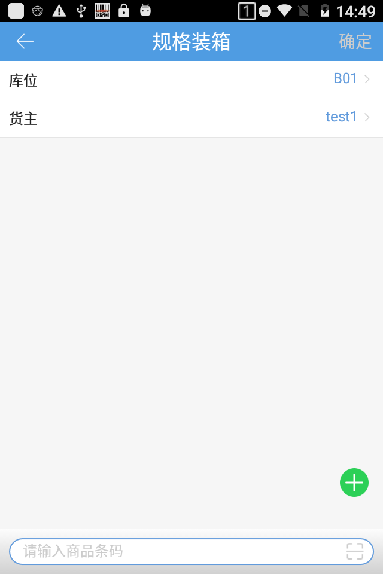
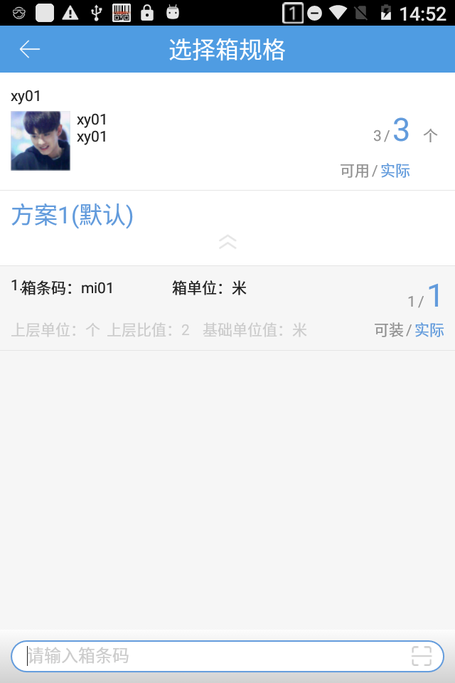
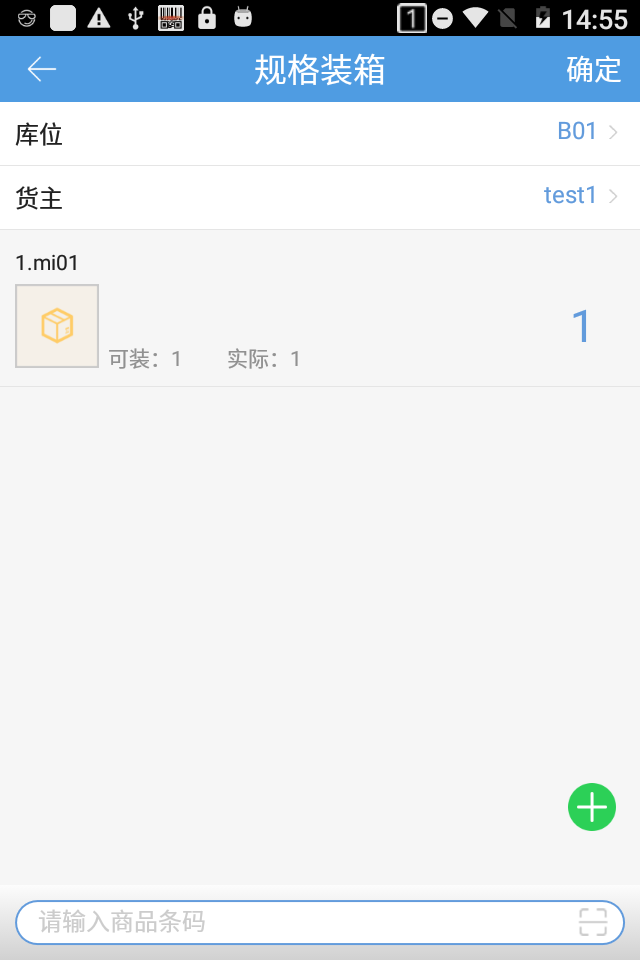

# PDA-规格装箱

PDA支持将仓库内的商品装规格箱存放。

首先选择需要装箱的商品所在库位，不能选择拣选、预配、次品库位；开启3PL的公司需要选择货主。

然后选择商品或扫描商品，跳到选择箱规格页面。

选择箱规格后，返回规格装箱页面，编辑装箱数量，点击确定装箱成功。

注意：

1若扫描的商品未设置装箱规格则提示商品没有设置装箱规格，不允许装箱。

2.若扫描生产批次商品提示生产批次商品，不允许装箱。

3.选择箱规格页面显示的箱规格是小于可用数的且只支持单选，

例如可用数20，

方案1：1包=10个，1箱=2包=20个

方案2：1车=100个

选择箱规格页面上只显示方案1。

> 更新: 2023-12-21 09:28:19  
> 原文: <https://hupun.yuque.com/unzko7/lsbfg0/fek1h2rvs5x098yo>