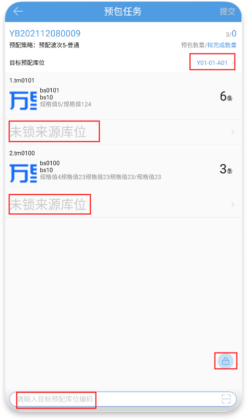

# PDA-预包任务

预包任务适用于以预包为主的仓库，根据子商品配比数量和计划预包数量计算预打包数量，并预包任务适用于以预包为主的仓库，根据子商品配比数量和计划预包数量计算预打包数量，并支持单独统计预包绩效。

01.领取任务并作业

在PC上创建任务单后，可以在PDA上领取任务并作业:

其中：

(1)领取任务有两种方式：页面下拉加载、扫任务单号匹配

(2)页面下拉加载显示的任务单是待作业状态的单据

(3)领取任务后，单据变成[作业中]状态，其他人不能领取该任务

(4)领取任务后放弃，单据变成[待作业]状态，其他人可以领取该任务

领取任务后，进入任务单详情页面，锁定来源库位后点击提交即可完成任务：

其中：

(1)预包数量=任务单计划预包数量，若有部分完成的成品，则预包数量=剩余预包数量

(2)拟完成数量=本次锁定的子商品数量可以组成的成品数量

(3)目标预配库位：用于指定成品存放的目标库位，默认选中所属预配波次中的第一个预配库位，可以手动点击修改或扫描匹配

(4)未锁来源库位：用户锁定子商品的来源库位，默认不显示，可以手动指定或一键锁定

(5)来源库位一键锁定范围：除箱拣选、工位、次品、货箱库存；手动指定库位范围：除预配、箱拣选、工位、次品、货箱库存

(6)子商品明细锁库时，若指定库位可用库存<计划数量，指定锁库后会自动拆出一个同规格未锁明细，数量=计划数量-已锁数量

02.无完成数量

部分明细已锁、部分明细未锁、无拟完成数量时点击提交，不会影响预包任务完成数量及明细数据，系统会生成一个移库单:

支持单独统计预包绩效。

01.领取任务并作业

在PC上创建任务单后，可以在PDA上领取任务并作业:

其中：

(1)领取任务有两种方式：页面下拉加载、扫任务单号匹配

(2)页面下拉加载显示的任务单是待作业状态的单据

(3)领取任务后，单据变成[作业中]状态，其他人不能领取该任务

(4)领取任务后放弃，单据变成[待作业]状态，其他人可以领取该任务

领取任务后，进入任务单详情页面，锁定来源库位后点击提交即可完成任务：

其中：

(1)预包数量=任务单计划预包数量，若有部分完成的成品，则预包数量=剩余预包数量

(2)拟完成数量=本次锁定的子商品数量可以组成的成品数量

(3)目标预配库位：用于指定成品存放的目标库位，默认选中所属预配波次中的第一个预配库位，可以手动点击修改或扫描匹配

(4)未锁来源库位：用户锁定子商品的来源库位，默认不显示，可以手动指定或一键锁定

(5)来源库位一键锁定范围：除箱拣选、工位、次品、货箱库存；手动指定库位范围：除预配、箱拣选、工位、次品、货箱库存

(6)子商品明细锁库时，若指定库位可用库存<计划数量，指定锁库后会自动拆出一个同规格未锁明细，数量=计划数量-已锁数量

02.无完成数量

部分明细已锁、部分明细未锁、无拟完成数量时点击提交，不会影响预包任务完成数量及明细数据，系统会生成一个移库单:

> 更新: 2023-12-21 09:59:22  
> 原文: <https://hupun.yuque.com/unzko7/lsbfg0/zd53hqa0ziurehif>