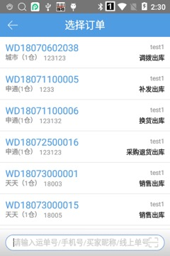
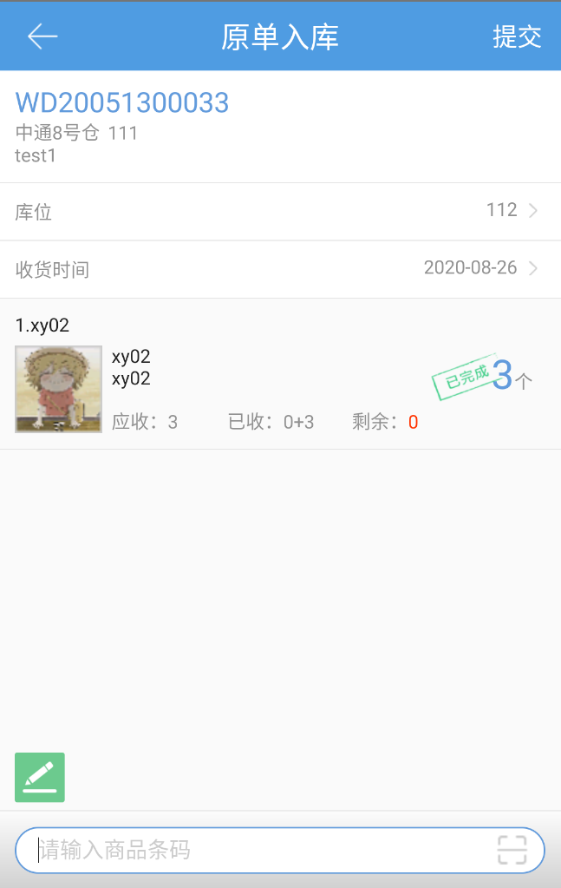

# PDA-原单入库

从仓库销售出库的订单，扫描运单号/手机号/卖家昵称/线上单号中的任意一项可以原单入库。

单据只能原单入库一次。

若单据建立了售后单且状态为未完成或者已完成，该单据不能再原单入库。

**01.****扫描的信息匹配到多个订单**

页面显示所有匹配到的订单，点击单据后进入入库页面。

 

**02.****扫描的信息匹配到一个订单**

直接进入入库页面，商品数量自动验货完毕，选择库位后可提交。

注：订单中的序列号商品会自动填写之前出库登记的序号，生产批次商品会自动填写之前出库的生产批次号。

 

PS.1 支持上传图片，上限为10张

> 更新: 2026-07-08 16:29:34  
> 原文: <https://hupun.yuque.com/unzko7/lsbfg0/tbz25eqr0g5lzety>