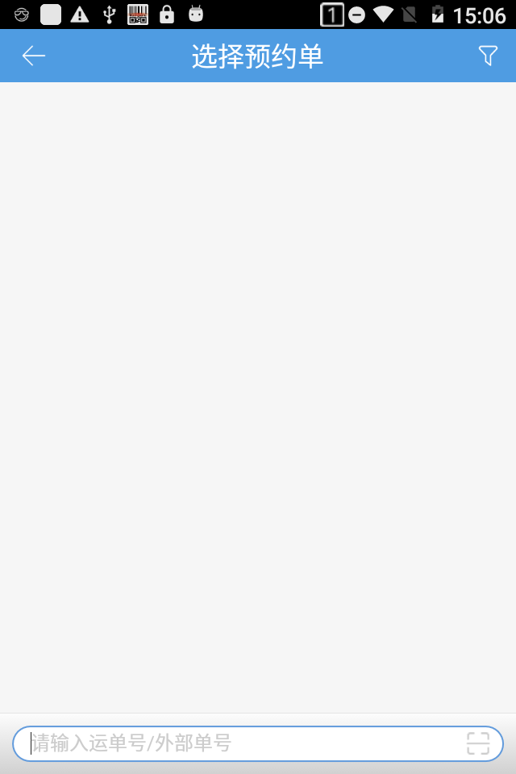
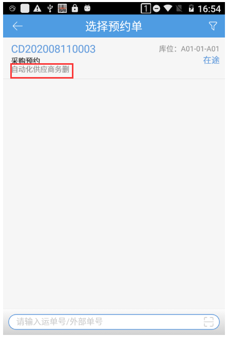
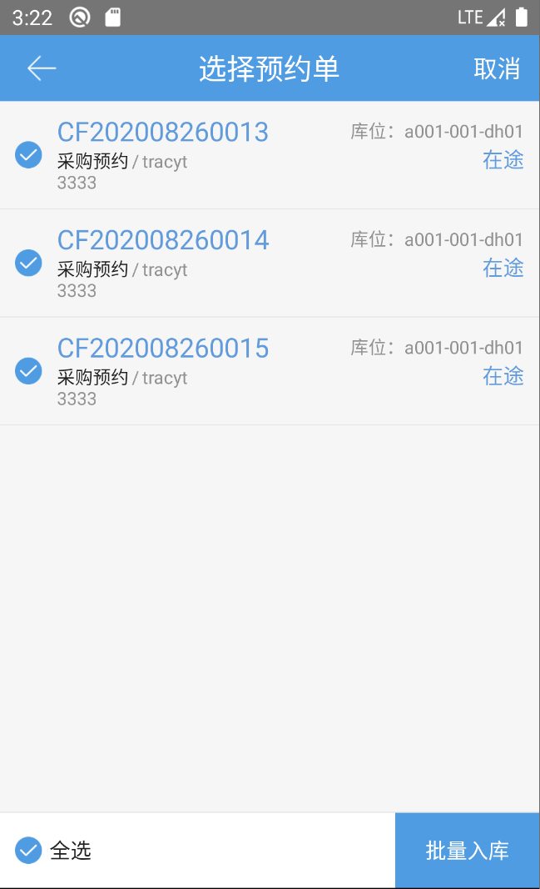
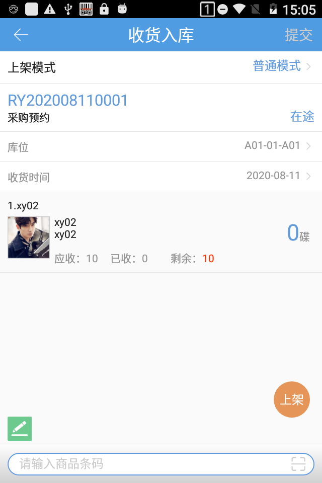
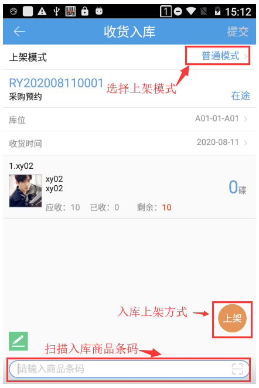
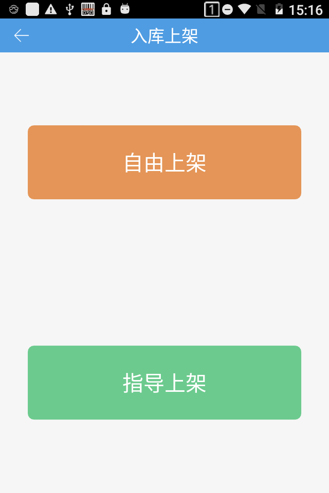
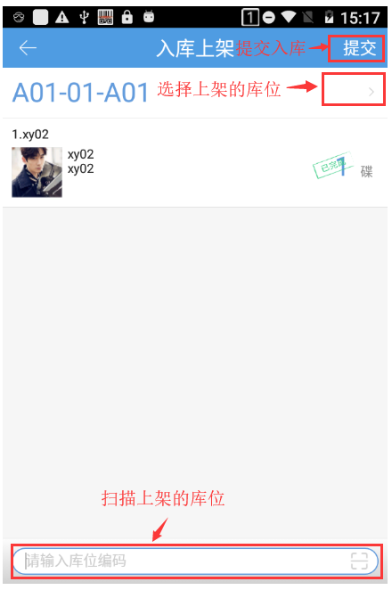
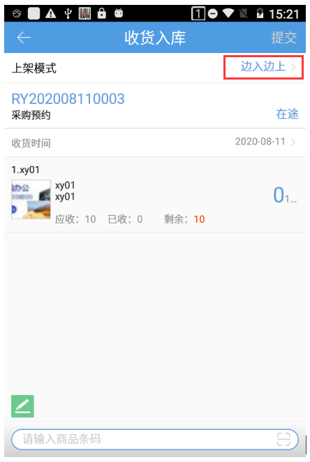
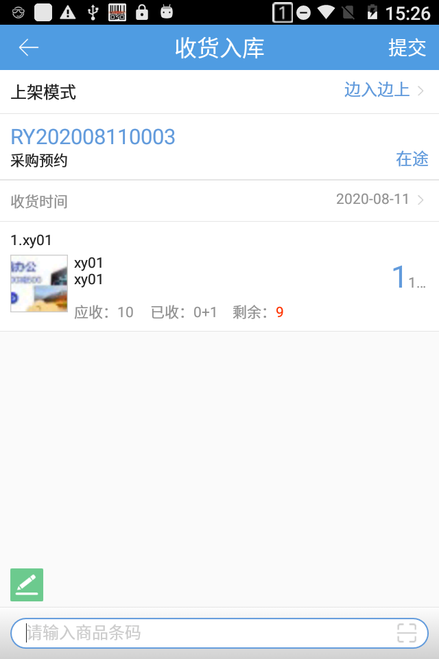
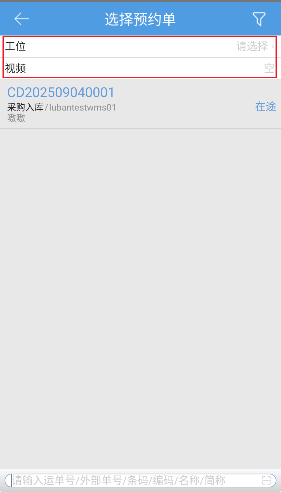

# PDA-收货入库

wms系统中的采购、销退、其他入库、调拨入库预约单，可以通过pda选择相应的预约单进行入库操作，具体步骤如下。

#### 1、选择单据
选择正确的仓库后，点击收货入库菜单，点击右上角按钮筛选预约单，支持查看供应商。

单号扫描/输入匹配，支持匹配销退预约单中ERP订单号字段，目前没有按照顺序匹配的逻辑，所有符合的都会查出来

收货入库支持批量入库

1.在下拉/筛选后，扫描运单号筛选出同一运单号的入库单，假如存在多笔，可选择多笔入库单批量入库；

2.在下拉/筛选后，再次筛选，筛选项有包含商品项或承运商项，假如存在多笔，可选择多笔入库单批量入库；

注：以上两种情况在加载完全部入库预约单的情况下才会显示；批量入库的单据需为同一入库类型且同一货主。

#### 2、普通模式——上架
选择好预约单后，跳到收货入库页面。

选择普通模式上架，即所有商品都扫描完成后再上架到库位上。操作步骤如下：上架模式选择普通模式，要入库的商品扫描完成后，点击上架。

选择入库上架方式：

选择上架库位后，点击提交，完成入库。

#### 3、边入边上模式——上架
选择边入边上模式：即扫描一款商品就跳转上架页面，边扫描边上架。操作步骤如下：上架模式选择边入边上，扫描商品。

扫描商品条码，跳到入库上架页面。

点击确定完成上架，返回到收货入库页面，点击提交，完成入库。

 提示：

①选择预约单后，商品实际入库的数量不能大于预约单商品的应收数量。若开启允许[入库超收](https://hupun.yuque.com/unzko7/plvu1m/tb8ay4)，则入库数量可大于应入数量。

②入库上架页面，序列号商品直接扫描序列号。

③边入边上，扫描生产批次商品先跳转到入库上架页面再跳转到生产批次设置页面，未设置生产批次点击返回直接返回收货入库页面。

④一次性录入序列号，后台开关开启保留区间截取，示例：

解析规则：保留区间截取，品牌：新增的品牌，保留区间截取第6到18位，条码长度范围为从0-21

商品A系统中商品条码69200811001-新增的品牌-序列号商品

商品B系统中商品条码69200811002-新增的品牌-非序列号商品

收货入库页面扫描条码1234569200811001001，匹配到了商品A且录入序列号1234569200811001001。

收货入库页面扫描条码1234569200811002001，匹配到了商品B不录入序列号。

#### 4、开启万里牛视频溯源
PC开启万里牛视频溯源，收货入库页面显示工位和设备，支持录制操作过程。选择工位后，会自动带出绑定的视频设备。

 

提示：

①生产批次商品暂不支持记录明细动态信息；

②PC开启“在操作页面强制选择工位”，需要先选择工位和设备才能继续入库操作；

③普通上架模式，视频结束时间为点击“上架/提交成功”节点，具体上架操作不包含在视频记录内。

> 更新: 2026-01-05 09:33:39  
> 原文: <https://hupun.yuque.com/unzko7/lsbfg0/umw7oi7xu2ye8qxq>