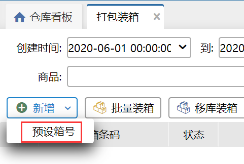
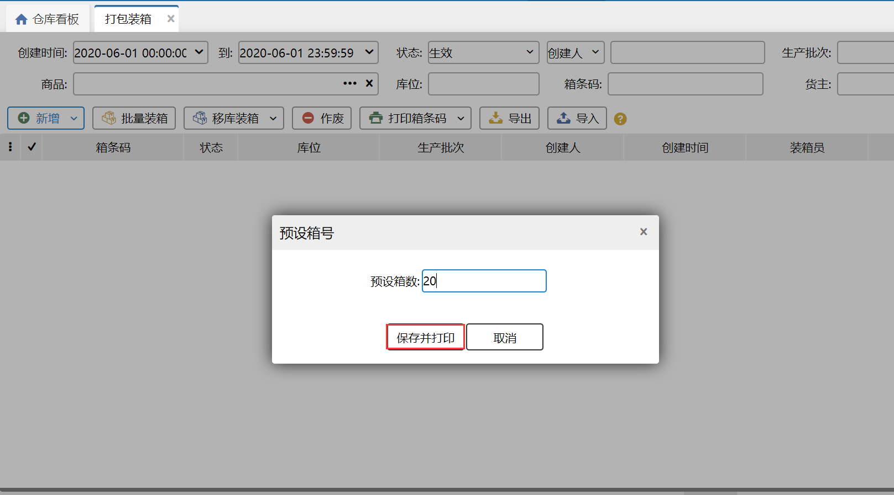
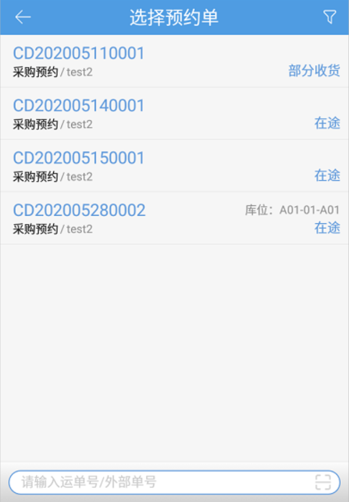
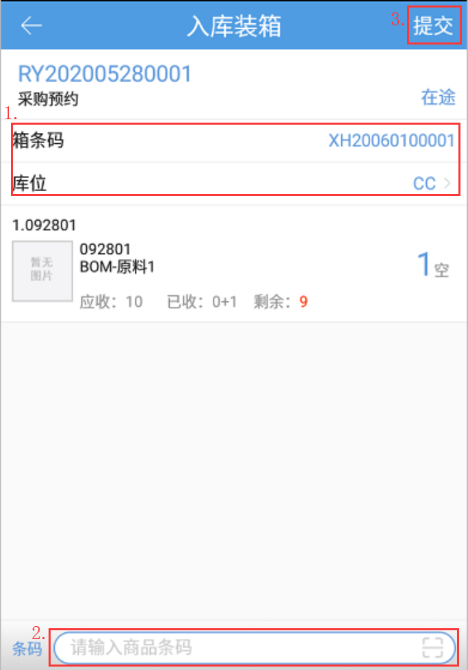

# PDA-清点装箱

适用于预约单的商品，先装箱再确认入库的操作，此处商品装的是唯一箱。前提条件：未开启入库审核的仓库才允许入库装箱。

建议先打印出箱条码贴在货箱上，装箱时需扫描箱条码，可以在PC端的[打包装箱](https://hupun.yuque.com/docs/share/aec8f154-a86a-40be-a643-7a194b177e0e?#)页面，通过预设箱号，批量打印箱条码。

1.选择需要入库装箱的预约单，入库装箱支持选择采购预约单、其他预约单、调拨预约单、销退预约单。

2.然后选择装箱商品的存放库位，扫描打印好的箱条码后，扫描添加预约单内的商品，达到装箱的数量后，点击提交，完成装箱。装箱完成后需要在PC的清点单页面查看清点单数据，分批入库任务页面查看待入库单据。

注意：

1.同一预约单允许多个操作员领取，操作清点装箱；

2.多个操作员清点装箱后，PC端生成1个待入库任务，其他操作员装箱后，更新单据内的装箱明细；

2.清点装箱的库位只能选择可以存放箱库存的库位即箱拣选、存储、过渡库位；

3.扫描的箱条码要符合系统中唯一箱的箱条码格式，即XH开头+11位数字；

4.唯一箱条码具有唯一性，不能选择已经在系统中使用过的箱条码；

5.业务配置开启条码截取，此页面扫描商品条码也支持截取；

6.支持生产批次商品和序列号商品装箱。若业务配置开启仓库级箱记录管理，则不限制生产批次混装；若开启仓库级箱记录管理，则不允许生产批次商品混批次装箱；

> 更新: 2024-05-30 14:27:07  
> 原文: <https://hupun.yuque.com/unzko7/lsbfg0/xpvs1cznt0kggt2x>