# PDA-理货清点

货品入库时，需要多个人操作，扫描入库时，是扫描一款商品后上架一款，库位放满后需要将商品上架到其他库位上，故推出多人入库功能，支持多人操作同一预约单入库，上架时支持同商品上架到不同库位。

此功能有后台开关控制，需要时联系技术人员开启。

#### 1.有预约单清点
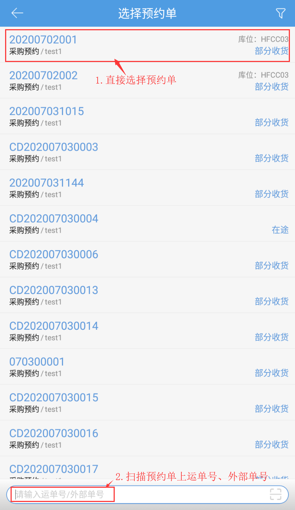

选择预约单后跳转理货清点页面，根据需要选择上架模式后，扫描商品开始清点。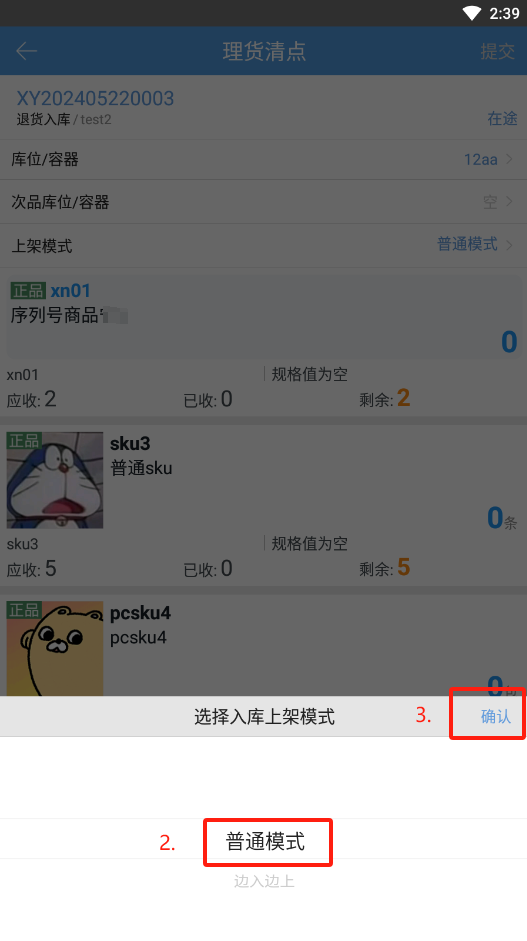

#### (1)普通模式
即所有商品都扫描完成后再上架到库位上，操作步骤如下：

a.上架模式选择普通模式，要入库的商品扫描完成后，点击上架。

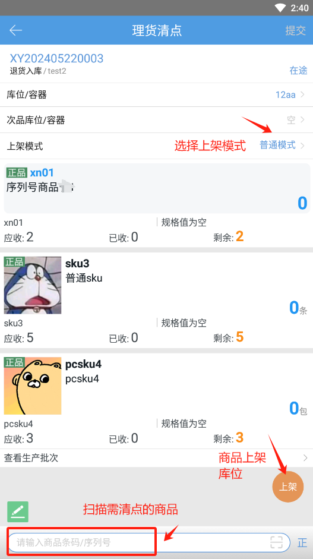

b.选择上架方式：

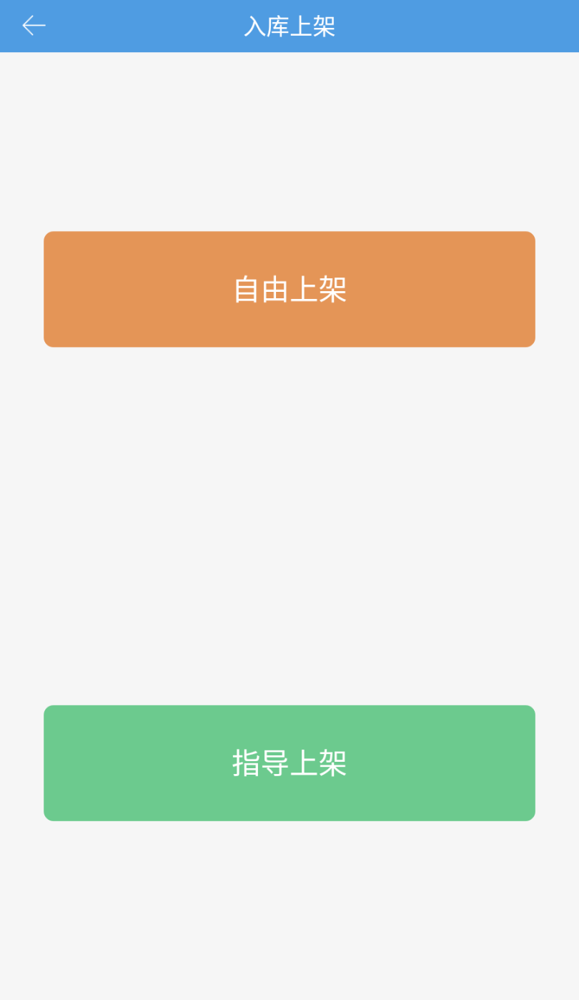

c.选择上架库位后，点击提交，完成清点。

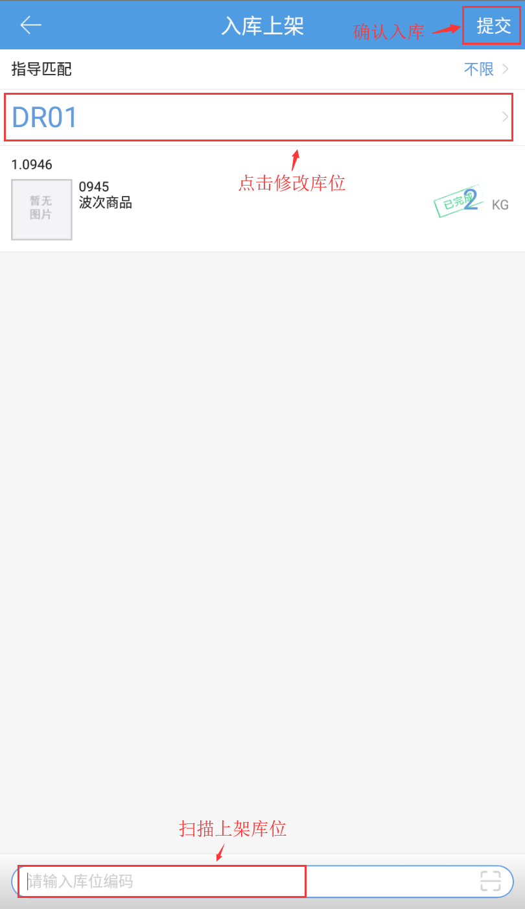

#### (2)边入边上
即扫描一款商品就跳转上架页面，边扫描边上架，操作步骤如下：

a.上架模式选择边入边上，扫描商品。

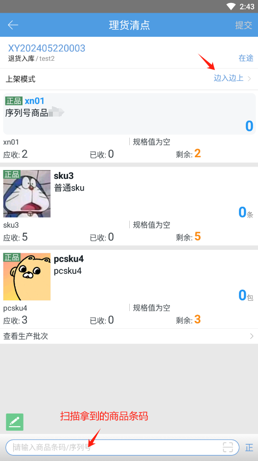

b.扫描商品后直接跳转入库上架页面。

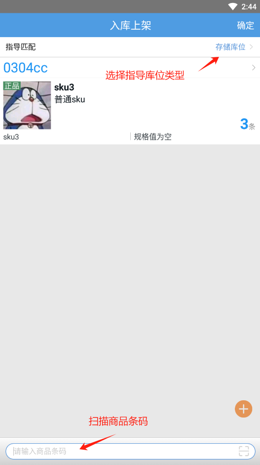

c.扫描商品条码添加入库数量，点击页面右下角+号，可以将商品放在其他库位。

注：此页面只扫描上架一款商品。

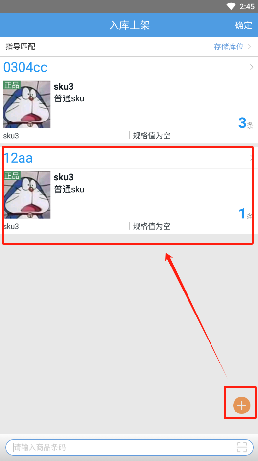

d.点击确定完成上架，返回到理货清点页面。

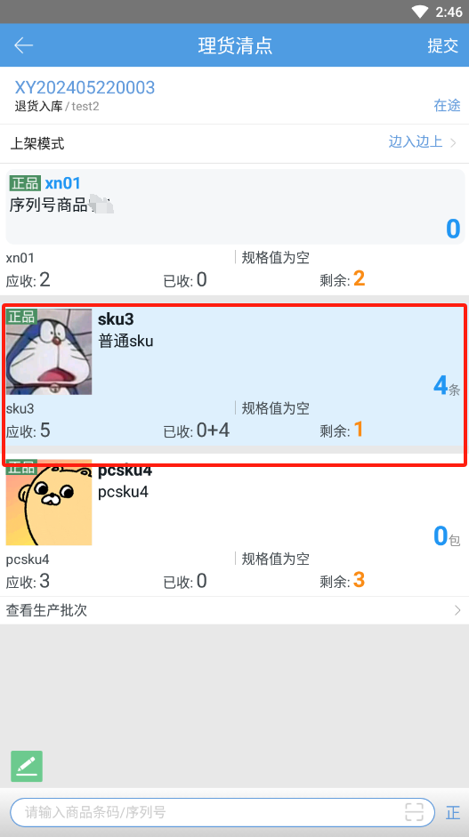

扫描下一款商品继续入库上架，商品上架完成后，点击提交，完成清点。

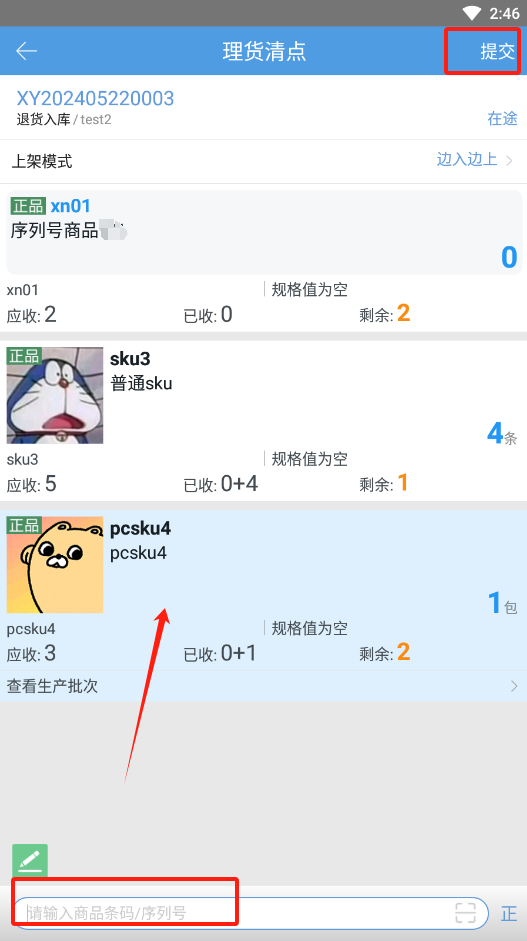

提交清点后，PC端清点单生成1笔清点单单据，分批入库任务页面新增1笔待入库任务，点击确认入库后完成商品入库。

#### 2.无预约单清点
开启3PL模块的公司，进入跳转到货主选择页需先选择货主，选择后回到理货清点页面。

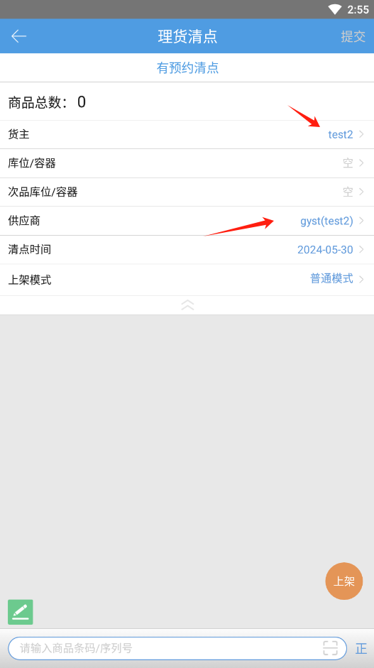

a.扫描商品条码后匹配商品操作。

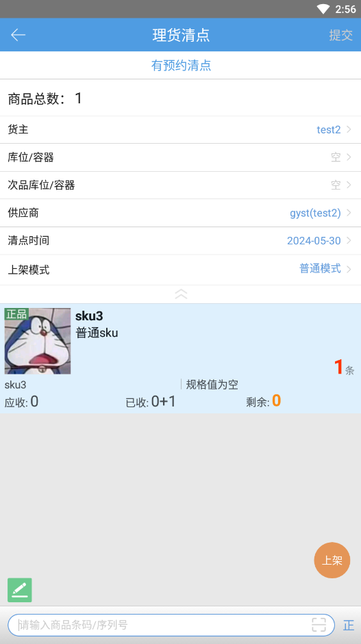

b.可在页面直接提交清点或操作入库上架后提交清点。

c.其余同有预约单清点。

提交清点后，PC端清点单生成1笔清点单单据，分批入库任务页面新增1笔待入库任务，点击确认入库后完成商品入库。（同货主+供应商的单据会自动合并成1笔待入库任务）

> 更新: 2024-10-25 11:59:17  
> 原文: <https://hupun.yuque.com/unzko7/lsbfg0/umblrzgv3i8of2sn>