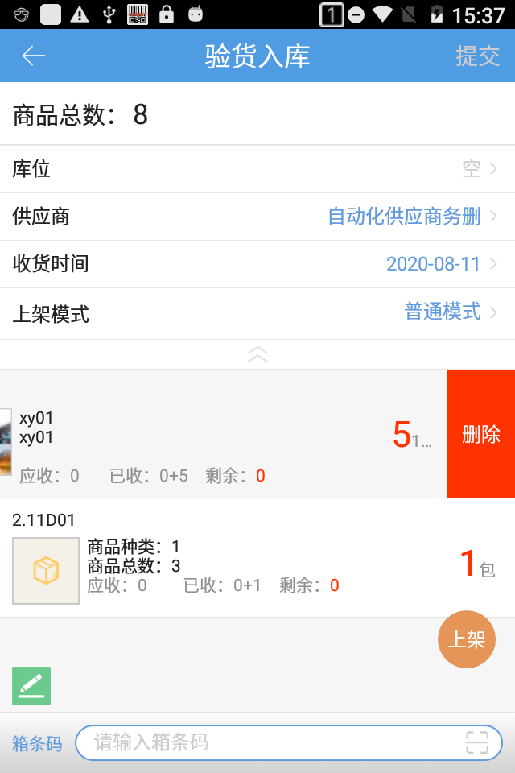
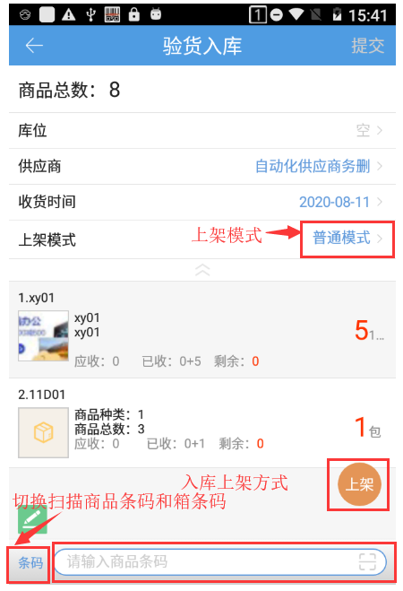
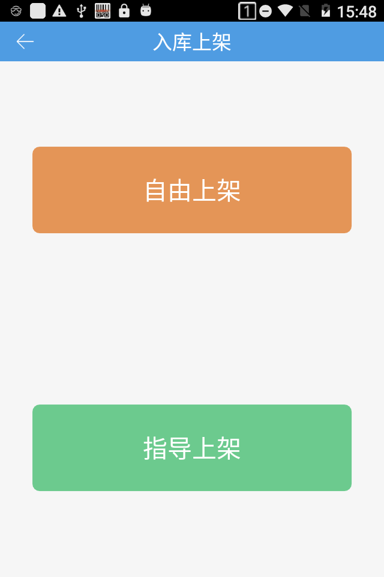
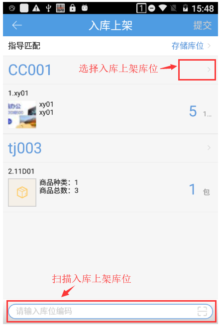
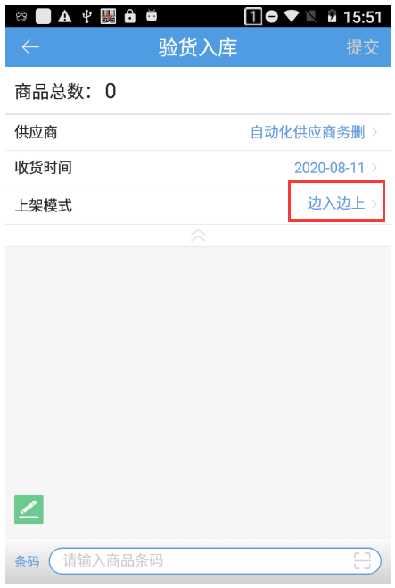
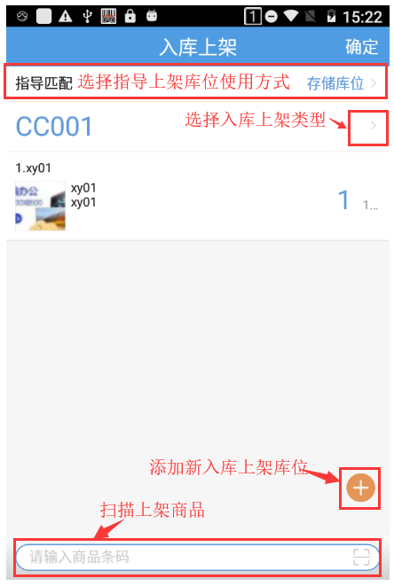
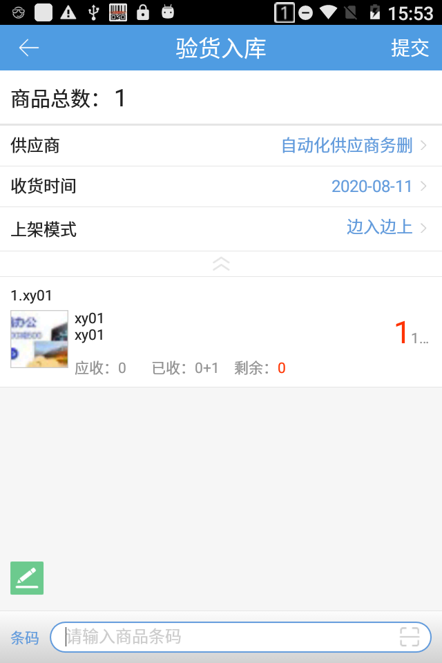
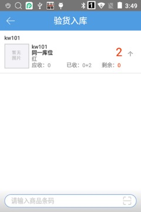

# PDA-验货入库

验货入库支持直接入库，无需预约单。

1）开3pl的公司进入验货入库页面后将自动跳转选择货主页面。

2）供应商可选择对应货主下的供应商。

3）扫描商品支持商品主条码和辅助条码，同时支持条码截取。左滑可以删除添加的商品。

4）合计栏记录了已添加商品的总数

 

4）选择普通上架模式：即所有商品都扫描完成后再上架到库位上，操作步骤如下：上架模式选择普通模式，要入库的商品扫描完成后，点击上架。

入库上架方式

选择上架库位后，点击提交，完成入库。

5）选择边入边上模式：即扫描一款商品就跳转上架页面，边扫描边上架，操作步骤如下：上架模式选择边入边上，扫描商品。

扫描商品条码，跳到入库上架页面。

点击确定完成上架，返回到验货入库页面，点击提交，完成入库。

6）开启条码截取时，点击明细行空白处，可跳转连扫页面，扫描截取的条码直接加该商品的数量。

7)一次性录入序列号，后台开关开启保留区间截取，示例：

解析规则：保留区间截取，品牌：新增的品牌，保留区间截取第6到18位，条码长度范围为从0-21

商品A系统中商品条码69200811001-新增的品牌-序列号商品

商品B系统中商品条码69200811002-新增的品牌-非序列号商品

收货入库页面扫描条码1234569200811001001，匹配到了商品A且录入序列号1234569200811001001。

收货入库页面扫描条码1234569200811002001，匹配到了商品B不录入序列号。

8）提交入库后，入库单可在采购入库页面查询得到。

 

> 更新: 2023-12-21 09:28:16  
> 原文: <https://hupun.yuque.com/unzko7/lsbfg0/nml4lfgt93ewt71l>