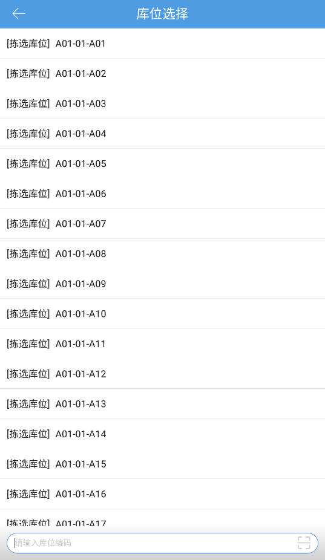
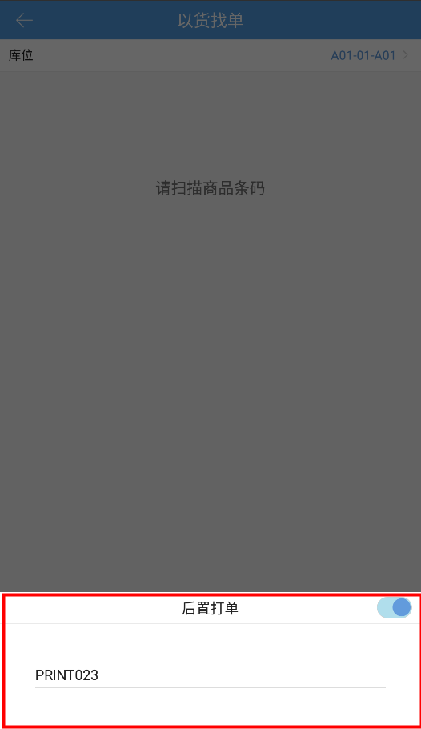
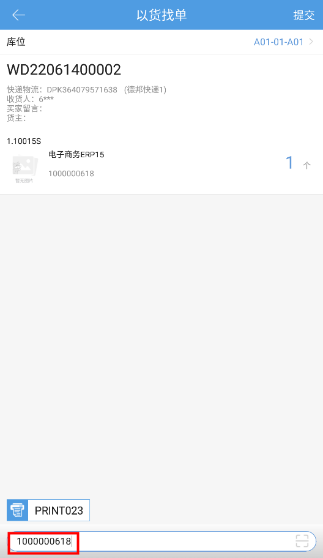

# PDA-以货找单

通过PDA扫描指定库位，扫描任意商品，系统将自动匹配对应订单（一单一货），将其快速提交到验货之后的环节，便于商家快速出库，优先发出退货商品。

一.进入以货找单页面，首先跳转至库位选择页选择库位，库位可选范围为所有非次品库位

二.设置后置打印，输入工作台编码连接打印机，否则输入商品条码后会报错

三.输入商品条码后显示匹配到的订单，库位锁定库存，点击提交或者开启以货找单自动提交将订单快速提交至验货的下一环节，打印单据，实现快速出库,点击返回或者切换库位后会解锁库存

注意：

1.订单匹配规则：

1）待分配有普通/电子面单的订单

2）找单逻辑：未锁定>锁定失败>已锁定>最晚发货时间>付款时间

订单支持重锁，如订单已锁定拣选库位A01-01-A01，异常暂存库位YC01上存在该订单商品库存，选择库位YC01，输入商品条码，可将订单重新锁定在异常暂存库位YC01上，这样可以先清理掉异常暂存库位库存

2.匹配订单锁定库存后，5分钟内无操作会自动解锁库位释放库存

3.匹配订单锁定库存后，待分配页面不支持将订单打到零拣，不能自动/手动生成波次，不能解锁库未分配，不能移至大宗，也不能回收电子面单等操作

4.匹配订单锁定库存后，该笔订单不能被波次拦截替换

> 更新: 2023-12-21 09:58:08  
> 原文: <https://hupun.yuque.com/unzko7/lsbfg0/zl5p3g4rp3alp5tw>