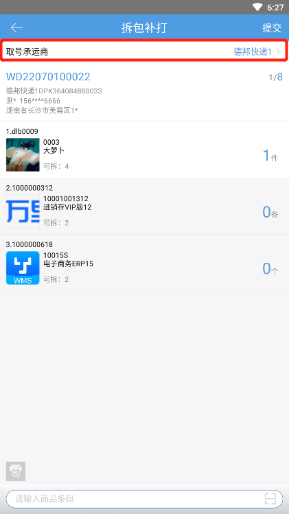
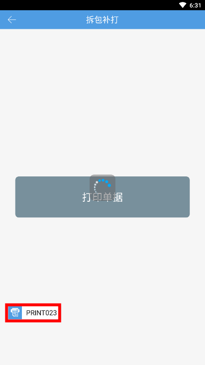

# PDA-拆包补打

针对大件商品，把货搬到电脑跟前扫码拆包不方便，因此新增PDA拆包补打功能，输入想要拆单的订单可进行多次拆单并支持变更快递。

1.点击取号承运商，可以进行修改快递

2.选择要拆出的明细后，点击提交，可以选择继续拆单或是直接提交

3.支持后置打印，提交后可以进行补打单据

> 更新: 2023-12-21 09:56:32  
> 原文: <https://hupun.yuque.com/unzko7/lsbfg0/dxt4xmf1k95xxo46>