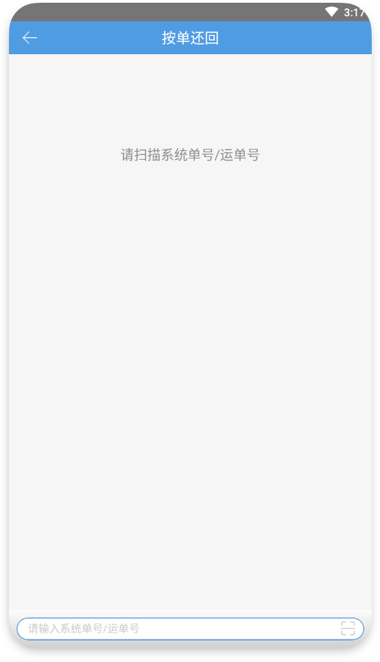
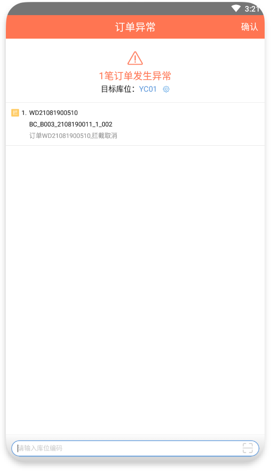
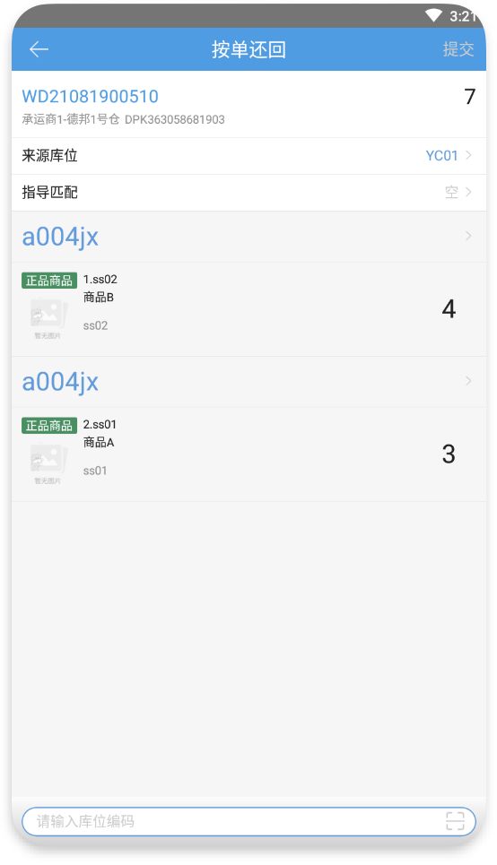
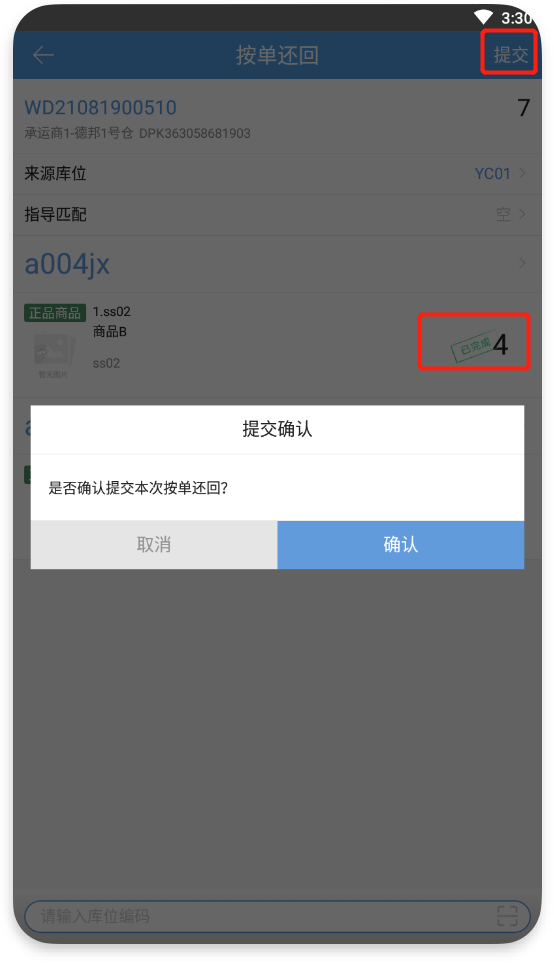
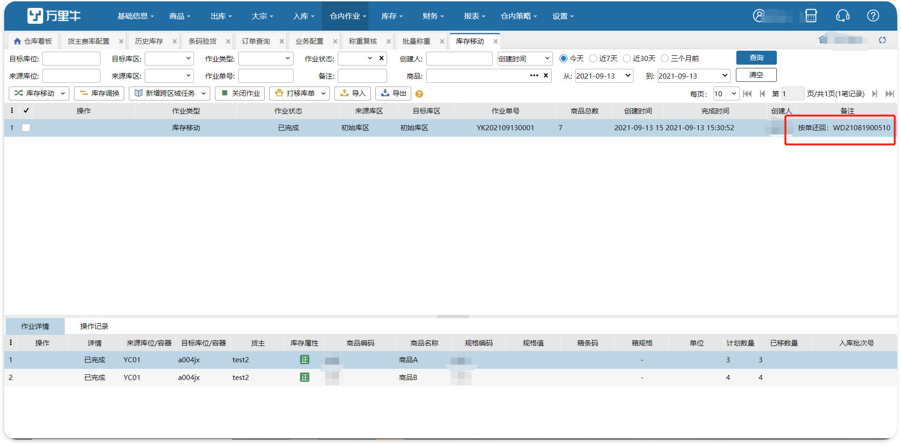

# PDA-按单还回

按单还回

已拣货拦截的订单系统默认把库存还到异常库位，但由于没有条码，商品本身很难辨识，没法实现拦截包裹还回商品的操作。订单在拣货时拦截，按照订单将已拣货的商品从异常暂存库位重新上架到其他库位。

1.订单已拣货已拦截，未确认异常

扫描系统单号/运单号跳到确认异常的页面，点击返回，回到按单还回首页；点击确认，跳到按单还回作业页面显示订单信息。

a).来源库位为已拣商品所放的异常暂存库位，支持修改（可选范围：非工位）。

b).指导匹配默认显示为空，上架库位即默认显示商品拣货下架的库位；支持选择其他类型的库位进行指导匹配；上架库位支持修改（可选范围：非工位和异常暂存库位）。

c).明细不支持编辑数量和删除，明细数量>1时支持左划拆分。

d).扫描确认页面所有商品的库位后，可提交按单还回。

注：在PC端库位库存详情可查看记录，单据类型：库存移动；在PC端库存移动页面生成1笔已完成的库存移动记录。

2.订单已拣货已拦截，已确认异常

扫描系统单号/运单号直接跳到按单还回作业页面显示订单信息。

其他如第1点同理。

3.若仓库未开启强锁且订单未锁定库位，显示来源库位(异常暂存库位)，不显示上架库位(拣货下架库位)。

若订单锁定库位，显示来源库位（异常暂存库位)和上架库位(拣货下架库位)。

注：a).暂不支持大宗订单。

b).已经按单还回的订单不支持再次按单还回。

c).支持规格箱。

d).不支持正常订单/挂起订单。

> 更新: 2023-12-21 09:56:28  
> 原文: <https://hupun.yuque.com/unzko7/lsbfg0/txlvvw1dvapkc486>