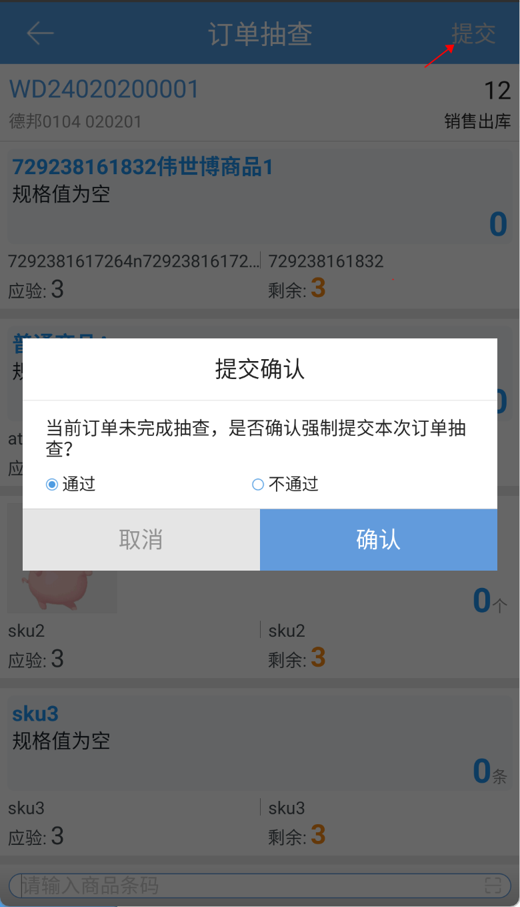

# PDA-订单抽查

本页面主要用于对近2个月内爆品订单进行抽查验货，避免批量出错。

1.订单匹配

当前仓库近2个月内的订单都能匹配的到，不区分订单状态，匹配后显示订单明细

订单明细不区分行业属性，所有商品都当作普通商品进行验货

2.提交

正常提交：所有明细验货完成后，点击提交，选择是否抽查通过并确认后，订单抽查成功

强制提交：部分/所有明细未验货，直接点击提交，选择是否抽查通过并确认后，订单抽查成功

注：

1.关联赠品免验配置，开启后赠品自动标记完成

2.关联条码截取配置，开启后按配置进行截取匹配

> 更新: 2024-04-24 16:18:15  
> 原文: <https://hupun.yuque.com/unzko7/lsbfg0/hp6tpd89btm4af3p>