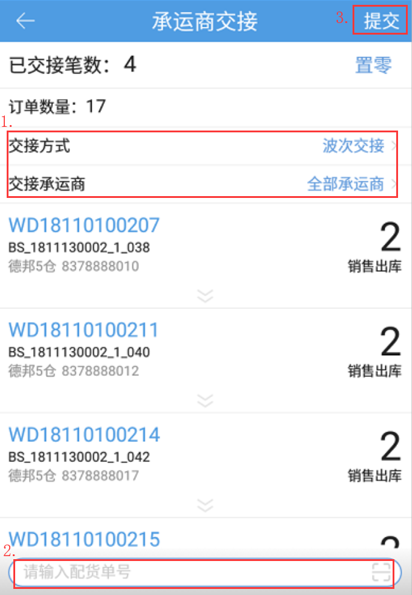

# PDA-承运商交接

承运商交接，用于仓库订单已出库时，记录是否有完成承运商交接。此处只要在这个页面有完成交接，则系统认为该订单已经交接到承运商处。具体操作如下：

选择交接方式（单笔、波次）以及交接承运商后，扫描订单的运单号（波次号），点击提交（F2）即可

在系统设置-语音播报-语音播报设置中开启“承运商交接承运商简称语音提示”，订单或波次匹配成功后会播报承运商简称.

提示：

1.承运商选择无限制，扫描的订单要属于选择的承运商；

2.仅支持待出库、已出库环节的订单进行交接；

3.点击置零可以将此操作员目前选择的承运商的交接记录笔数清零；

4.交接方式选择单笔交接，支持扫描多笔订单一起交接，一次扫描限制200笔订单以内；

5. 只勾选一个交接承运商，订单匹配成功后，不会播报承运商简称；

6.勾选多个交接承运商，且波次中有多个不同承运商订单时，播报“xxx等多个”。

> 更新: 2024-02-02 10:36:51  
> 原文: <https://hupun.yuque.com/unzko7/lsbfg0/kv0pbqbh6w67lgqe>