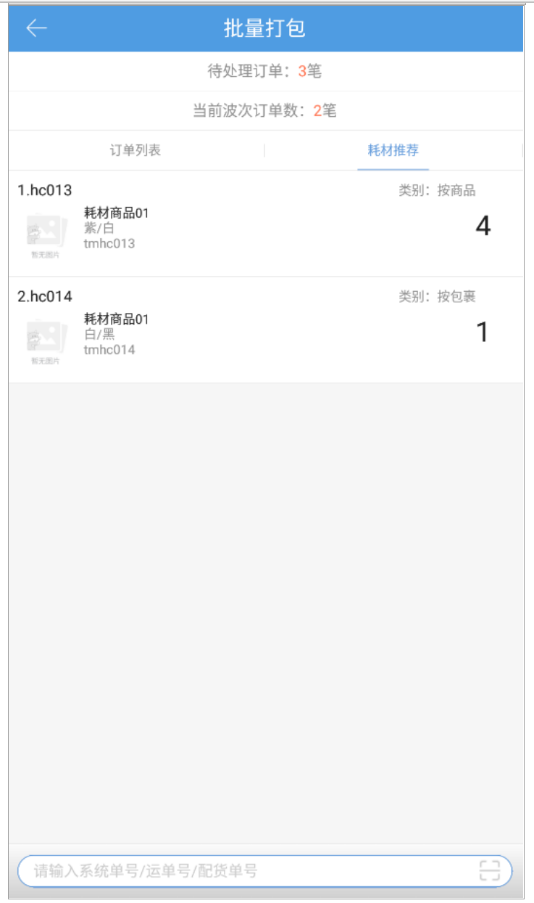

# PDA-批量打包

pda的批量打包支持对同品、混品、预配波次的订单进行批量操作，具体步骤如下：

1、未开启耗材管理时，系统自动提交打包

(1).点击批量打包按钮，用户可见如图界面，通过输入、扫描系统单号/运单号/配货单号操作需打包订单：

提示：

1.系统自动提交打包并打上标记，无需手动提交

2.当前波次订单数=该波次下待打包环节的订单数量

2、设置耗材登记环节为“打包”，开启耗材管理-耗材推荐，订单自动提交打包，打包耗材按推荐显示，不支持手动录入耗材

3、设置耗材登记环节为“打包”，开启耗材管理-实际使用，订单需手动提交打包，打包耗材默认按推荐显示，支持手动录入耗材并提交，若不录入耗材，则按推荐使用耗材：

> 更新: 2023-12-21 09:57:28  
> 原文: <https://hupun.yuque.com/unzko7/lsbfg0/bf9hx00n75xuyvxl>