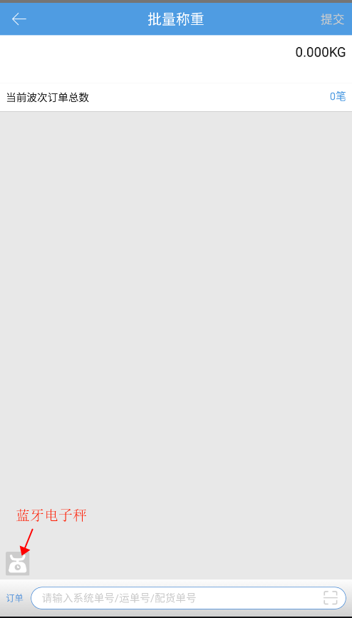
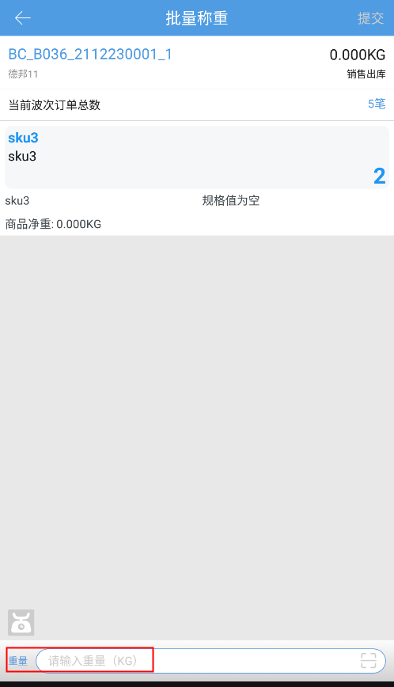
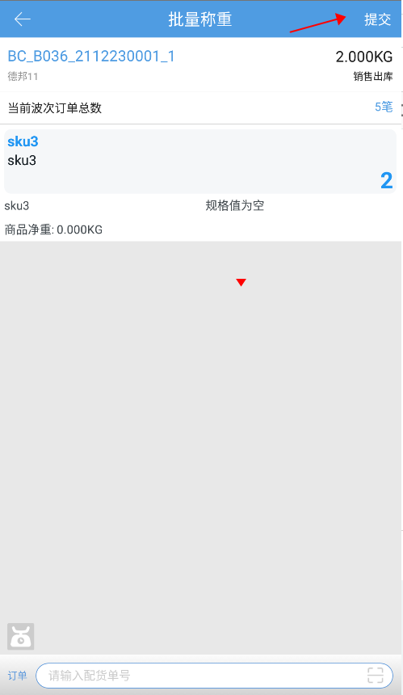

# PDA-批量称重

PDA的批量称重支持对同品、预配波次的订单进行批量操作，用户可以通过pda扫描订单，输入正确格式的重量即可提交称重。若用户期望先扫重量再扫订单，则点击底部输入框隔壁的按钮进行切换。

小贴士：PDA批量称重，连接蓝牙电子秤可实现称重输入哦。蓝牙电子秤推荐：坤宏KHW+、耀华XK3190

1.连接蓝牙电子秤（如需），扫配货单号匹配波次。

2.手动输入重量或通过蓝牙电子秤自动获取重量。

3.操作提交订单。

4.关联业务配置称重复核校验。

已设置校验，订单称重时重量不符合校验值则跳转到重量异常页，提示--称重重量与订单估重不符，超出允许范围+/-XXkg/%（或估重为0校验），能否继续提交称重关联是否有强制提交称重权限。

> 更新: 2023-12-27 10:50:21  
> 原文: <https://hupun.yuque.com/unzko7/lsbfg0/xcr44bh728x40pyv>