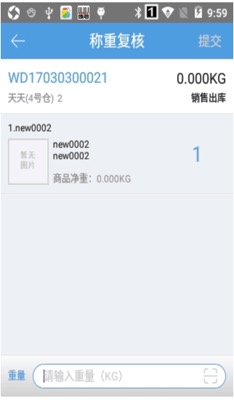
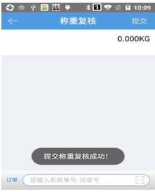

# PDA-称重复核

称重复核，用户可以通过pda扫描订单，输入正确格式的重量即可提交称重。若用户期望先扫重量再扫订单，则点击底部输入框隔壁的按钮进行切换。

小贴士：PDA称重复核，连接蓝牙电子秤可实现称重输入哦。蓝牙电子秤推荐：坤宏KHW+、耀华XK3190

#### 1、未开启视频录制功能
1.1 点击称重复核按钮，输入系统单号/运单号，会显示相应订单的信息，如图所示。

1.2 直接输入重量，即可提交称重。

注：

a.开启称重复核自动提交，先称重后再扫订单后，自动提交称重复核。

b.关联业务配置称重复核校验。

已设置校验，订单称重时重量不符合校验值则提示--称重重量与订单估重不符，超出允许范围+/-XXkg/%（或估重为0校验），能否继续提交称重关联是否有强制提交称重权限。

#### 2、开启视频录制功能
视频录制步骤请参考[订单打包](https://hupun.yuque.com/unzko7/lsbfg0/wpnzfyg3ouuupkn6#dM3ZH)相关内容。

 

> 更新: 2024-06-25 18:09:02  
> 原文: <https://hupun.yuque.com/unzko7/lsbfg0/hdhtv8gv3upb9fdz>