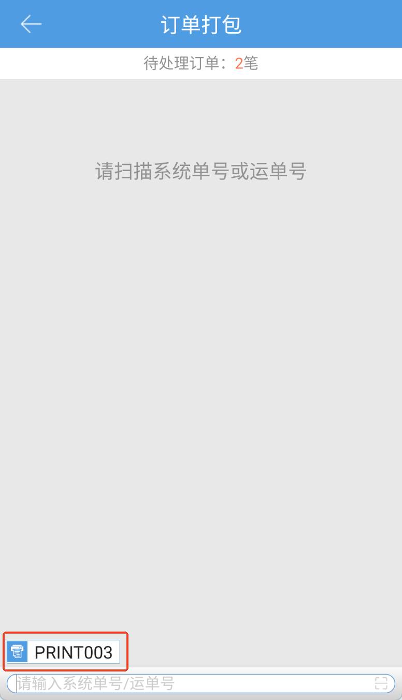
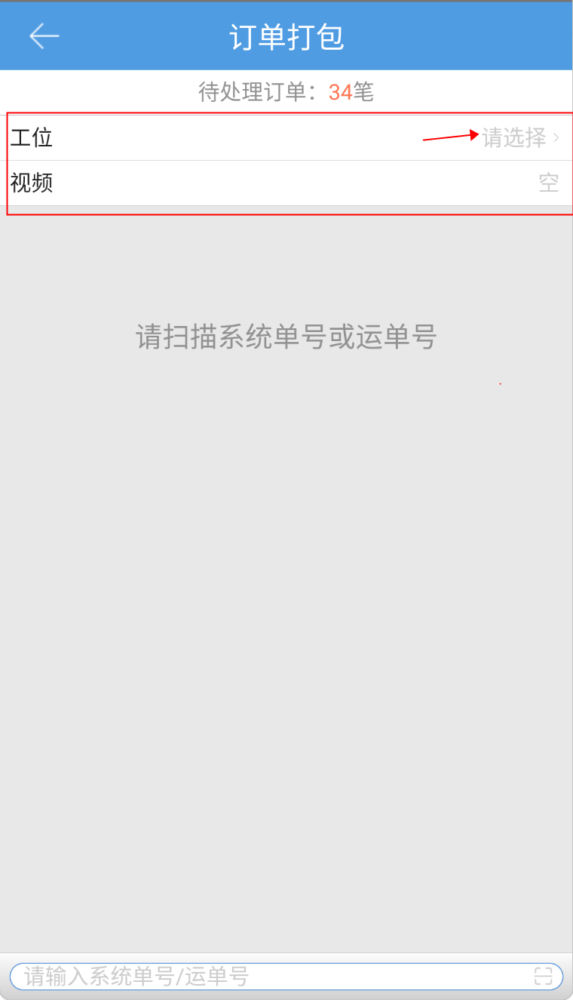
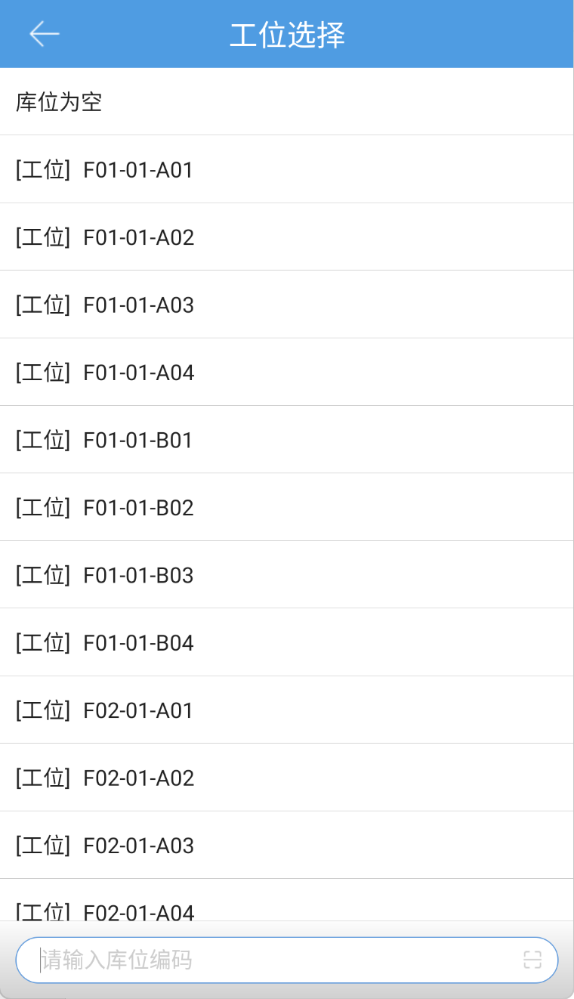
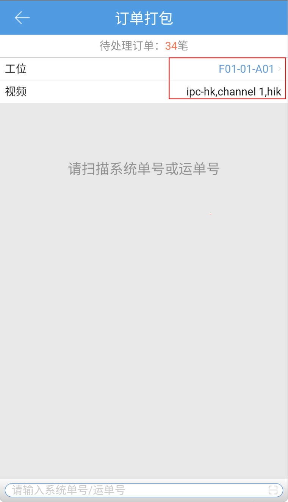

# PDA-订单打包

#### 1、未启用视频录制功能
pda的订单打包只能单笔提交下一环节，具体操作步骤如下：

1.1 未开启后置打印

点击订单打包按钮，用户可见如图界面，通过输入、扫描系统单号或运单号操作需打包订单，未开启打包环节登记耗材时，扫描订单自动提交打包：

开启耗材管理-打包环节登记耗材时，扫描单号后，会根据登记方式显示页面。

①按耗材推荐，匹配到订单后，默认展示耗材推荐列表，并自动提交订单：

②按实际使用，匹配到订单后，默认展示耗材推荐列表，可按需录入实际使用耗材后提交订单：

1.2 开启后置打印时，在订单提交成功后，会根据设置的工作台打印出单据：

#### 2、启用视频录制功能
**使用前提：当前仓开启“允许添加IPC摄像机及NVR网络录像机”，否则条码验货页面不显示工位选择入口**

2.1 点击工位栏-请选择，跳转到工位选择列表，点击选择对应工位

   

2.2 选择工位后，若工位有绑定的IPC视频设备，则会自动带出IPC视频设备：

注：

1）此处选择工位后，不会带出所关联的USB视频设备

2）若开启“在操作页面强制选择工位”，则视频栏不能为空，否则扫描单号会报错先设置已绑定摄像头的工位；若未开启，则视频栏为空也允许继续操作。

2.3 订单打包操作同第1部分内容一致，此处不再赘述。订单提交成功后，在PC订单查询页面可以点击对应订单查看所录制的视频内容。

 

> 更新: 2024-10-25 11:11:25  
> 原文: <https://hupun.yuque.com/unzko7/lsbfg0/wpnzfyg3ouuupkn6>