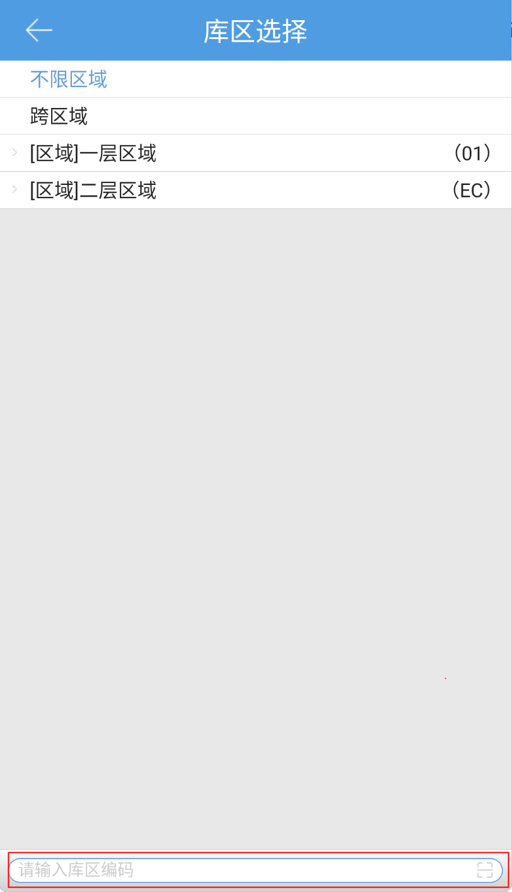
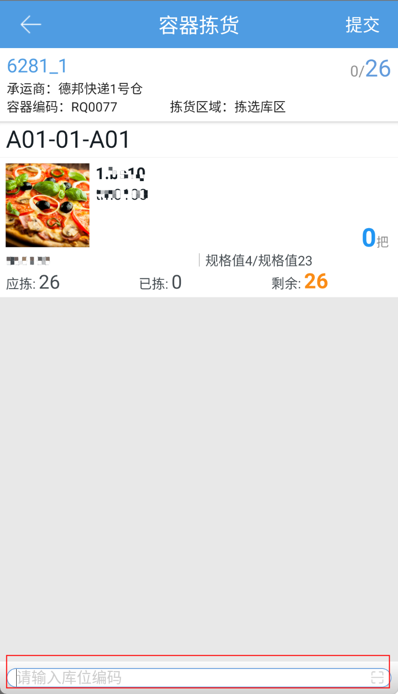

# PDA-容器拣货

容器拣货，pda通过扫描容器编码，进行拣货，具体步骤如下：

一、点击容器拣货按钮，打开首界面，点击右上角的按钮可以筛选库区。

筛选拣货区域后，扫描容器编码（容器拣货方式为拣货框）匹配已拆分波次进行拣货。

二、选择波次后，扫描商品行上的库位，商品行自动标记已完成。

若pc端开启PDA拣货检验商品条码，扫描库位后，再扫描商品条码，商品才会自动标记完成。

若pc端开启PDA拣货检验商品数量，点击商品行上的数量，可以直接修改商品数量。

三、所有商品行都已完成后，点击确认，即可提交下一环节。

 容器拣货领取逻辑

1.仅领取已拆分的波次；

2.按照PDA选择的库区领取对应容器拣货任务；

3.若波次订单都被拦截挂起，则不领取该波次；

4.仅领取与容器指定的库区、承运商、指定波次一致、且拣货方式为拣货框的波次。

5、波次拆分成多个拣货任务时，第一个拣货任务提交后再次扫描容器编码，会自动匹配同波次下剩余拣货任务

> 更新: 2024-02-06 10:28:03  
> 原文: <https://hupun.yuque.com/unzko7/lsbfg0/lqztr7cdz568ytfr>