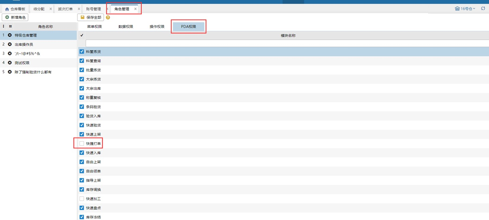
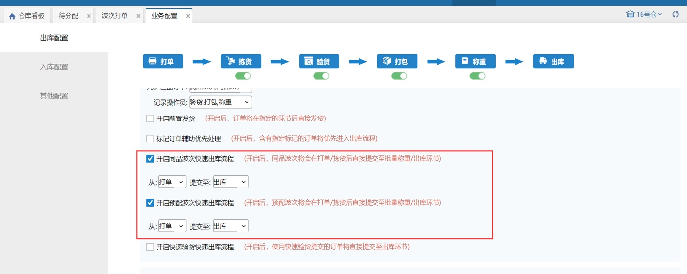
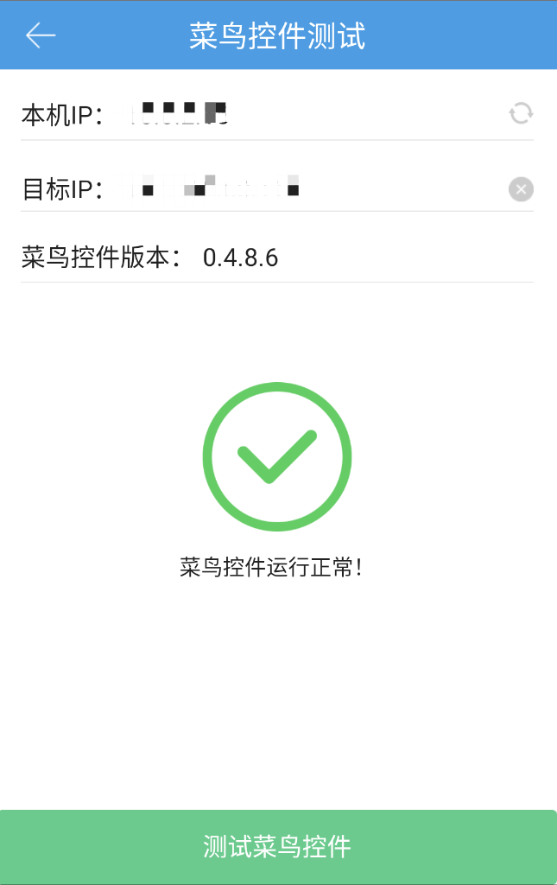

# PDA-快捷打单

当用户仓库有多个固定预配波次,且预配波次是走快速流程 打单到出库的,仓库操作员可以使用PDA领取波次任务打印快递单,并自动提交出库.

### 01.菜单权限
菜单权限,系统管理员和仓库管理员默认有此权限,普通操作员需要仓库管理员添加快捷打单权限.

### 02.快速流程配置
首先要开启预配波次或同品波次快速出库流程,且开始环节必须是打单环节.

### 03.领单配置
1.设置工作台，PC端设备管理，设置工作台的绑定库区、指定承运商、指定波次、绑定地址、打印机。

 

 

 

①、绑定库区：领单时，仅领取绑定库区的波次。

②、绑定地址：点击刷新，自动获取本机ip。

③、指定承运商：领单时，仅领取指定承运商的波次；

④、指定波次：领单时，仅领取指定的波次策略。

⑤、打印机设置：设置打印快递单的打印机。

 

 

2.检查网络，保证PC和PDA要在同一局域网，可以用PDA上的小工具检测，若是菜鸟控件运行正常，则PC和PDA在同一个局域网；若是报错，则检查PC和PDA网络。

3.波次策略设置，指定的波次策略要开启允许PDA领单才能被领取到。

### 04.快捷打单
操作步骤如下

1. 点击快捷打单按钮，用户可见如图界面，输入工作台编码或扫工作台编码，领取任务。                    

2.领取任务后,直接打印快递单和自动提交到快速流程设置的结束环节,任务完成后,继续扫描工作台,领取下个任务。          

 

> 更新: 2023-12-21 09:28:17  
> 原文: <https://hupun.yuque.com/unzko7/lsbfg0/it9cvpbv9f755gwo>