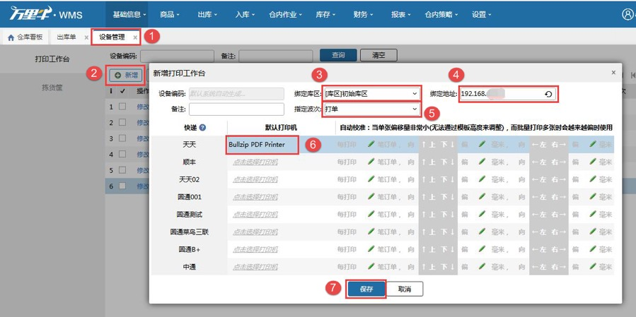
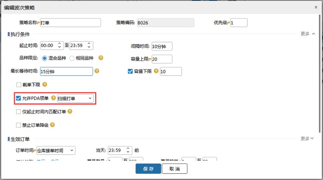

# PDA-扫描打单

业务场景：仓库操作员使用PDA领取波次任务，并直接打印电子面单，结合批量拣货、播种拣货，提升整体配货效率。 

### 01.领单配置
设置工作台，PC端设备管理，设置工作台的绑定库区、指定承运商、指定波次、绑定地址、打印机。                  

①、绑定库区：领单时，仅领取绑定库区的波次。

②、绑定地址：点击刷新，自动获取本机ip。③、指定承运商：领单时，仅领取指定承运商的波次；

9.                        

④、指定波次：领单时，仅领取指定的波次策略。

⑤、打印机设置：设置打印快递单的打印机。

检查网络，保证PC和PDA要在同一局域网，可以用PDA上的小工具检测，若是菜鸟控件运行正常，则PC和PDA在同一个局域网；若是报错，则检查PC和PDA网络。                   

                    

波次策略设置，指定的波次策略要开启允许PDA领单才能被领取到。                  

            

### 02.扫描打单
具体步骤如下：

1点击扫描打单按钮，用户可见如图界面，输入工作台编码或扫工作台编码，领取任务。                    

2.领取任务后，打印快递单，跳转到如图界面，用户选择拣货方式，进行拣货。

3.拣货提交后，任务完成，即可再次扫工作台编码，领取下个任务。

### 03.领单逻辑
1. 波次策略勾选了开启PDA允许领单-扫描打单，才能被领取到。

2. 波次是待打单状态，才能被领取到。

3.波次中的订单都生成了电子面单，才能被领取到。

4.没有打印过快递单、发货单、配货单、发票的波次，才能被领取到。

5.与工作台设置的绑定库区、指定波次一致的波次，才能被领取到。

6.与工作台设置的指定承运商一致的波次，才能被领取到。

7.序列号登记环节在拣货且波次中含有序列号商品，该波次不能被领到。

符合条件的任务如何分配：

按当前正在拣货的库区(待拣货正在执行的波次任务)，库区中拣选人员最少的波次优先领取，如果跨区跟单区数量相同则跨区优先，越早生成的波次优先领取。

Ps.目的是边拣边播动态分流，防止某个区人太多全部扎堆的交通堵塞，造成效率降低。

 

> 更新: 2023-12-21 09:28:17  
> 原文: <https://hupun.yuque.com/unzko7/lsbfg0/gg2t4fdo0erthxz1>