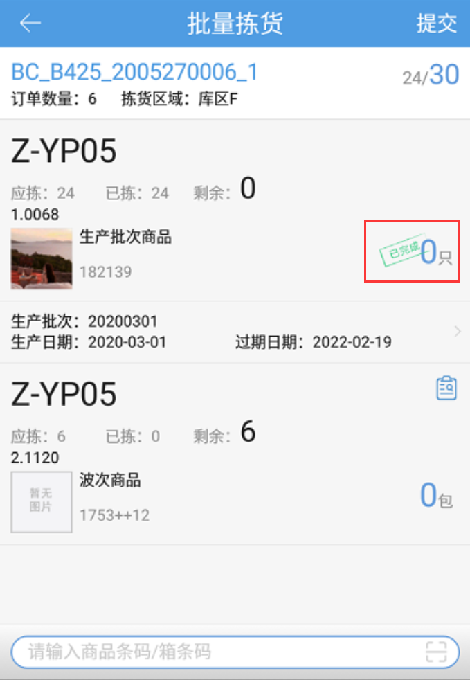
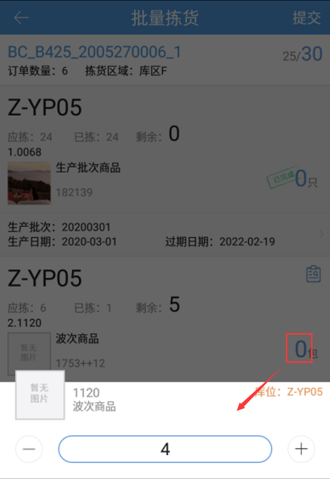
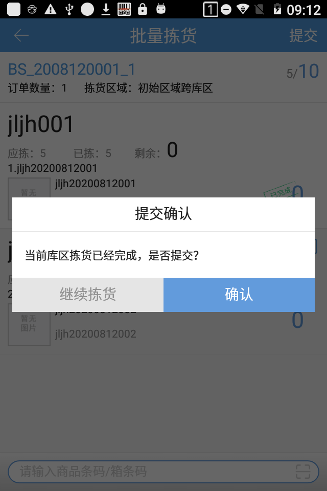

# PDA-批量拣货

pda的批量拣货适用于波次订单快速提交下一环节，具体操作步骤如下：

一、点击批量拣货按钮，如下图输入配货单号或运单号匹配订单。

提示

1.波次号就是配货单号。对一波零拣订单批量拣货，需要在pc上打印这波零拣订单的配货单，在此页面输入配货单显示的配货单号即可进行拣货。

2.扫描运单号，带出订单所属波次下的全部待拣货的订单

二、选择订单后，扫描商品行上的库位，商品行自动标记已完成。

点击商品行上的数量，可以直接修改商品数量。

三、所有商品行都已完成后，点击确认，即可提交下一环节。

 四、开启按库区接力拣货，一个库区明细拣货完成后，提示库区拣货已完成是否提交，确认提交后生成接力拣货任务。下个库区拣货直接扫描运单号或配货单号领取接力拣货任务。

> 更新: 2023-12-21 09:28:17  
> 原文: <https://hupun.yuque.com/unzko7/lsbfg0/gcgvupeqazgwzul4>