# PDA-播种拣货

用户不需要打印配货单，可以直接通过PDA对一波订单快速拿货和分订单。

下图是一波订单的配货单，PDA播种拣货的时候商品显示与配货单商品显示一致。配货分布中的（1）指一波订单中的第一笔订单，也是PDA播种拣货的第一个播种框。

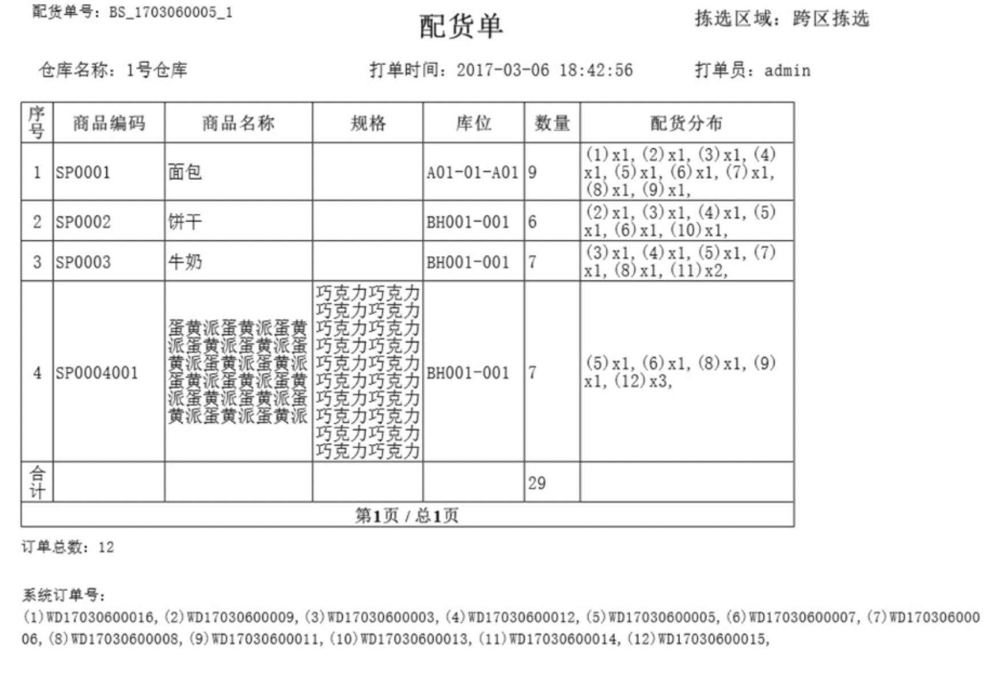

点击播种拣货按钮，通过扫描一波订单中任意一个运单号或配货单号来匹配一波订单，或者波次策略中选择允许PDA领单-扫描打单，则可通过扫描相应的工作台编码领取波次订单。

a).可选择作业模式为边拣边播或先拣后播，作业模式记忆为仓库+操作员上。作业过程中支持返回主页面，切换作业模式。

模式切换时支持带出之前作业的已拣、未拣、已播、未播的数量。

例：订单中有sku1-2个，sku2-3个，锁在库位kw01上。

边拣边播切到先拣后播：在边拣边播拣货sku1-2个并且播种，切到先拣后播，sku1显示已拣2，播种页面显示已播2；

先拣后播切到边拣边播：在先拣后播拣货sku2-2个，播种1个，切到边拣边播，跳到sku2播种页面（播种框显示1），再跳到sku1拣货播种2个，再跳到sku2页面拣货播种1个（播种框显示1）。

b).作业完成后可进行后置打单，根据开关配置。开启后，作业完成，自动跳转至后置打印扫描工作台，若工作台输入错误，支持修改，修改可打印的正确工作台后自动打印；若工作台ip不正确，修改后，可直接点击“打印运单”按钮进行打印。

提示：PDA领单需同步配置好工作台的IP地址和波次策略处的设置。

### 边拣边播
a).显示播种框分布。

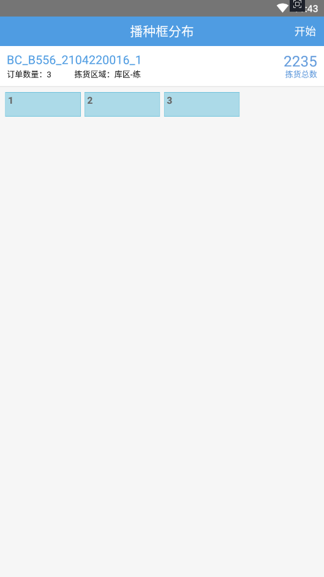

b).选择配货单后，推着播种车去显示库位。找到库位后扫描库位编码。

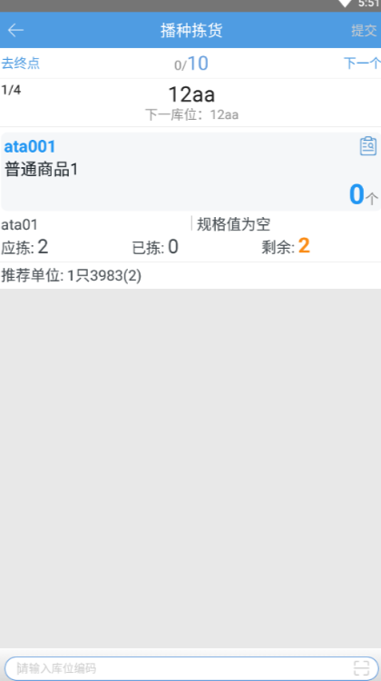

c).支持查看拣货进度，扫描商品条码，拣货进度根据扫描商品的数量更新，扫描箱条码时，拣货进度增加的是箱内库存的数量。

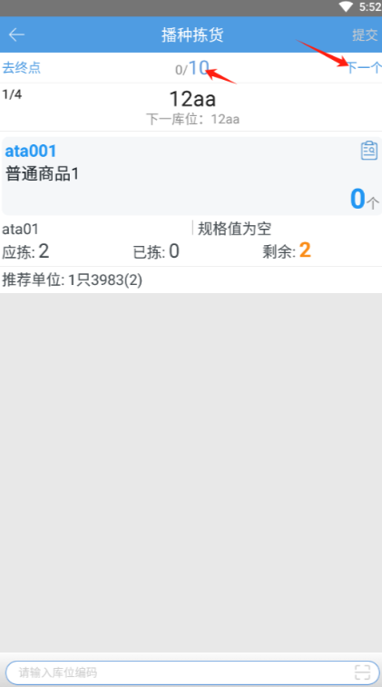

  

d).扫描库位后进行拿货操作，点击确认按钮即可完成此商品此库位的拣货，确认按钮可通过F12快速确认。

提示：商品详情支持收起，记忆在仓库+操作员上。

图中有些框是“X”，表示这些订单可能不在拣货环节，可能被挂起/拦截确认了。

可操作上一个/下一个跳过商品拣货。（本次作业点击过上一个或下一个按钮后，不支持播种回看，但支持定位下一未拣货完成明细）

e).拣货至波次内的最后一个商品，点击确认即可完成拣货。

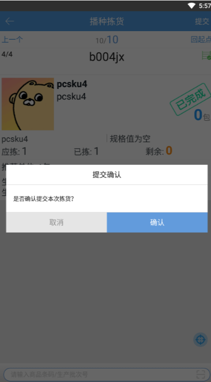

f).点击绿色回看按钮，支持回看上一次的播种分配页面。

g).开启按库区接力拣货，一个库区明细拣货完成后，提示库区拣货已完成是否提交，确认提交后生成接力拣货任务。下个库区拣货直接扫描运单号或配货单号领取接力拣货任务。

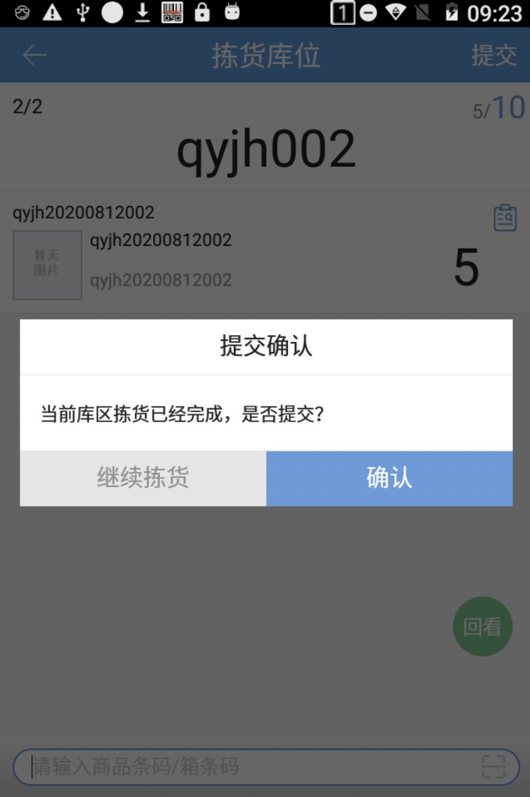

提示：播种拣货会有记忆功能，即配货因为某些原因中断，再次选择此配货单，之前拣货过的商品不需要再次操作，直接继续未完成的拣货。选择其他配货单，再选择此配货单，就不会记忆此配货单进度。

### 先拣后播
a).选择先拣后播作业模式，扫描波次号后，进入先拣后播作业页面。

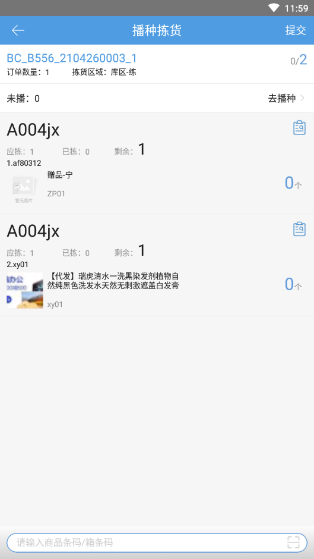

b).已拣货数量不为0时，点击去播种进入播种页面，播种页面支持扫描商品条码、箱条码，支持条码截取。已播和未播数量实时刷新，播种后返回先拣后播页面，未播数量实时刷新。生产批次商品有多个批次，播种时支持扫完商品条码选择批次。

c).支持播种框语音播报，跟随设置处的播种验货语音播报开关。

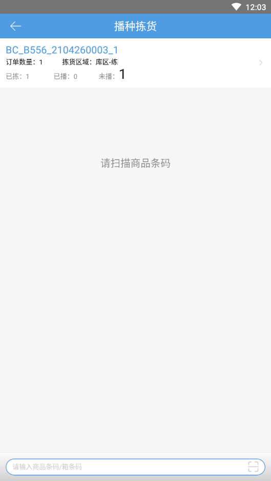

d).从播种页面支持点击进入播种进度页面查看进度。某商品已拣=已播时，在此页面打上完成标识。

e).拣货完成，播种完成后，返回先拣后播页面弹出提交拣货，确认后提交拣货。

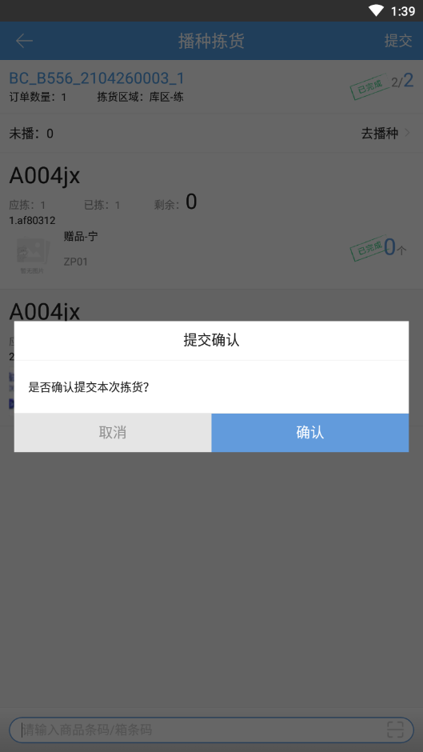

### 跳过缺货库位仅记录缺货数量
PDA拣货模式支持-拣货报缺时全部订单提交拣货后再提交报缺（订单拣货、批量拣货、自由领单+批量拣货、播种拣货、料筐拣货、领单播种拣货）

a).业务配置-出库配置-开启订单缺货处理-选择已拣库存异常打回时还回-显示跳过缺货库位仅记录缺货数量

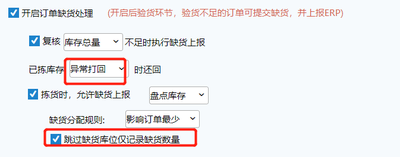

b).波次内有商品明细报缺时跳过该商品，仅记录缺货数量，不显示报缺明细（如有已拣再报缺，已拣明细和数量显示，报缺数量不显示），所有明细都拣货完成后提交拣货时，正常订单到下一环节，有后置打印的正常打印，缺货订单提交到缺货，拦截挂起订单提交到异常订单，异常页面显示缺货订单和拦截挂起订单。

c).PDA拣货开启接力拣货时，最后一个操作员提交拣货时订单再提交缺货订单。

### 语音提示
pda-系统设置开启语音提示后，在作业过程中会根据配置播报库位/商品/数量：

### 合并播种拣货
pda系统设置支持配置分页样式和合并样式。

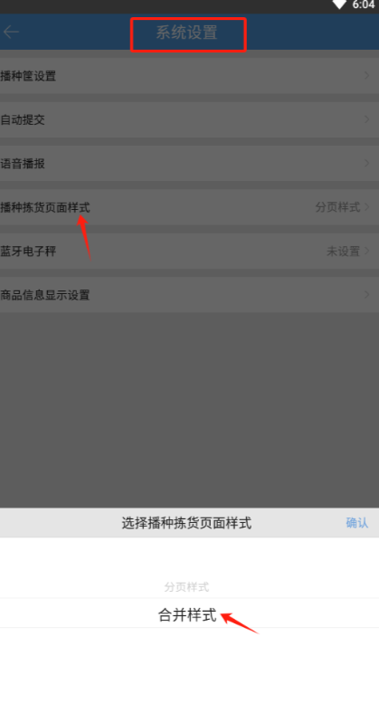

合并样式如下：可操作本次拣货和查看上一播种任务。

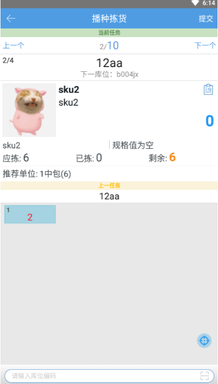

> 更新: 2024-05-07 10:42:41  
> 原文: <https://hupun.yuque.com/unzko7/lsbfg0/yslltcrchttp7w92>