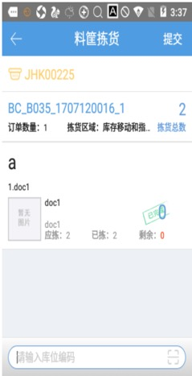
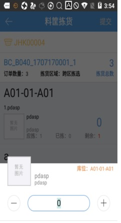
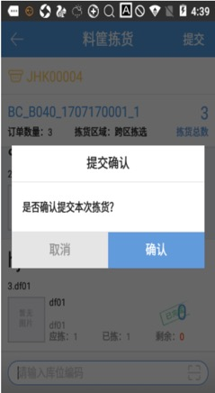

# PDA-料筐拣货

料筐拣货，pda通过扫描拣货筐编码进行拣货，操作方式关联所扫描容器上选择的拣货方式：

1、点击料筐拣货按钮，打开首界面，显示所选区域下待处理波次的笔数，扫描拣货筐编码选择波次进行拣货。

点击右上角的按钮可以筛选库区。

2、容器选择不同拣货方式时，对应不同的操作流程

2.1 容器拣货方式选择“拣货框”

扫描容器编码领取到波次后，进入批量拣货模式，点击波次号可以查看商品详情，需要先开启左下角蓝牙打印，才能点击右上角确认按钮，继续拣货流程，后续流程和[批量拣货](https://hupun.yuque.com/unzko7/lsbfg0/gcgvupeqazgwzul4)一致：

2.2 容器拣货方式选择“播种车”

扫描容器编码领取到波次后，进入播种拣货模式，点击波次号可以查看商品详情，可按需切换作业模式和开启后置打单开关，点击右上角确认按钮，继续拣货流程，后续流程和[播种拣货](https://hupun.yuque.com/unzko7/lsbfg0/yslltcrchttp7w92)一致：

2.3 容器拣货方式选择“拣货时选择”

扫描容器编码领取到波次后，进入模式选择页面，点击波次号可以查看商品详情，可按需选择播种拣货或批量拣货模式，继续拣货流程，若选择播种拣货则后续流程和[播种拣货](https://hupun.yuque.com/unzko7/lsbfg0/yslltcrchttp7w92)一致，若选择批量拣货则后续流程和[批量拣货](https://hupun.yuque.com/unzko7/lsbfg0/gcgvupeqazgwzul4)一致：

3、拣货方式关联PC端配置

3.1 未开启PDA拣货校验商品条码

选择波次后，扫描商品行上的库位，商品行自动标记已完成：

点击商品行上的数量，可以直接修改商品数量：

3.2 开启PDA拣货校验商品条码，按配置方式校验库位和商品

①仅商品种类：仅扫描商品条码，每种SKU扫描一次

②仅商品数量：仅扫描商品条码，按商品数量扫描

③库位、商品种类：先扫描库位编码再扫描商品条码，每种SKU扫描一次

④库位、商品数量：先扫描库位编码再扫描商品条码，按商品数量扫描（逐渐扫描）

所有商品行都已完成后，点击确认，即可提交下一环节：

 料筐拣货自动领取逻辑：

1.仅领取勾选了波次策略-允许领单-料筐拣货的波次；

2.仅领取待打单环节且生成电子面单的波次（后台开关可配置领取无电子面单波次）；

3.按照PDA选择的库区领取对应待打单的波次；

4.预配波次优先普通波次；

5.若波次订单都被拦截挂起，则不领取该波次；

6.波次中有订单含有序列号、批次号商品、拣选区域为空，波次打印过快递单、发货单、配货单、发票该波次不会被领取；

7.仅领取与拣货筐指定的库区、承运商、指定波次一致的波次。

 

> 更新: 2024-10-25 14:22:46  
> 原文: <https://hupun.yuque.com/unzko7/lsbfg0/atpnq1abcxaah749>