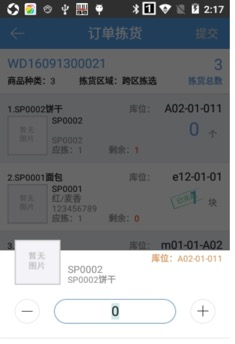
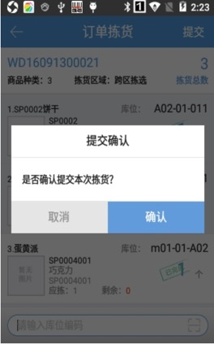
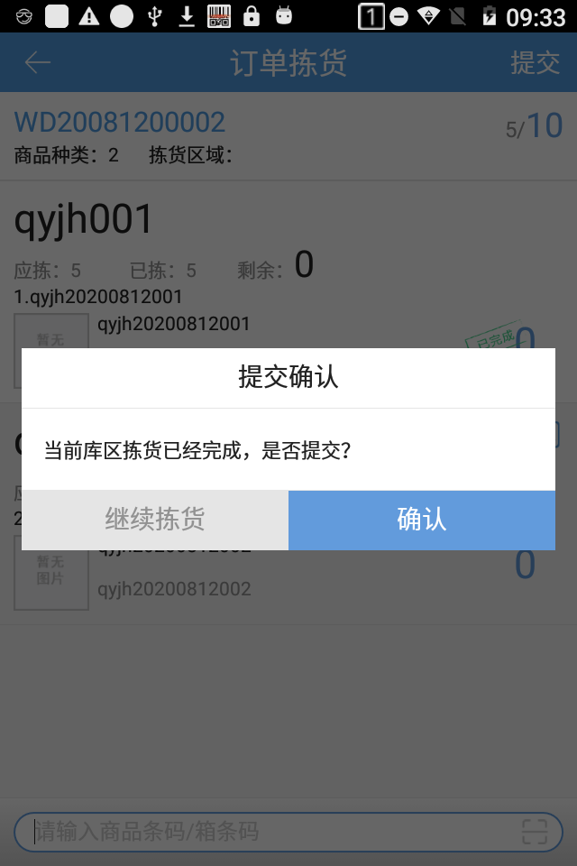
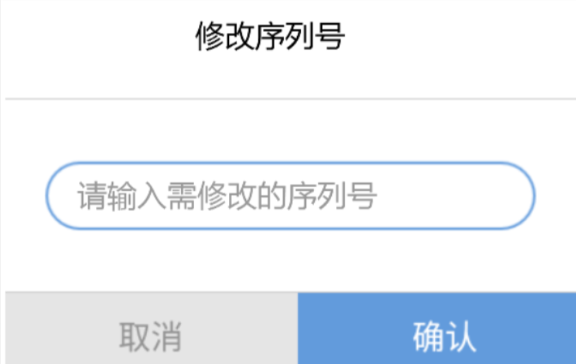

# PDA-订单拣货

pda的订单拣货只能单笔提交下一环节，具体操作步骤如下：

1.点击订单拣货按钮，用户可见如图界面，通过输入、扫描系统单号或运单号操作需拣货订单。

2.选择订单后，用户可以根据商品显示的库位进行取货。扫描库位，相应订单需要此库位上的商品就会标记已完成。

点击商品数量，弹窗可修改数量，点击完成即可。

支持右上角查看拣货进度，扫描商品条码，拣货进度根据扫描商品的数量更新，扫描箱条码时，拣货进度增加的是箱内库存的数量；

3.所有的商品行都为已完成，则会自动弹窗提交，点击确认即可。

4.开启按库区接力拣货，一个库区明细拣货完成后，提示库区拣货已完成是否提交，确认提交后生成接力拣货任务。下个库区拣货直接扫描运单号领取接力拣货任务。

提示

1. 如开启了PDA拣货检验商品条码配置，则根据配置的结果，拣货时进行库位或商品条码扫描。

2.序列号商品，扫描商品条码后跳转序列号录入界面，商品数量不可编辑。 

3.一次性录入序列号，后台开关开启保留区间截取，示例：

解析规则：保留区间截取，品牌：新增的品牌，保留区间截取第6到18位，条码长度范围为从0-21

商品A系统中商品条码69200811001-新增的品牌-序列号商品

商品B系统中商品条码69200811002-新增的品牌-非序列号商品

收货入库页面扫描条码1234569200811001001，匹配到了商品A且录入序列号1234569200811001001。

收货入库页面扫描条码1234569200811002001，匹配到了商品B不录入序列号。

4.若商品为序列号商品且序列号登记环节在拣货，即商品需录入序列号，序列号支持修改。

点击修改输入序列号若符合，则确认后修改成功。

注：修改序列号不会再次扣减库存。

                   

 

> 更新: 2024-07-04 13:49:41  
> 原文: <https://hupun.yuque.com/unzko7/lsbfg0/bwipfoa3yuv0g7zh>