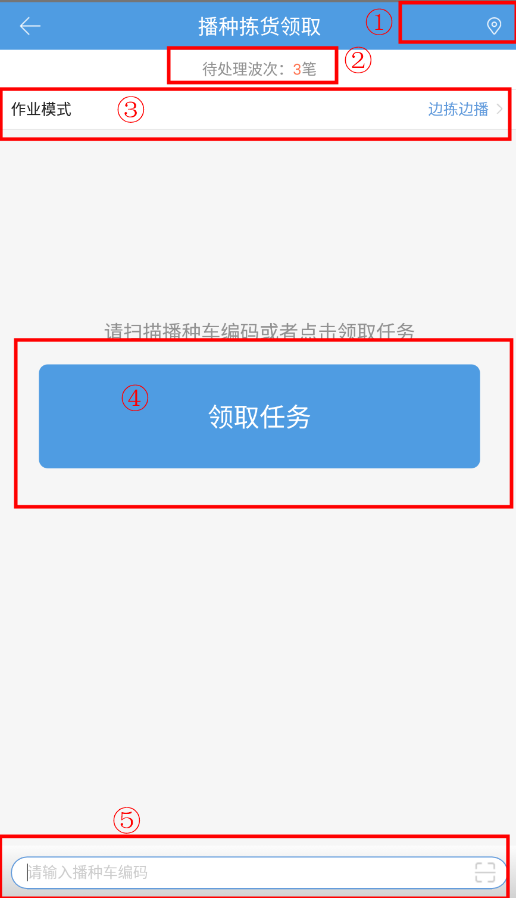
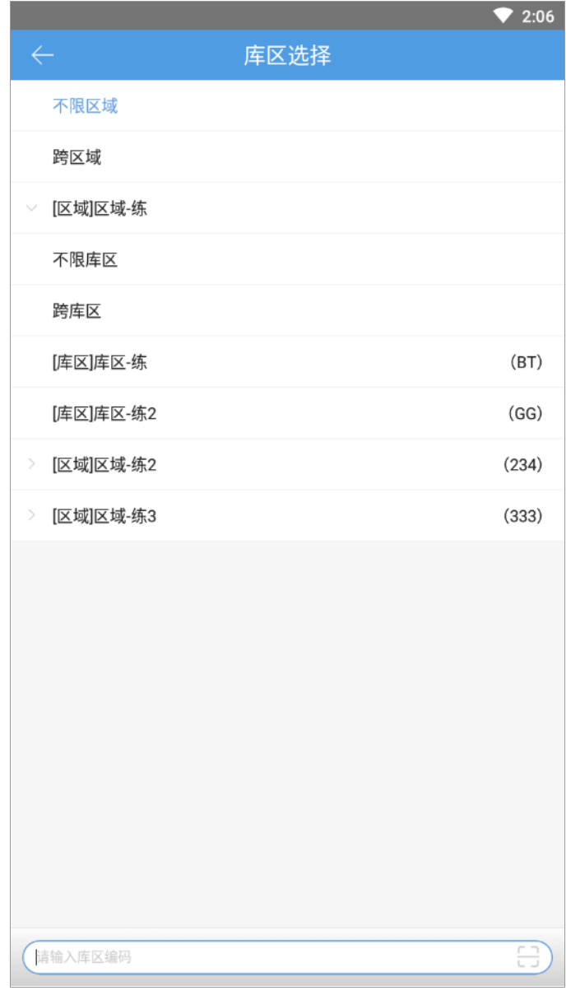
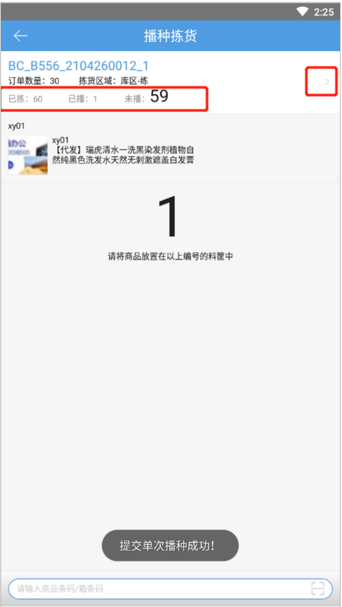
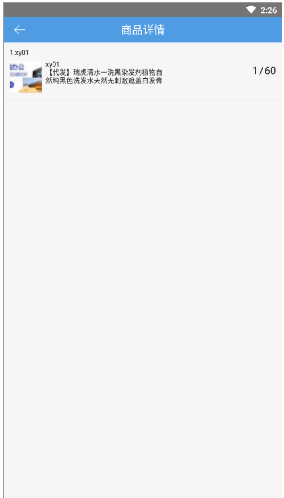
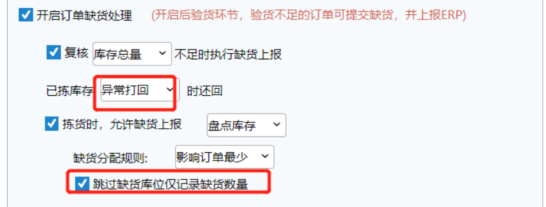

# PDA-领单播种拣货

领单播种拣货

可以直接点击领取波次或者扫描播种车编码领取任务，点击领取仓库中后置打印业务，播种拣货实现无纸化操作，扫播种车一般是拿着打印单去进行拣货，没有后置打印。播种车时在PC容器管理中增加配置的。

前置条件：a).PC端波次策略-允许PDA领单-选择领单播种拣货。

b).波次内订单有生成电子面单。

1、点击领单播种拣货按钮，进入领单播种拣货首页面。

领单方式1：领取任务

(1).可进行库区选择，待处理波次将在指定作业区域内筛选，记忆在仓库+操作员+本地上。

(2).领取的波次类型：非自由波次。

可领取的波次内订单状态为待拣货或待打单，且优先领取待拣货波次。

先领取有优先标记的波次，都有优先标时订单预售>天猫>代收货款>加急。

领单方式2：选择任务

(1).先选择作业模式，再点击“选择任务”

(2).可按指定条件筛选任务，在列表中直接点击某个任务或通过扫描配货单号领取任务

(3).设置中可选择分页样式和合并样式，分页样式可选择作业模式为边拣边播或先拣后播，合并样式为边拣边播，作业模式记忆在仓库+操作员上。

(4).支持后置打印，点击领取拣货完成后，扫工作台进行打印运单。

(5).在其他菜单下已有绑定任务的前提下，再在领单播种拣货领取新的任务，会报错提示。

(6).PC端拣货作业报表-执行页面增加领单播种拣货，可进行绩效数据查看。

2.选择边拣边播作业模式，点击领取任务，显示播种框分布。

3.跳转至拣货页面，该库位该商品拣货完成后，进行播种。

4.全部商品拣货完成，播种完成后，提示提交拣货，确认后订单到下一环节。

5.选择先拣后播作业模式，支持全部拣货后进行播种，详细用法见播种拣货-先拣后播。

6.提交拣货完成后，跳转至后置打印页面扫描工作台编码打印运单。

支持修改工作台，修改后获取正确的工作台信息，自动打印。

若工作台ip不对，支持修改ip后，点击“打印运单”按钮，正常打印。

7.PDA拣货模式支持-拣货报缺时全部订单提交拣货后再提交报缺（订单拣货、批量拣货、自由领单+批量拣货、播种拣货、料筐拣货、领单播种拣货）

a).业务配置-出库配置-开启订单缺货处理-选择已拣库存异常打回时还回-显示跳过缺货库位仅记录缺货数量

b).波次内有商品明细报缺时跳过该商品，仅记录缺货数量，不显示报缺明细（如有已拣再报缺，已拣明细和数量显示，报缺数量不显示），所有明细都拣货完成后提交拣货时，正常订单到下一环节，有后置打印的正常打印，缺货订单提交到缺货，拦截挂起订单提交到异常订单，异常页面显示缺货订单和拦截挂起订单。

c).PDA拣货开启接力拣货时，最后一个操作员提交拣货时订单再提交缺货订单。

> 更新: 2023-12-21 09:57:22  
> 原文: <https://hupun.yuque.com/unzko7/lsbfg0/pzhxy8lfv7wqzkls>