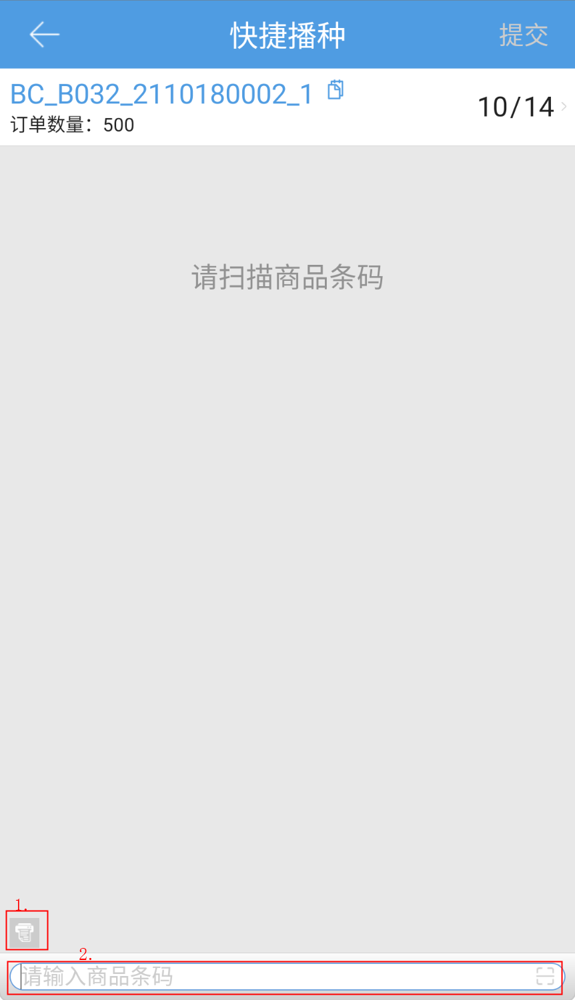
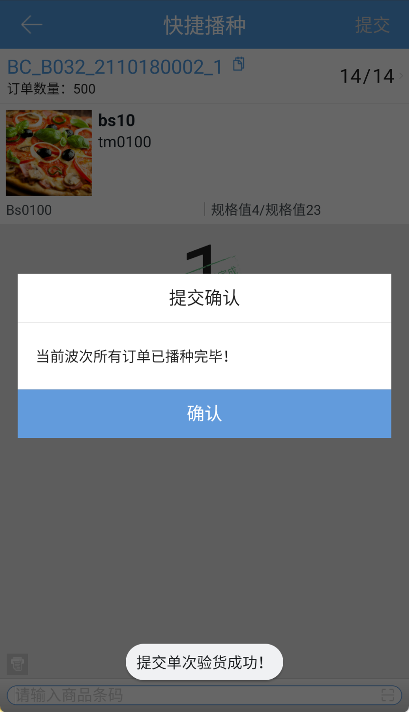

# PDA-快捷播种

快捷播种，pda通过扫描配货单号或容器编码，对同品波次或预配波次进行播种，具体步骤如下：

1.扫描配货单号或容器编码，匹配同品波次或预配波次

2.开启后置打印，扫描商品条码进行播种

点击配货单号后的按钮，可查看剩余订单情况：

波次内所有订单播种完成后，显示提交确认弹窗，确认后波次播种成功，提交到下一个环节。

> 更新: 2024-02-06 11:15:39  
> 原文: <https://hupun.yuque.com/unzko7/lsbfg0/rhrk0zo2pq5fk6lr>