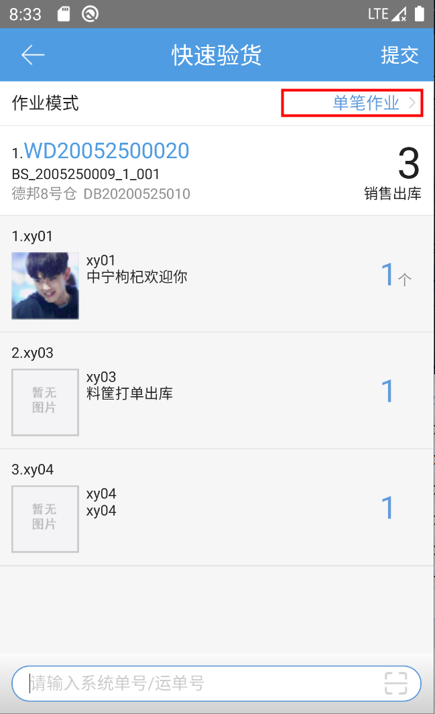
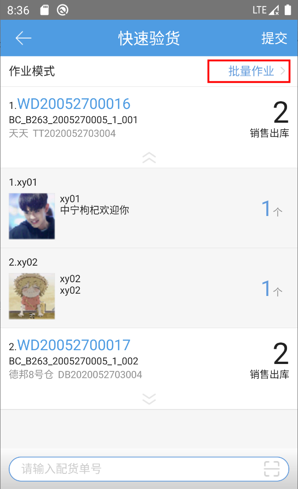

# PDA-快速验货

快速验货，用户可直接扫描订单无需扫描商品进行验货。

作业模式：单笔作业、批量作业

① 单笔作业：用户扫描输入系统单号或运单号后，界面显示相应订单的详细信息，如图所示。

② 批量作业：用户扫描输入配货单号后，界面显示相应订单的详细信息，如图所示。

继续扫描下一笔订单/波次，第一次输入的订单会自动提交下一环节。点击右上角的提交按钮，可手动提交当前显示的订单/波次至下一环节。

 

> 更新: 2023-12-21 09:28:17  
> 原文: <https://hupun.yuque.com/unzko7/lsbfg0/zybgvy519ollfpl3>