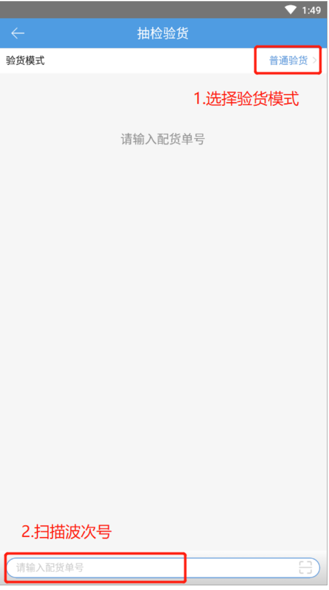
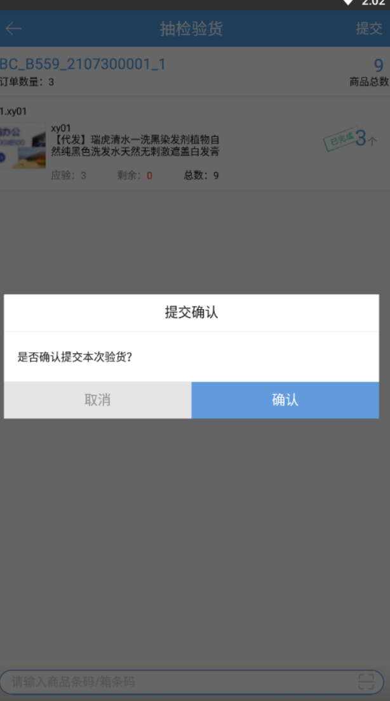
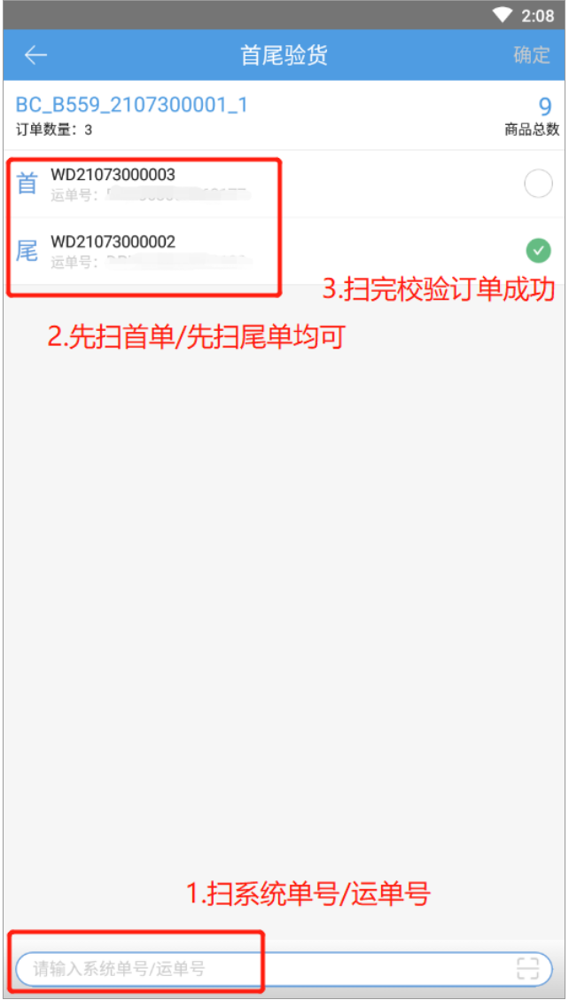
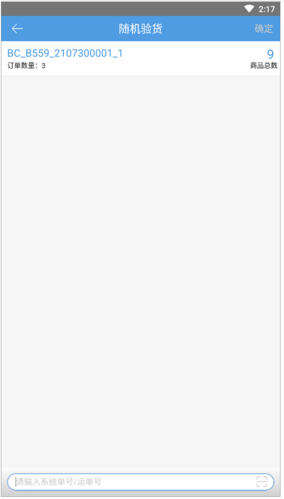
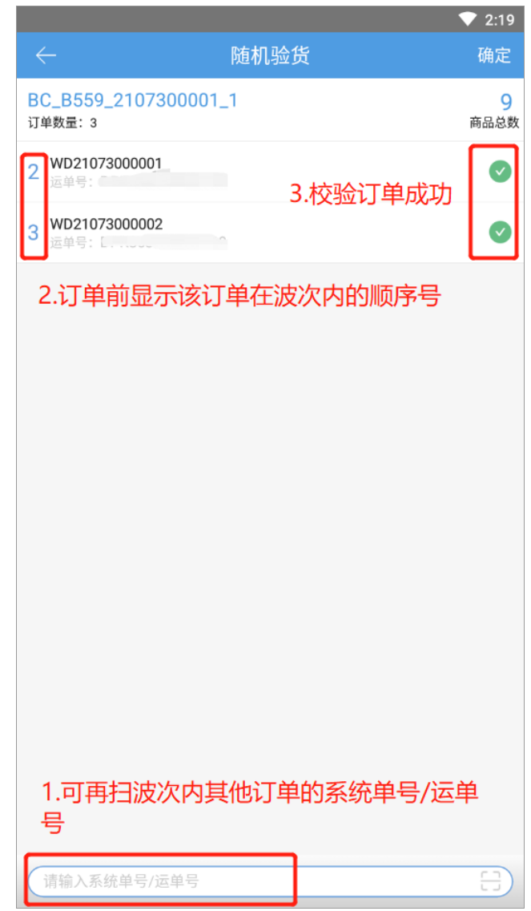
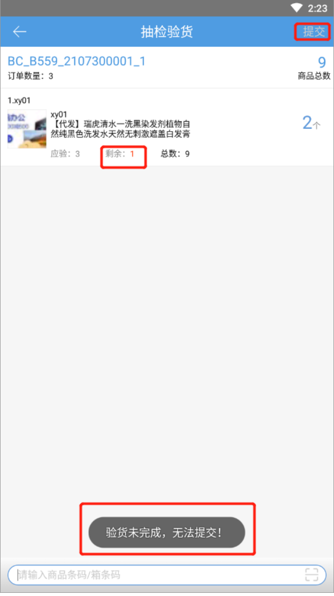
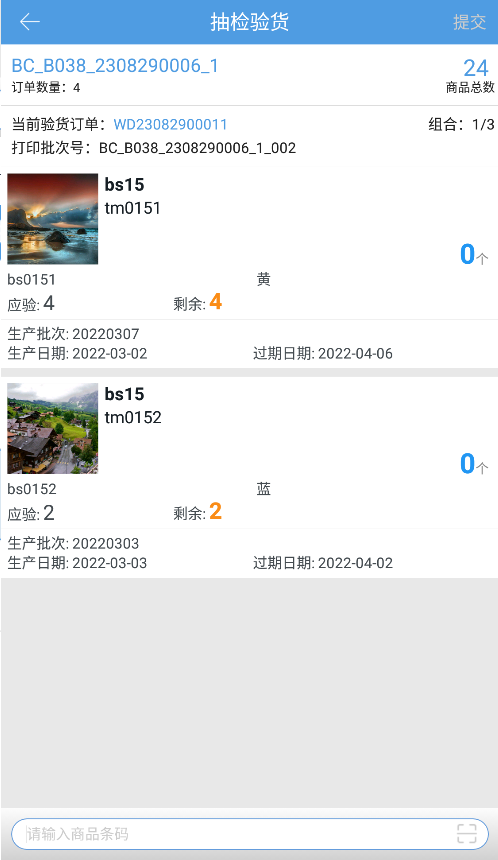

# PDA-抽检验货

PDA抽检验货

同品、预配波次有大批量相同明细的单据，如若批量验货则容易出现整个波次拿错货的情况，所以需要对其中一单进行抽查检验，由于同品订单在打印时往往是连着打，那么撕单时就可能撕错，就导致发错货，因此在抽检的时候抽检方式也需要多样化。

PDA抽检验货的操作步骤如下：

1.点击抽检验货按钮，扫描同品/预配波次的波次号匹配订单。

a).可选择验货模式有：普通验货、首尾验货、随机验货、首尾+随机验货，作业模式记忆为仓库+操作员上。

2.验货模式-普通验货

a).波次中共3笔订单，每笔订单明细均为sku1：数量3个。

b).扫描商品条码，验货波次的其中一单，提交整笔波次验货完成。

3.验货模式-首尾验货

a).扫描波次号后，页面显示整笔波次的首单的系统单号/运单号和尾单的系统单号/运单号。

b).首单和尾单都校验完成后，跳到抽检验货页面，扫描商品条码进行验货一单，验货完成波次内所有订单正常提交到下一环节。

4.验货模式-随机模式

a).扫描波次后跳到随机验货页面，下方扫波次内任意订单的系统单号/运单号匹配订单。

b).校验订单属于该波次成功后，点击确定，跳到抽检验货页面扫描条码验货，验货未完成，提交按钮置灰，无法提交；完成后整笔波次订单提交到下一环节。

5.验货模式-首尾+随机验货

a).扫波次后显示波次的首单和尾单，不校验，点击确定，无法进行下一步。

b).校验首单和尾单后，扫波次内其他任意订单的单号跳到抽检验货页面，扫描条码进行验货

注：

1.验货模式仅是作为抽检订单是否属于当前波次。

2.当波次内仅有1单时不进行检验订单。

3.此页面支持扫含生产批次商品的波次。

4.商品明细数量编辑关联权限配置，勾选权限的允许手动修改数量，未勾选的不允许修改数量，只能通过扫描条码录入明细。

6.验货核对批次

开启验货核对批次-抽检验货后，验货步骤分为校验订单--核对批次两个步骤，其中校验订单的方式和上述四种模式一致，核对批次的方式如下，以首尾验货为例。

①.手动选择核对

扫描波次后，订单信息显示首单信息，需先完成首尾单校验，再验商品：

扫描商品条码后，若有多个批次号，则扫描商品条码后转到生产批次列表，可以扫描输入商品条码；若只有1个批次号，则直接增加已验数量：

     

每个组合核验完成后，会自动切换显示下一个组合，并刷新“组合”和“本次剩余验货订单”数据，直到最后一个组合核验完成后，可以录入耗材或提交整个波次。

组合：指在波次订单中，如果商品批次号不同，那么订单中出现不同的批次搭配都记为一种组合。

例：波次中有4个订单，订单1 明细a 锁定批次01 数量1 批次02 数量2，订单2 明细a 锁定批次01 数量3，订单3 明细a 锁定批次01 数量2 批次02 数量1，订单4 明细a 锁定批次01 数量1 批次02 数量2

上述波次共有3个组合：组合1：明细a 锁定批次01 数量1 批次02 数量2，共2个订单；组合2：明细a 锁定批次01 数量3，共1个订单；组合3：明细a 锁定批次01 数量2 批次02 数量1，共1个订单

②.扫描批次号核对

扫描波次后，订单信息显示首单信息，需先完成首尾单校验，再验商品

每次扫描生产批次商品，都会转到生产批次列表，可以扫描输入批次号：

每个组合核验完成后，会自动切换显示下一个组合，并刷新“组合”数据，直到最后一个组合核验完成后，可以录入耗材或提交整个波次。

> 更新: 2023-12-21 09:56:43  
> 原文: <https://hupun.yuque.com/unzko7/lsbfg0/nsnbnf6zpmr8xirm>