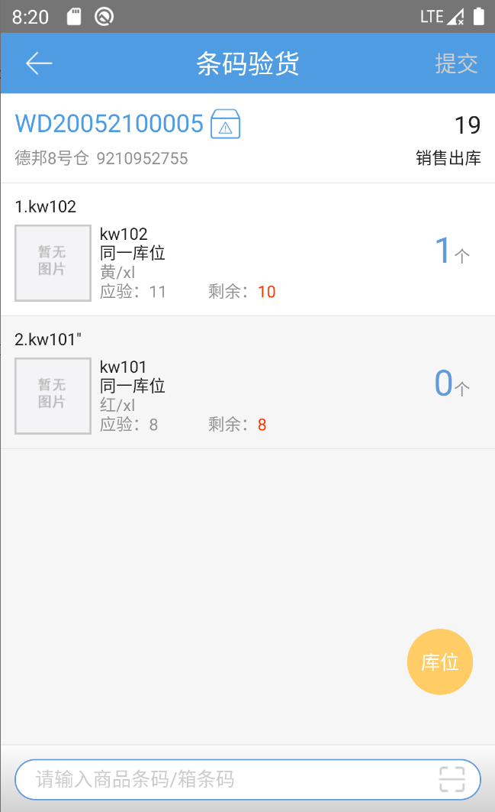
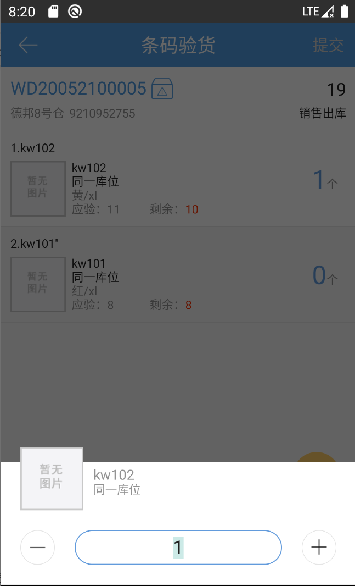
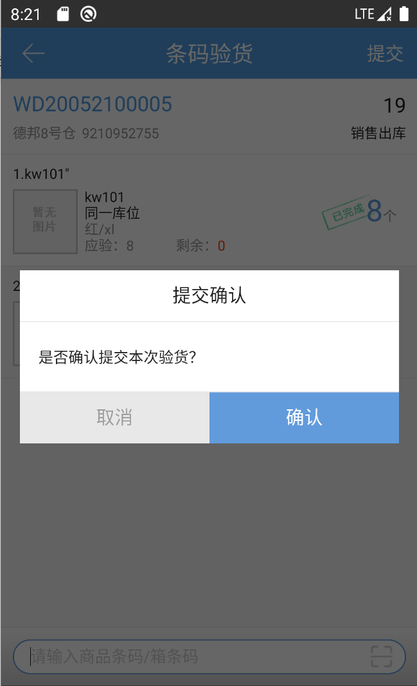
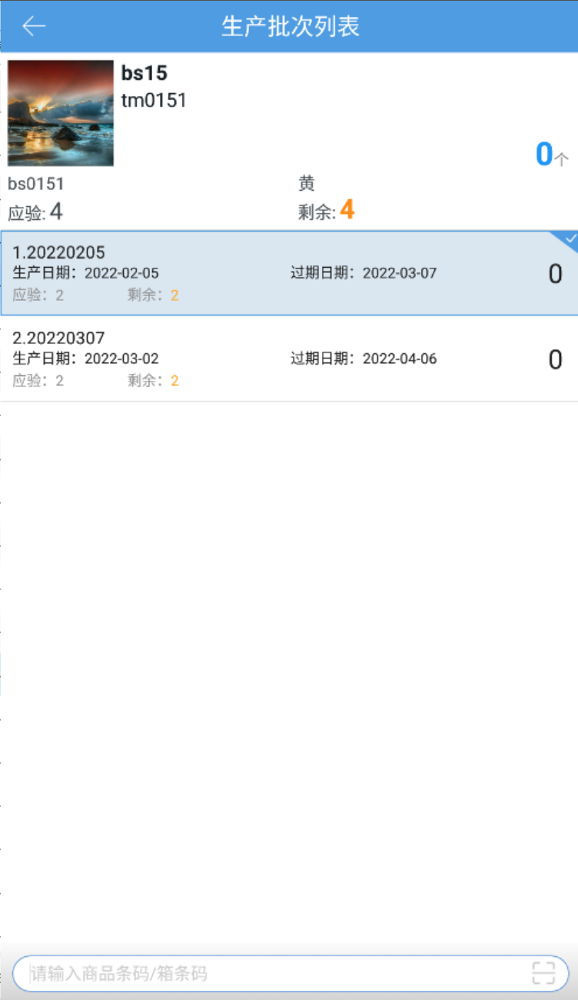
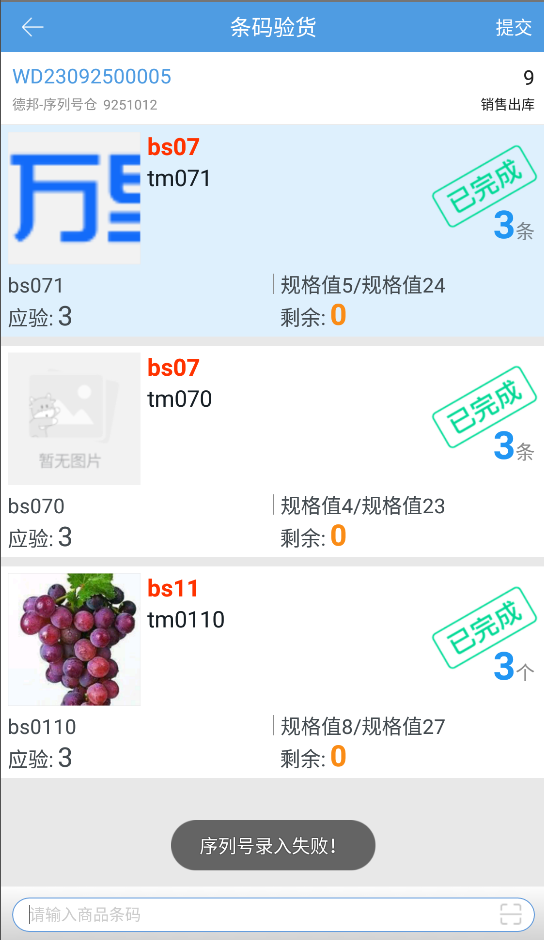

# PDA-条码验货

### 1、未启用视频录制功能
#### 1.1 基本步骤
用户可扫描订单号和商品条码进行验货。具体操作步骤如下：

点击条码验货按钮，通过扫描系统单号和运单号操作订单。

扫描输入相应订单的商品条码即可验货。如图输入kw102，商品行数量为1且自动标记已完成。

用户也可以点击商品数量，进行直接编辑修改。

提示

a.pc上流程配置开启验货商品条码截取，pda会自动生效。若截取条码前3位，商品条码是new0001，则pda只需要扫描条码new即可完成验货。

b.开启赠品属性商品免验货则赠品商品数量直接带出无需输入。

c.开启序列号扩展属性后台开关+序列号登记环节：验货，操作页支持扫外箱码不跳转序列号录入页直接快速带出序列号。

d.当发现商品拣货时少拣漏拣，可点击库位查看商品的缺货库位即原始锁库库位。

e.商品明细数量编辑关联权限配置，勾选权限的允许手动修改数量，未勾选的不允许修改数量，只能通过扫描条码录入明细。

所有商品验货完成，点击确认即可提交下一环节。

提示：支持自动提交验货，只需要在系统设置了开启条码验货自动提交按钮。

#### 1.2 验货核对批次
##### ①.手动选择核对
扫描商品条码后，若有多个批次号，则扫描商品条码后转到生产批次列表，可以扫描输入商品条码：

查询模式切换，底部扫描框默认显示“条码”，若[开启集合码便捷录入](https://hupun.yuque.com/unzko7/lsbfg0/caki7lz4105n2vpg#CKIQO)开关，会显示“集合码”，通过扫描集合码来匹配商品条码，并跳转到批次设置页面。

##### ②.扫描批次号核对
每次扫描生产批次商品，都会转到生产批次列表，可以扫描输入批次号：

查询模式切换，底部扫描框默认显示“条码”，若[开启集合码便捷录入](https://hupun.yuque.com/unzko7/lsbfg0/caki7lz4105n2vpg#CKIQO)开关，会显示“集合码”，通过扫描集合码来同时匹配商品条码、生产批次号等多个信息。

开启批次匹配验货（联系客服开启）+验货核对批次+解析商品条码时核对批次，条码验货验货页扫批次号匹配到商品+批次号，不跳转批次验货页，直接对应批次号验货数量+1。

例：商品sku2，商品条码001，批次号001、002；

       扫001不跳转页面，批次001验货数量+1；扫002报错无匹配。

##### ③.序列号校验
序列号商品录入环节在“验货”环节时，若录入无效序列号，在提交订单时会将对应商品及序列号标红显示，不允许提交到下个环节，重新录入有效序列号后，可以正常提交。

##### ④.序列号上传图片
拼多多平台且带【SN图片上传标记】的订单支持上传序列号商品图片，具体操作参考[专题功能介绍](https://hupun.yuque.com/unzko7/lsbfg0/izydyvvvxo58sagh)。

#### 2、启用视频录制功能
视频录制步骤请参考[订单打包](https://hupun.yuque.com/unzko7/lsbfg0/wpnzfyg3ouuupkn6#dM3ZH)相关内容。

> 更新: 2026-06-15 15:52:27  
> 原文: <https://hupun.yuque.com/unzko7/lsbfg0/kedwevg81h50ddpk>